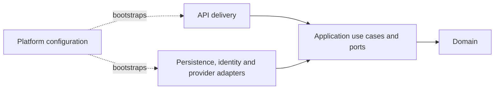

# VideoGame Platform backend

The backend is the executable walking skeleton for the VideoGame Platform learning
MVP. It proves the approved Java and Spring baseline, enforceable module boundaries,
the initial PostgreSQL/Flyway persistence contract, and baseline observability before
product behaviour is implemented.

## Current status and scope

- **Status:** Active walking skeleton
- **Runtime:** Java 25, without preview features
- **Framework:** Spring Boot 4.1.0 with Spring MVC
- **Architecture:** Modular monolith with Spring Modulith 2.1.0
- **Build:** Maven Wrapper from the repository root
- **Persistence:** PostgreSQL 18, SQL-first Flyway, JPA schema generation disabled
- **Current HTTP surface:** Spring Boot Actuator health, info, and metrics only

The application currently has no product endpoint, catalogue repository, JPA entity,
authentication, external provider call, or frontend integration. It does have the
minimum module-owned catalogue schema, deterministic opt-in development seed, and
PostgreSQL 18 migration/persistence evidence required before the first public read.
It also has safe liveness/readiness groups, build/source metadata, correlation,
structured logs, bounded metrics, W3C trace context, and disabled-by-default OTLP
export.

The repository-level [backend development guide](../docs/development/backend.md)
tracks the broader walking-skeleton boundary and deferred evidence. The approved
[solution architecture](../docs/architecture/mvp-solution-architecture.md),
[technology baseline](../docs/architecture/technology/mvp-technology-baseline.md),
and [ADR-0010](../docs/decisions/0010-use-java-25-spring-boot-4-and-spring-modulith.md)
remain authoritative when this README and an approved source conflict.

## Technology stack

| Concern | Technology | Version or policy |
|---|---|---|
| Language | Java | 25; preview features disabled |
| Application framework | Spring Boot | 4.1.0 |
| HTTP runtime | Spring MVC | Managed by Spring Boot |
| Module model | Spring Modulith | 2.1.0 |
| Operational endpoints | Spring Boot Actuator | `health`, `info`, and `metrics` exposed |
| Metrics and traces | Micrometer and OpenTelemetry | Spring Boot-managed Micrometer 1.17/Tracing 1.7 and OpenTelemetry 1.62 |
| Persistence | PostgreSQL, Spring Data JPA, Hibernate | PostgreSQL 18; Hibernate DDL disabled |
| Schema evolution | Flyway Community, SQL-first | Spring Boot-managed 12.4.0 |
| Persistence integration tests | Testcontainers PostgreSQL | 2.0.5 with `postgres:18.4-bookworm` |
| Architecture tests | Spring Modulith Test and ArchUnit | ArchUnit 1.4.2 |
| Unit and integration tests | JUnit Jupiter, AssertJ, Spring Boot Test | Managed by Spring Boot |
| Build and packaging | Maven Wrapper and Spring Boot Maven Plugin | Maven 3.9 line enforced |

Dependencies are declared in [`pom.xml`](pom.xml). Their versions are managed by
the root [`pom.xml`](../pom.xml) or declared explicitly when no approved BOM owns
them.

## Prerequisites

Use the supported WSL2 development environment described in the
[local setup guide](../docs/development/local-setup.md). The backend itself requires:

- a complete Java 25 JDK available through `PATH`;
- the committed Maven Wrapper;
- Docker Desktop available from WSL2 for PostgreSQL 18 Testcontainers;
- network access to Maven Central and the container registry on the first build.

Confirm the active toolchain from the repository root:

```bash
java --version
javac --version
./mvnw --version
```

The Maven build fails early when Java is outside `[25,26)` or Maven is outside the
supported `[3.9,4.0)` range. Verification starts an isolated PostgreSQL 18 container;
it needs Docker but not the long-lived local dependency topology, Keycloak, an IGDB
credential, or Node.js. The separately managed PostgreSQL and Keycloak topology is
documented in the [dependency guide](../docs/development/local-dependencies.md).

## Build, test, and run

All commands below run from the repository root.

Run the complete backend verification and create the executable jar:

```bash
./mvnw clean verify
```

This command requires Docker because it migrates a fresh PostgreSQL 18 database and
executes the persistence constraint tests. Run only the focused migration gate with:

```bash
bash scripts/validate-migrations.sh
```

Run only the backend module while also building any required reactor dependencies:

```bash
./mvnw -pl backend -am clean verify
```

Start and migrate the local application as documented in the
[database migration guide](../docs/development/database-migrations.md). In summary,
start the dependencies, load the ignored local credentials, and opt into Flyway on
the first application startup:

```bash
bash scripts/local-dependencies.sh up
set -a
source .env
set +a
APPLICATION_FLYWAY_ENABLED=true ./mvnw -pl backend spring-boot:run
```

The central
[catalogue persistence model](../docs/architecture/diagrams/mermaid/catalogue-persistence-model.mmd)
visualizes the implemented tables, columns, keys, and relationships. Keep executable
schema changes in versioned Flyway SQL rather than creating a separate `backend/docs`
copy of the model.

The default address is `http://localhost:8080`. Stop the process gracefully with
`Ctrl+C`; Spring allows up to 20 seconds for each shutdown phase.

After a successful package, run the executable artifact directly:

```bash
java -jar backend/target/videogame-platform-backend-0.2.0-SNAPSHOT.jar
```

To change the HTTP port for a local run, use a standard Spring Boot override:

```bash
SERVER_PORT=8081 ./mvnw -pl backend spring-boot:run
```

## Architecture and module ownership

`VideoGamePlatformApplication` is the single executable boundary. Spring Modulith
discovers the five direct packages below `com.videogameplatform` as application
modules:

```text
backend/src/main/java/com/videogameplatform
├── catalogue                # Provider-independent catalogue and releases
│   ├── domain               # Framework-independent domain types and rules
│   ├── application          # Use cases and inbound/outbound ports
│   └── adapter
│       ├── persistence      # Database implementation and persistence models
│       └── provider/igdb    # IGDB adapter and provider transport models
├── ratings                  # Personal and aggregate ratings boundary
│   ├── domain
│   ├── application
│   └── adapter/persistence
├── identity                 # Translation from external to product identity
│   └── adapter
├── api                      # Inbound HTTP delivery and API transport models
│   ├── delivery
│   └── model
└── platform                 # Replaceable technical concerns
    ├── configuration
    └── observability
```

The intended dependency direction is inward:



The current automated rules enforce that:

- domain code does not depend on Spring, Jakarta, application, adapter, API, or
  platform packages;
- application code does not depend on Spring, Jakarta, adapters, API, or platform;
- domain types do not use API, persistence, or provider transport models;
- API models and outbound adapter models do not depend on each other;
- the Spring Modulith model contains exactly `catalogue`, `ratings`, `identity`,
  `api`, and `platform`, and all detected module dependencies are valid.

Keep product rules in domain code, orchestration and ports in application code, and
framework or integration details in adapters. Do not reuse transport or persistence
records as domain models.

## Runtime configuration

The committed defaults live in
[`src/main/resources/application.yaml`](src/main/resources/application.yaml).

| Property | Default | Purpose |
|---|---|---|
| `spring.application.name` | `videogame-platform-backend` | Stable application identity |
| `spring.datasource.url` | Local application JDBC URL | Runtime database connection |
| `spring.datasource.username` | `videogame_app` | DML-only runtime role |
| `spring.datasource.password` | Empty; required from the environment | Runtime secret |
| `spring.flyway.enabled` | `false` | Keeps maintained-environment migration separate from normal startup |
| `spring.flyway.url` | Application database URL | Migration connection target |
| `spring.flyway.user` | `videogame_app_migrator` | Schema-owning migration role |
| `spring.flyway.password` | Empty; required when Flyway is enabled | Migration secret |
| `spring.flyway.locations` | `classpath:db/migration` | Production migration location; seed is opt-in |
| `spring.flyway.clean-disabled` | `true` | Prevents destructive clean through committed configuration |
| `spring.jpa.hibernate.ddl-auto` | `none` | Disables Hibernate schema generation |
| `spring.jpa.open-in-view` | `false` | Keeps persistence work outside HTTP rendering |
| `spring.lifecycle.timeout-per-shutdown-phase` | `20s` | Maximum graceful-shutdown time per phase |
| `spring.modulith.runtime.verification-enabled` | `true` | Verifies module structure during startup |
| `server.shutdown` | `graceful` | Stops accepting work before terminating |
| `management.endpoint.health.probes.enabled` | `true` | Enables liveness and readiness health groups |
| `management.endpoint.health.group.liveness.include` | `livenessState` | Keeps liveness limited to process viability |
| `management.endpoint.health.group.readiness.include` | `readinessState,db,catalogueStore` | Requires application readiness, database connectivity, and migrated catalogue query access |
| `management.endpoint.health.show-details` | `never` | Avoids exposing component details |
| `management.endpoints.web.exposure.include` | `health,info,metrics` | Restricts the public Actuator surface |
| `management.info.env.enabled` | `false` | Prevents arbitrary environment-backed info fields |
| `management.tracing.propagation.type` | `w3c` | Consumes and produces W3C trace context only |
| `management.tracing.sampling.probability` | `1.0` | Keeps complete root-trace evidence at the current low-volume stage |
| `management.tracing.export.otlp.enabled` | `false` | Keeps trace export optional and fail-open |
| `management.otlp.metrics.export.enabled` | `false` | Keeps metric export optional and fail-open |
| `logging.level.root` | `INFO` | Avoids dependency-framework debug noise |
| `logging.level.com.videogameplatform` | `INFO` | Application log baseline; override with `LOGGING_LEVEL_COM_VIDEOGAMEPLATFORM` |

Spring Boot properties can be overridden with command-line arguments, environment
variables, or an external configuration file. For example,
`MANAGEMENT_ENDPOINT_HEALTH_SHOW_DETAILS=always` is technically valid but must not
be committed or used in a shared environment without a security review.

The only application-specific shared bean is a `java.time.Clock` configured for
`Europe/Madrid`. Inject that clock into time-dependent application code instead of
calling the system clock directly, so tests can replace it deterministically.

`APPLICATION_DB_PASSWORD` and `APPLICATION_MIGRATION_DB_PASSWORD` are secrets. The
local dependency wrapper generates them in ignored `.env`; maintained environments
must supply them through a protected secret source. Never add credentials to
`application.yaml`, this README, Postman files, Git history, logs, or URLs.

The complete observability property table, safe defaults, restart behaviour,
structured-log profile, source-revision build option, OTLP endpoints, cardinality
policy, and security rules are maintained in the
[backend observability guide](../docs/development/observability.md).

## Actuator API

Actuator is served on the application port under `/actuator`. All currently exposed
operations are read-only and require no request body.

| Method | Path | Purpose | Expected local result |
|---|---|---|---|
| `GET` | `/actuator` | Discovery links for exposed Actuator resources | `200 OK` |
| `GET` | `/actuator/health` | Aggregate application health | `200 OK`, status `UP` |
| `GET` | `/actuator/health/liveness` | Whether the process should be restarted | `200 OK`, status `UP` |
| `GET` | `/actuator/health/readiness` | Whether the process can receive traffic | `200 OK`, status `UP` |
| `GET` | `/actuator/info` | Non-sensitive build/application information | `200 OK`; build version and source revision |
| `GET` | `/actuator/metrics` | Available bounded diagnostic meter names | `200 OK`; HTTP, JVM, process, system, JDBC, and pool meters |
| `GET` | `/actuator/metrics/{name}` | Measurements and available low-cardinality tags | `200 OK` for a known meter |

Example:

```bash
curl --fail --silent http://localhost:8080/actuator/health
```

Liveness includes process state only. Readiness includes application state, the
database, and the migrated catalogue schema; an empty catalogue remains ready because
the later API can safely report `CATALOGUE_NOT_READY`. IGDB and telemetry never control
readiness. Health details stay hidden by default, and endpoints such as
`env`, `configprops`, `beans`, `heapdump`, and `loggers` are deliberately not
exposed.

Import the prepared collection and environment from [`postman/`](postman/) to call
every exposed endpoint and run status/schema checks in Postman.

## Test strategy

| Test | Type | Evidence |
|---|---|---|
| `BackendStartupTest` | Full-context HTTP/database integration test | Java 25, PostgreSQL 18, migration, health groups, build info, metrics, ECS correlation, W3C trace propagation, and telemetry safety |
| `CorrelationIdFilterTest` | Focused servlet-filter unit test | Valid/invalid IDs, response header, MDC lifecycle, safe route fields, and exceptional completion |
| `CatalogueStoreHealthIndicatorTest` | Database failure integration test | Missing schema produces detail-free `DOWN` |
| `CataloguePersistenceIntegrationTest` | Flyway and JDBC integration test | Migration from zero, seed determinism, checksums, constraints, and runtime privileges |
| `ModularityTest` | Architecture test | Spring Modulith dependency verification and approved module set |
| `HexagonalArchitectureTest` | Architecture test | Inward dependencies and separation of boundary models |

Run one test class when diagnosing a focused failure:

```bash
./mvnw -pl backend -Dtest=BackendStartupTest test
./mvnw -pl backend -Dtest=CorrelationIdFilterTest test
./mvnw -pl backend -Dtest=CatalogueStoreHealthIndicatorTest test
./mvnw -pl backend -Dtest=CataloguePersistenceIntegrationTest test
./mvnw -pl backend -Dtest=ModularityTest test
./mvnw -pl backend -Dtest=HexagonalArchitectureTest test
```

New behaviour should add the smallest suitable unit, application, adapter, contract,
and integration tests. Architecture tests complement behavioural tests; they do not
replace them.

## IntelliJ IDEA

Open the repository root as a Maven project and use Java 25 for both the Project SDK
and Maven runner. IntelliJ Ultimate already provides the required Spring, Maven, and
Actuator support.

Either run `VideoGamePlatformApplication` directly or create a Maven configuration
with working directory set to the repository root and command line:

```text
-pl backend spring-boot:run
```

Use the imported Postman environment or IntelliJ's HTTP client to inspect Actuator;
do not copy real secrets into shared run configurations.

## Troubleshooting

| Symptom | Likely cause and action |
|---|---|
| Maven Enforcer rejects Java | Select a Java 25 JDK in `PATH` and `JAVA_HOME`, then re-run `./mvnw --version`. |
| Port `8080` is already in use | Stop the conflicting process or run with `SERVER_PORT=8081`. |
| `/actuator/health` is unreachable | Confirm the startup completed, the selected port is correct, and no unsupported management base-path override is active. |
| An Actuator endpoint returns `404` | Only `health`, `info`, and `metrics` are exposed; verify the path and committed configuration. |
| Application startup reports a module violation | Inspect the dependency named by Spring Modulith and restore the inward dependency direction. |
| Testcontainers cannot find Docker | Start Docker Desktop, enable this WSL distribution, and verify `docker info`. |
| PostgreSQL authentication fails locally | Start the dependency topology and load the generated `.env` into the shell without printing it. |
| Flyway reports a checksum mismatch | Stop; do not repair automatically. Restore the immutable applied file or add a corrective migration. |
| Tests work in IntelliJ but not Maven | Align IntelliJ's Project SDK and Maven runner with the Java 25 JDK used by the wrapper. |

## Adding backend capabilities safely

For each future change:

1. Start from an approved use case and the OpenAPI contract.
2. Put behaviour in the owning module and preserve the package dependency rules.
3. Keep API, persistence, identity, and provider models at their boundaries.
4. Add behavioural and architecture evidence proportional to the change.
5. Document every configuration property, including safe default, secret status,
   validation, and restart behaviour.
6. Update OpenAPI, Postman, operational checks, and this README when the HTTP surface
   changes.
7. Preserve the telemetry allowlist and route-template cardinality rules in the
   observability guide.
8. Run `./mvnw clean verify` and the repository documentation validations.

The local PostgreSQL/Keycloak topology and initial application persistence are
implemented separately. Catalogue repositories and queries, the Keycloak-backed BFF
session, product APIs, a deployed telemetry backend, application containers, the
complete CI gate, and remote deployment remain focused work items. This backend does
not claim a product read or remote operational evidence merely because its schema can
migrate or its telemetry can be exported.
