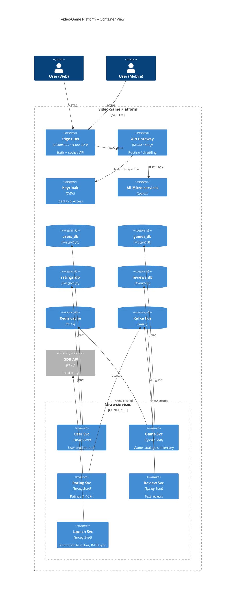

## MERMAID C4 Container Diagram



## PLANTUML C4 Container Diagram

```puml
@startuml
!includeurl https://raw.githubusercontent.com/plantuml-stdlib/C4-PlantUML/master/C4_Container.puml
LAYOUT_WITH_LEGEND()

Person(webUser,    "Player (Web)")
Person(mobileUser, "Player (Mobile)")

System_Boundary(videoGame, "Video-Game Platform") {

    Container(cdn,     "Edge CDN",   "CloudFront / Azure CDN", "Static + cached API")
    Container(apiGw,   "API Gateway","NGINX / Kong",           "Routing / throttling")
    Container(keycloak,"Keycloak",   "OIDC",                   "Identity & Access")

    Container_Boundary(svcs, "Micro-services") {
        Container(userSvc,   "User Svc",   "Spring Boot", "User profiles")
        Container(gameSvc,   "Game Svc",   "Spring Boot", "Game catalogue")
        Container(ratingSvc, "Rating Svc", "Spring Boot", "Ratings (1-5)")
        Container(reviewSvc, "Review Svc", "Spring Boot", "Text reviews")
        Container(launchSvc, "Launch Svc", "Spring Boot", "Promotions / IGDB sync")
    }

    ContainerDb(pgUsers,   "users_db",    "PostgreSQL")
    ContainerDb(pgGames,   "games_db",    "PostgreSQL")
    ContainerDb(pgRatings, "ratings_db",  "PostgreSQL")
    ContainerDb(mongoRev,  "reviews_db",  "MongoDB")
    ContainerDb(redis,     "Redis cache", "Redis")
    ContainerDb(kafka,     "Kafka bus",   "Kafka")
}

Container_Ext(igdb, "IGDB API", "REST")
Container_Ext(prom, "Prometheus", "Metrics")
Container_Ext(graf, "Grafana",    "Dashboards")
Container_Ext(elk,  "ELK Stack",  "Logs")

Rel(webUser,    cdn,    "HTTPS")
Rel(mobileUser, cdn,    "HTTPS")
Rel(cdn,        apiGw,  "HTTPS")
Rel(apiGw,      keycloak,"Token check")
Rel(apiGw,      svcs,   "REST")

Rel(userSvc,   pgUsers,   "JDBC")
Rel(gameSvc,   pgGames,   "JDBC")
Rel(ratingSvc, pgRatings, "JDBC")
Rel(reviewSvc, mongoRev,  "Driver")
Rel(gameSvc,   redis,     "cache")
Rel_L(ratingSvc, kafka, "rating-created")
Rel_L(reviewSvc, kafka, "review-created")
Rel_R(launchSvc, igdb,  "pulls")
Rel(svcs, prom, "metrics")
Rel(svcs, elk,  "logs")
SHOW_LEGEND()
@enduml

```