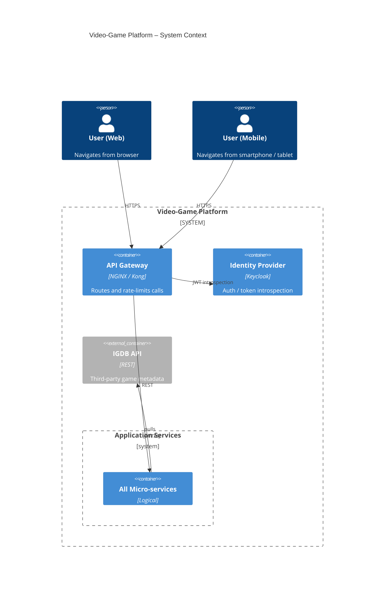

## MERMAID DIAGRAM



## PLANTUML DIAGRAM

```puml
@startuml
!includeurl https://raw.githubusercontent.com/plantuml-stdlib/C4-PlantUML/master/C4_Context.puml
LAYOUT_WITH_LEGEND()

Person(webUser,    "Player (Web)")
Person(mobileUser, "Player (Mobile)")

System_Boundary(videoGame, "Video-Game Platform") {
    System(apiGw,   "API Gateway", "NGINX / Kong")
    System(keycloak,"Keycloak",    "OIDC")
    System(kafka,   "Kafka",       "Event Bus")
    System_Ext(igdb,"IGDB API",    "Third-party")
    Boundary(svcs, "Application Services") {
        System(userSvc,   "User Svc",   "Spring Boot")
        System(gameSvc,   "Game Svc",   "Spring Boot")
        System(ratingSvc, "Rating Svc", "Spring Boot")
        System(reviewSvc, "Review Svc", "Spring Boot")
        System(launchSvc, "Launch Svc", "Spring Boot")
    }
}

Rel(webUser,    apiGw, "HTTPS")
Rel(mobileUser, apiGw, "HTTPS")
Rel(apiGw, keycloak, "JWT introspection")
Rel(apiGw, svcs,   "REST / JSON")
Rel_L(ratingSvc, kafka, "rating-created")
Rel_L(reviewSvc, kafka, "review-created")
Rel_R(launchSvc, igdb,  "pulls metadata")

SHOW_LEGEND()
@enduml

```