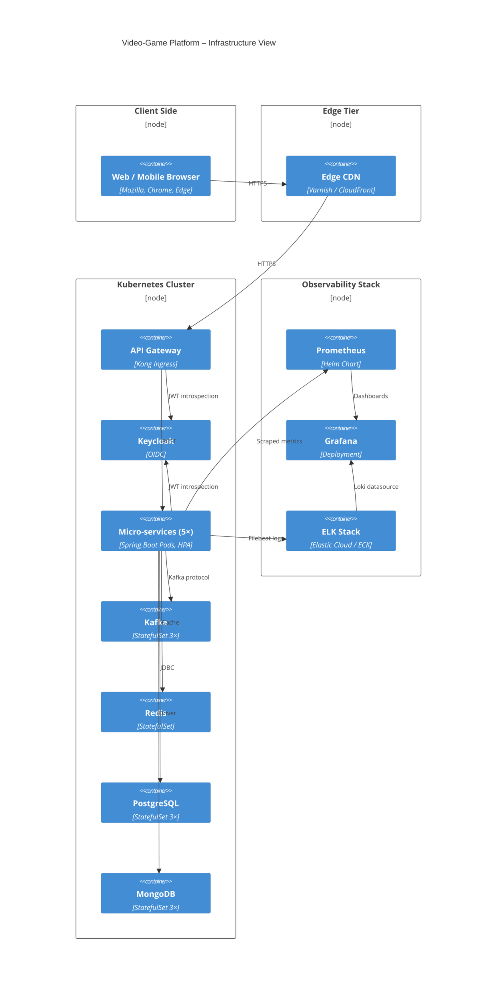

## MERMAID C4 Deployment Diagram



## PLANTUML C4 Deployment Diagram

```puml
@startuml
!includeurl https://raw.githubusercontent.com/plantuml-stdlib/C4-PlantUML/master/C4_Deployment.puml
LAYOUT_WITH_LEGEND()

Deployment_Node(browser, "Web / Mobile Browser") {
    Deployment_Node(edge, "Edge CDN", "CloudFront") {
        Container(cdn,"Edge CDN")
    }
}

Deployment_Node(k8s, "Managed Kubernetes Cluster") {
    Deployment_Node(ns, "namespace: videogame") {
        Container(apiGw,   "API Gateway",   "Kong Ingress", "1-3 replicas")
        Container(keycloak,"Keycloak",      "OIDC",         "2 replicas")
        Container(userPod, "User Svc Pod",  "Spring Boot",  "HPA 2-10")
        Container(gamePod, "Game Svc Pod",  "Spring Boot",  "HPA 2-10")
        Container(ratingPod,"Rating Svc Pod","Spring Boot", "HPA 2-10")
        Container(reviewPod,"Review Svc Pod","Spring Boot", "HPA 2-10")
        Container(launchPod,"Launch Svc Pod","Spring Boot", "HPA 2-6")
        ContainerDb(pg,    "PostgreSQL", "3-node StatefulSet")
        ContainerDb(mongo, "MongoDB",    "3-node StatefulSet")
        ContainerQueue(kafka,    "Kafka",      "3-node StatefulSet")
        ContainerQueue(redis,    "Redis",      "StatefulSet")
    }
}

Deployment_Node(obs, "Observability Stack") {
    Container(prom,"Prometheus")
    Container(graf,"Grafana")
    Container(elk, "ELK Stack")
}

Rel(browser, cdn,    "HTTPS")
Rel(cdn,     apiGw,  "HTTPS")
Rel(apiGw,   keycloak,"JWT introspection")
Rel(apiGw,   userPod,"REST")
Rel(userPod, pg,     "JDBC")
Rel(ratingPod, kafka,"rating-created")
Rel(userPod, prom,   "metrics")
Rel_L(prom, graf,    "dashboards")
Rel(elk, graf,       "Loki datasource")
SHOW_LEGEND()
@enduml

```
