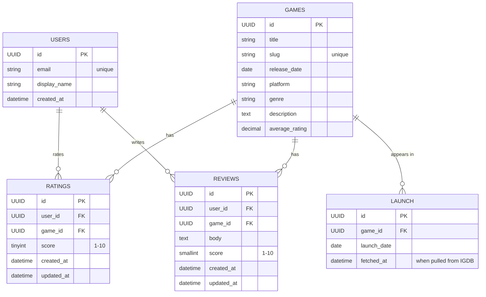

```mermaid
erDiagram
    USERS {
        UUID  id PK
        string email  "unique"
        string display_name
        datetime created_at
    }

    GAMES {
        UUID  id PK
        string title
        string slug  "unique"
        date   release_date
        string platform
        string genre
        text   description
        decimal average_rating
    }

    RATINGS {
        UUID     id PK
        UUID     user_id  FK
        UUID     game_id  FK
        tinyint  score  "1-10"
        datetime created_at
        datetime updated_at
    }

    REVIEWS {
        UUID     id PK
        UUID     user_id  FK
        UUID     game_id  FK
        text     body
        smallint score  "1-10"
        datetime created_at
        datetime updated_at
    }

    LAUNCH {
        UUID   id PK
        UUID   game_id FK
        date   launch_date
        datetime fetched_at  "when pulled from IGDB"
    }

    USERS  ||--o{ RATINGS  : "rates"
    USERS  ||--o{ REVIEWS  : "writes"
    GAMES  ||--o{ RATINGS  : "has"
    GAMES  ||--o{ REVIEWS  : "has"
    GAMES  ||--o{ LAUNCH : "appears in"
```
