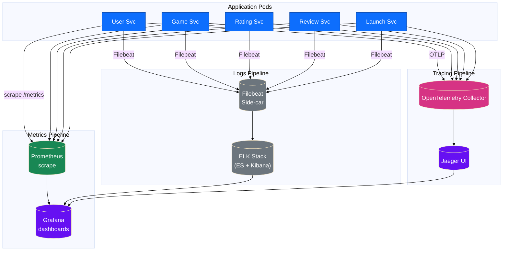
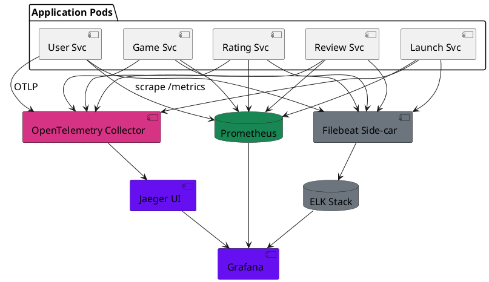

## MERMAID DIAGRAM

```mermaid
%%{init:{
  "theme":"base",
  "themeVariables":{"fontSize":"18px"},
  "flowchart":{"rankSpacing":60,"nodeSpacing":50}
}}%%
flowchart TD
    subgraph "Application Pods"
        direction TB
        svc1["User Svc"]:::svc
        svc2["Game Svc"]:::svc
        svc3["Rating Svc"]:::svc
        svc4["Review Svc"]:::svc
        svc5["Launch Svc"]:::svc
    end

    subgraph "Metrics Pipeline"
        prom[("Prometheus<br/>scrape")]:::metric
        graf[("Grafana<br/>dashboards")]:::ui
    end

    subgraph "Logs Pipeline"
        filebeat[("Filebeat<br/>Side-car")]:::log
        elk[("ELK Stack<br/>(ES + Kibana)")]:::log
    end

    subgraph "Tracing Pipeline"
        otel[("OpenTelemetry&nbsp;Collector")]:::trace
        jaeger[("Jaeger UI")]:::ui
    end

    classDef svc    fill:#0d6efd,color:#fff,stroke:#003d9c;
    classDef metric fill:#198754,color:#fff;
    classDef log    fill:#6c757d,color:#fff;
    classDef ui     fill:#6610f2,color:#fff;
    classDef trace  fill:#d63384,color:#fff;

    %% flows
    svc1 -->|scrape /metrics| prom
    svc2 --> prom
    svc3 --> prom
    svc4 --> prom
    svc5 --> prom

    svc1 -- Filebeat --> filebeat
    svc2 -- Filebeat --> filebeat
    svc3 -- Filebeat --> filebeat
    svc4 -- Filebeat --> filebeat
    svc5 -- Filebeat --> filebeat
    filebeat --> elk

    svc1 -- OTLP --> otel
    svc2 --> otel
    svc3 --> otel
    svc4 --> otel
    svc5 --> otel
    otel --> jaeger

    prom --> graf
    elk  --> graf
    jaeger --> graf
```

## PLANTUML DIAGRAM

```puml
@startuml
skinparam defaultFontSize 16
hide empty description

package "Application Pods" {
    component "User Svc"    as U
    component "Game Svc"    as G
    component "Rating Svc"  as R
    component "Review Svc"  as V
    component "Launch Svc"  as L
}

database "Prometheus" as Prom #198754
component "Grafana"   as Graf #6610f2
database "ELK Stack"  as ELK  #6c757d
component "Filebeat Side-car" as FB #6c757d
component "OpenTelemetry Collector" as OT #d63384
component "Jaeger UI" as J   #6610f2

U --> Prom : scrape /metrics
G --> Prom
R --> Prom
V --> Prom
L --> Prom

U --> FB
G --> FB
R --> FB
V --> FB
L --> FB
FB --> ELK

U --> OT : OTLP
G --> OT
R --> OT
V --> OT
L --> OT
OT --> J

Prom --> Graf
ELK  --> Graf
J    --> Graf
@enduml

```
