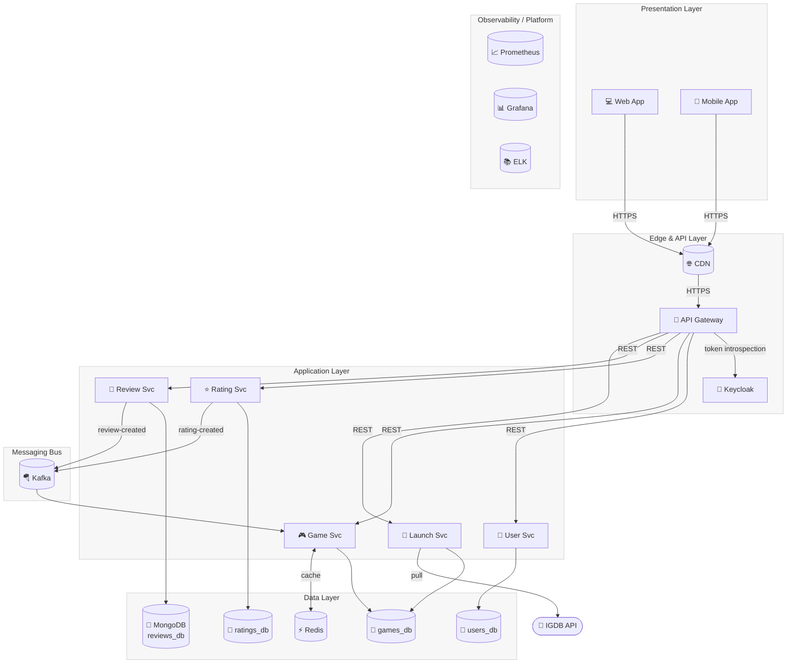
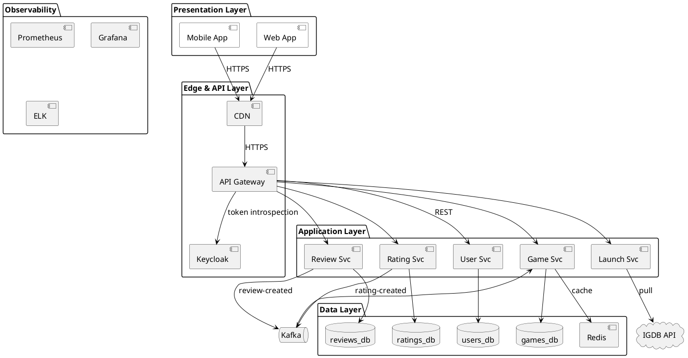

## MERMAID DIAGRAM

```mermaid
flowchart TD
    %% ───────── PRESENTATION ─────────
    subgraph PL["Presentation Layer"]
        direction TB
        WebApp["💻 Web App"]
        MobileApp["📱 Mobile App"]
    end
    %% ───────── EDGE/API ──────────
    subgraph EA["Edge & API Layer"]
        direction TB
        CDN[("🌐 CDN")]
        API["🚪 API Gateway"]
        Auth["🔐 Keycloak"]
        API -->|"token introspection"| Auth
    end

    %% ────── APPLICATION ───────
    subgraph AL["Application Layer"]
        direction BT
        UserSvc["👤 User Svc"]
        GameSvc["🎮 Game Svc"]
        RatingSvc["⭐ Rating Svc"]
        ReviewSvc["📝 Review Svc"]
        LaunchSvc["🚀 Launch Svc"]
    end

    %% ─────── MESSAGING ────────
    subgraph MB["Messaging Bus"]
        Kafka[("🪂 Kafka")]
    end

    %% ───────── DATA ───────────
    subgraph DL["Data Layer"]
        direction TB
        PgUsers[("🐘 users_db")]
        PgGames[("🐘 games_db")]
        PgRatings[("🐘 ratings_db")]
        Redis[("⚡ Redis")]
        Mongo[("🍃 MongoDB<br/>reviews_db")]
    end

    %% ───── OBSERVABILITY ──────
    subgraph OBS["Observability / Platform"]
        Prom[("📈 Prometheus")]
        Graf[("📊 Grafana")]
        ELK[("📚 ELK")]
    end

    IGDB(["🎯 IGDB API"])

    %% communications (unchanged, condensed)
    WebApp -->|HTTPS| CDN
    MobileApp -->|HTTPS| CDN
    CDN -->|HTTPS| API
    API -->|REST| UserSvc & GameSvc & RatingSvc & ReviewSvc & LaunchSvc
    UserSvc  --> PgUsers
    GameSvc  --> PgGames
    RatingSvc--> PgRatings
    ReviewSvc--> Mongo
    LaunchSvc--> PgGames
    GameSvc  <-->|cache| Redis
    RatingSvc -->|rating-created| Kafka
    ReviewSvc -->|review-created| Kafka
    Kafka --> GameSvc
    LaunchSvc -->|pull| IGDB
    classDef layer fill:#f7f7f7,stroke:#ccc,stroke-width:1px
    class PL,EA,AL,MB,DL,OBS layer
```

## PLANTUML DIAGRAM

```puml
@startuml
' ─── styling ───────────────────────────────────────────────────────
skinparam defaultFontSize 16
skinparam rectangle {
  BackgroundColor #f7f7f7
  BorderColor #cccccc
}
skinparam arrowColor black
hide empty description

' ─── presentation layer ────────────────────────────────────────────
package "Presentation Layer" {
    [Web App] as WebApp #White
    [Mobile App] as MobileApp #White
}

' ─── edge / api layer ──────────────────────────────────────────────
package "Edge & API Layer" {
    [CDN] as CDN
    [API Gateway] as APIG
    [Keycloak] as Auth
    APIG --> Auth : token introspection
}

' ─── application layer ────────────────────────────────────────────
package "Application Layer" {
    [User Svc] as UserSvc
    [Game Svc] as GameSvc
    [Rating Svc] as RatingSvc
    [Review Svc] as ReviewSvc
    [Launch Svc] as LaunchSvc
}

' ─── data layer ────────────────────────────────────────────────────
package "Data Layer" {
    database "users_db" as PgUsers
    database "games_db" as PgGames
    database "ratings_db" as PgRatings
    database "reviews_db" as Mongo
    [Redis] as Redis
}

' ─── messaging / obs ───────────────────────────────────────────────
queue "Kafka" as Kafka
cloud "IGDB API" as IGDB
package "Observability" {
    [Prometheus] as Prom
    [Grafana] as Graf
    [ELK] as ELK
}

' ─── flows ─────────────────────────────────────────────────────────
WebApp  --> CDN : HTTPS
MobileApp --> CDN : HTTPS
CDN --> APIG : HTTPS
APIG --> UserSvc  : REST
APIG --> GameSvc
APIG --> RatingSvc
APIG --> ReviewSvc
APIG --> LaunchSvc

UserSvc  --> PgUsers
GameSvc  --> PgGames
RatingSvc--> PgRatings
ReviewSvc--> Mongo
GameSvc  --> Redis : cache
RatingSvc --> Kafka : rating-created
ReviewSvc --> Kafka : review-created
Kafka --> GameSvc
LaunchSvc --> IGDB : pull
@enduml
```