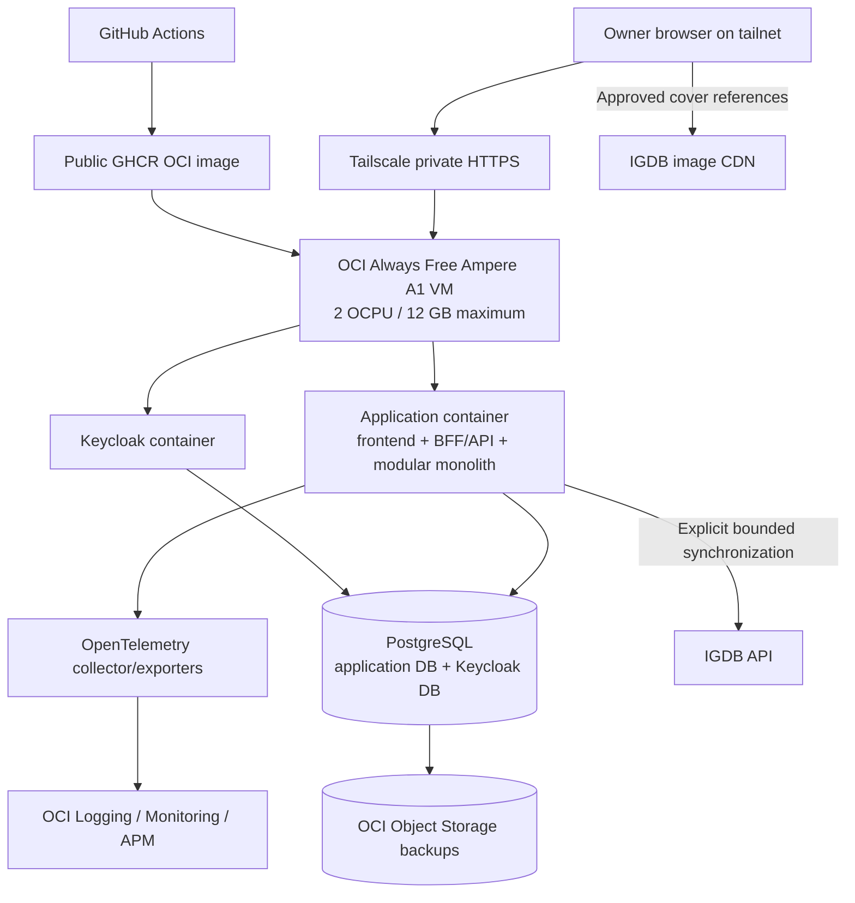

# Learning MVP platform and delivery design

- **Status:** Approved
- **Version:** 1.3
- **Owner:** Ruben Hernandez
- **Last updated:** 2026-08-09
- **Approval:** Owner-approved for the private, non-commercial learning MVP
- **Phase:** MVP implementation after completed Phase 1 solution definition
- **Scope:** Private, non-commercial learning MVP
- **Solution architecture:** [Learning MVP solution architecture](../mvp-solution-architecture.md)
- **OpenAPI:** [Browser-facing API contract](../api/openapi.yaml)
- **Delivery lifecycle:** [Learning MVP delivery lifecycle](../../development/delivery-lifecycle.md)
- **Hosting decision:** [ADR-0005](../../decisions/0005-host-private-dev-on-oci-always-free.md)
- **Database decision:** [ADR-0006](../../decisions/0006-use-postgresql-and-versioned-forward-migrations.md)
- **Identity decision:** [ADR-0007](../../decisions/0007-use-keycloak-as-the-initial-identity-provider.md)
- **Delivery tooling decision:** [ADR-0008](../../decisions/0008-use-github-actions-and-ghcr-for-initial-delivery.md)
- **Observability decision:** [ADR-0009](../../decisions/0009-use-opentelemetry-compatible-instrumentation.md)
- **Technology baseline:** [Learning MVP technology baseline](../technology/mvp-technology-baseline.md)

> This document turns the approved logical architecture into the minimum platform
> needed to build, deploy, observe, and recover one private vertical slice. It owns
> technical platform behaviour; the delivery lifecycle owns human workflow and gates.

## 1. Objectives and boundaries

The platform optimizes for reproducibility, zero recurring monetary cost, safe change,
private access, observable failure, data recovery, portability, and useful enterprise
cloud learning without introducing distributed architecture.

It is authoritative for:

- environment purposes and topology;
- build artefacts and deployment mechanics;
- configuration, secrets, persistence, migrations, backup, and recovery;
- health, observability, network, and infrastructure-as-code requirements.

The [delivery lifecycle](../../development/delivery-lifecycle.md) owns readiness,
branches, pull requests, review, quality gates, approval, release records, and the
Definition of Done. A future operations runbook will contain exact commands only after
they have been implemented and tested.

`MUST` is mandatory, `SHOULD` is the expected default with a documented reason for
deviation, and `MAY` is optional.

## 2. Scope

Included:

- local development on Ubuntu under WSL2 with containerized dependencies;
- ephemeral CI dependencies;
- one persistent private `dev` environment;
- one OCI application image containing frontend, BFF/API, and modular monolith;
- PostgreSQL, Keycloak, explicit migrations, secrets, health, telemetry, backup,
  restore, and application rollback;
- GitHub Actions, GHCR, Terraform-based infrastructure, and private Tailscale access.

Deferred until a measured trigger exists:

- public production, staging, multiple replicas, high availability, multi-region;
- Kubernetes, service mesh, API Management, brokers, distributed cache, search engine,
  multiple application databases, and independently deployed business services;
- automatic catalogue schedules, canary/blue-green delivery, formal SLOs, and on-call.

The provider release-mode gate still prohibits public deployment, monetization,
copied/stored provider images, redistribution, and broad unattended synchronization.

## 3. Accepted platform decisions

| Decision | Accepted implementation | Record |
|---|---|---|
| Environments | `local`, ephemeral `test`, persistent private `dev`; production deferred | This document |
| Application artefact | One immutable multi-architecture OCI image | [ADR-0008](../../decisions/0008-use-github-actions-and-ghcr-for-initial-delivery.md) |
| CI and registry | GitHub Actions and public GHCR package linked to the public repository | [ADR-0008](../../decisions/0008-use-github-actions-and-ghcr-for-initial-delivery.md) |
| Remote hosting | OCI Always Free Ampere A1 VM in one owner-selected home region | [ADR-0005](../../decisions/0005-host-private-dev-on-oci-always-free.md) |
| Private access | Tailscale Personal with MagicDNS/HTTPS; no public application ingress | [ADR-0005](../../decisions/0005-host-private-dev-on-oci-always-free.md) |
| Persistence | One PostgreSQL server with isolated application and Keycloak databases/roles | [ADR-0006](../../decisions/0006-use-postgresql-and-versioned-forward-migrations.md) |
| Identity | Separately operated Keycloak process using OIDC Authorization Code with PKCE | [ADR-0007](../../decisions/0007-use-keycloak-as-the-initial-identity-provider.md) |
| Schema evolution | Ordered immutable forward migrations; destructive changes use expand/contract | [ADR-0006](../../decisions/0006-use-postgresql-and-versioned-forward-migrations.md) |
| Observability | OpenTelemetry-compatible instrumentation exported initially to OCI services | [ADR-0009](../../decisions/0009-use-opentelemetry-compatible-instrumentation.md) |
| Infrastructure | Terraform configuration in the repository; remote state and applies are serialized | [ADR-0005](../../decisions/0005-host-private-dev-on-oci-always-free.md) |
| Synchronization | Manual internal command before any schedule | [ADR-0004](../../decisions/0004-synchronize-and-serve-local-catalogue-data.md) |

The technology baseline is approved. It selects supported application runtime and
framework versions, build and dependency management, frontend delivery, persistence
and migration tooling, test tooling, local orchestration, version maintenance, and
explicit `linux/amd64` and `linux/arm64` verification as one coherent set. ADR-0010
through ADR-0012 record only the durable backend, persistence-tooling, and frontend
choices; inherited platform decisions remain in ADR-0005 through ADR-0009.

## 4. Environment model

| Environment | Lifetime | Purpose | Data | Access |
|---|---|---|---|---|
| `local` | Developer-controlled | Fast development, debugging, component and journey tests | Seeded/disposable | Windows/WSL host only |
| `test` | One CI job | Contract, integration, migration, security, and acceptance tests | Generated fixtures | CI runner only |
| `dev` | Persistent but recoverable | Real HTTPS, identity, deployment, migrations, telemetry, and owner acceptance | Non-sensitive learning data | Owner tailnet only |
| `production` | Deferred | Public or real-user release | Undefined | Prohibited |

`dev` is an integration and owner-acceptance environment. Deploying to it does not
automatically create a named release. A release requires the explicit record defined
by the delivery lifecycle.

The local environment SHOULD provide one repository command to start the application,
PostgreSQL, and Keycloak. Docker Desktop WSL integration is enabled when containerized
implementation begins. CI uses fixtures and MUST NOT require live IGDB credentials.

## 5. Private dev topology



The VM may use a public OCI address for outbound connectivity, but OCI network rules
MUST deny public application, database, identity, telemetry, and SSH ingress. Owner
access uses Tailscale policy and HTTPS. Administrative access uses Tailscale SSH or a
similarly private path; it is never exposed to the internet.

Tailscale is an access boundary, not product authentication. Keycloak and backend
authorization remain required. The app and identity routes may share the private host
through separate paths or ports, but only the application origin exposes `/api/v1/**`.

## 6. Zero-cost constraint

The design uses only resources marked Always Free or free for the current public,
non-commercial repository. The limits were verified on 2026-08-03 and MUST be checked
again before provisioning:

- OCI Ampere A1: at most 2 OCPUs and 12 GB memory in the tenancy;
- OCI block volumes: at most 200 GB total, including boot volumes;
- OCI Object Storage: at most 20 GB for backups;
- OCI Logging: at most the Always Free monthly allowance;
- GitHub Actions: standard hosted runners for the public repository;
- GHCR: public container image storage and bandwidth under the current free policy;
- Tailscale Personal: non-commercial free plan limits.

The OCI account MUST remain an Always Free account unless the owner separately approves
a paid account. Do not provision trial-only resources, paid shapes, managed PostgreSQL,
NAT Gateway, paid DNS, paid runners, or paid observability. Infrastructure code MUST
constrain shapes and sizes; automatic scaling is disabled. Budget alerts are useful
but are soft alerts and do not replace these hard resource restrictions.

Free tiers may change and capacity is not guaranteed. If an eligible A1 shape is
unavailable, wait or use local `dev`; do not silently select a paid shape. Oracle may
reclaim idle instances, so the environment is treated as rebuildable and persistent
state is backed up outside the VM. Artificial load MUST NOT be generated to avoid idle
reclamation.

Official evidence and alternatives are recorded in
[ADR-0005](../../decisions/0005-host-private-dev-on-oci-always-free.md).

## 7. Build and artefact

The source-to-image flow is:

```text
reviewed commit -> tests -> frontend/backend build -> OCI image -> scan -> GHCR -> dev
```

The image MUST:

- contain the compiled frontend, BFF/API, modular monolith, and version metadata;
- support `linux/arm64` for OCI Ampere A1 and SHOULD also support `linux/amd64` for
  developer and migration portability;
- run as a non-root user from a minimal supported base image;
- contain no environment configuration, secrets, provider payloads, or copied provider
  image binaries;
- be identified by commit SHA and content digest; `latest` is never the deployment
  reference;
- receive dependency and vulnerability scanning before publication.

Publishing a public container is acceptable because the repository is public and the
image contains no private configuration or data. A change in repository/package
visibility or GHCR pricing reopens ADR-0008.

## 8. Configuration and secrets

Configuration is injected at runtime and documented in `.env.example` or an equivalent
reference. Missing or invalid security-critical configuration fails startup clearly.
Logs may show safe effective configuration categories but never secret values.

OCI Vault or an equivalently protected runtime source stores remote secrets. At
minimum, protect database credentials, Keycloak bootstrap/administration credentials,
OIDC client secret, session/CSRF keys, IGDB credentials, Tailscale authentication
material, OCI deployment identity, and telemetry keys.

Secrets MUST be independently rotatable, least-privileged, absent from Terraform
state where possible, and different between local and `dev`. A future runbook will
record rotation procedures after exact commands exist.

## 9. PostgreSQL, migrations, and recovery

One PostgreSQL server runs in `dev`, with separate databases and least-privilege roles
for the application and Keycloak. Catalogue and Ratings retain their logical ownership
inside the application database; modules do not query each other's tables directly.

Every application schema change is an ordered immutable migration. CI proves creation
from an empty database and, once versions exist, upgrade from the last supported
schema. One deployment actor runs migrations before application replacement.
Destructive changes use expand/contract and require an explicit backup and recovery
plan. Application rollback never assumes database rollback is safe.

Backups MUST:

- run before destructive maintenance and at least weekly while meaningful ratings or
  curation state exists;
- include application data and the Keycloak database/configuration needed to restore
  identity mappings;
- be encrypted and stored outside the VM in OCI Object Storage within the free limit;
- include environment, timestamp, PostgreSQL version, and schema/application version;
- be retained only while useful and tested through an isolated restore after initial
  setup and after material changes.

The catalogue can be synchronized again, but ratings, identity mapping, and
product-owned curation are not assumed disposable.

## 10. CI and deployment mechanics

The delivery lifecycle defines required gates and approvals. Technically, GitHub
Actions:

1. validates documentation and OpenAPI;
2. runs the implementation checks that exist;
3. builds and scans the multi-architecture image;
4. publishes the immutable image to GHCR from trusted `main`;
5. makes its digest eligible for a manually approved `dev` deployment.

The initial deployment sequence is:

```text
select digest
  -> validate Always Free target and secret references
  -> confirm recovery preconditions
  -> run one serialized migration job
  -> replace application container
  -> wait for readiness
  -> run smoke and accessibility journey checks
  -> record outcome
  -> accept, forward-fix, or restore previous application image
```

Deployments are manual until this sequence and recovery are proven. Concurrent `dev`
deployments are prohibited. Deployment credentials use least privilege and are not
available to untrusted pull-request code. A failed new version is never marked
successful merely because the old version remains healthy.

## 11. Health, observability, and privacy

Liveness reports only process viability. Readiness verifies the application can serve
its supported local-data behaviour and reach required local dependencies. IGDB and
telemetry outages MUST NOT make reads unready. Health output does not expose topology,
configuration, secrets, provider payloads, or personal data.

The first slice emits structured logs, W3C trace context, request/error/latency
metrics, deployed version, database/migration state, authentication outcomes without
tokens, rating command outcomes, and catalogue synchronization/freshness state.
Telemetry uses route templates and bounded labels; game IDs, user IDs, tokens,
correlation IDs, cover URLs, and raw errors are not metric labels.

OpenTelemetry-compatible instrumentation keeps the application independent from OCI.
OCI Logging, Monitoring, and the Always Free APM allowance are the initial backend;
local development may use console exporters. Retention is minimized to remain useful,
private, and inside free limits.

Even in private `dev`, collect only the identity data needed to map validated
`issuer + subject` to `UserId`. Do not log tokens, emails, credentials, or rating
ownership details unnecessarily. Identity/rating deletion and retention behaviour
must be defined before any user other than the owner is invited.

Accessibility remains part of deployed journey acceptance as specified by the
[delivery lifecycle](../../development/delivery-lifecycle.md), not a future production
enhancement.

## 12. Synchronization and failure guarantees

Catalogue synchronization starts as an explicit internal command. Scheduling is
introduced only after the command, freshness rules, telemetry, and recovery are
stable. The command MUST fetch only bounded references, validate before publication,
stage new candidates, preserve cover approval, and keep the previous valid snapshot
on failure.

| Failure | Required behaviour |
|---|---|
| IGDB unavailable or rate-limited | User reads continue from local data; sync records failure |
| Cover CDN unavailable | Product fallback appears; game remains visible |
| No valid catalogue snapshot | Contracted `CATALOGUE_NOT_READY`; no request-path IGDB call |
| Migration fails | New application is not activated; recovery is explicit |
| New application fails readiness/smoke | Previous image remains or is redeployed when schema-compatible |
| Backup fails | Recoverability is reported as failed; no false successful release |
| OCI VM is reclaimed | Reprovision from IaC, restore durable state, and verify the journey |

## 13. Infrastructure as code and portability

Terraform configuration in a future `infra/` directory defines the OCI compartment,
network, Always Free VM and storage, IAM, Vault bindings, telemetry, backup resources,
and outputs needed by deployment. Secret values and state are not committed. Applies
are serialized and destructive plans require owner inspection.

Portability is intentional:

- application and Keycloak run as standard OCI containers;
- PostgreSQL uses portable logical backups and standard SQL/migrations;
- application telemetry uses OpenTelemetry rather than OCI-only APIs;
- Tailscale access can be replaced by another private ingress;
- hosting-specific code remains in infrastructure adapters and deployment files.

OCI replacement is required if Always Free changes, capacity remains unavailable,
reclamation becomes disruptive, resource limits block the journey, or public release
changes security/legal requirements. Migration changes infrastructure and telemetry
exporters, not domain or API contracts.

## 14. Implementation sequence

1. **Technology baseline — complete:** approved version lines, maintenance policy,
   quality toolset, durable ADRs, and an explicit executable compatibility gate.
2. **Local skeleton — in progress:** the application foundations, local PostgreSQL
   and Keycloak topology, SQL-first Flyway migrations, deterministic seed, and
   PostgreSQL 18 persistence tests are executable. Add version, liveness, readiness,
   identity integration, the complete CI gate, combined packaging, and
   `linux/amd64`/`linux/arm64` application compatibility.
3. **First public read:** implement `GET /api/v1/releases` against PostgreSQL and prove
   `CATALOGUE_NOT_READY` without live request-path IGDB calls.
4. **Delivery:** build and scan `linux/arm64`/`linux/amd64` image; publish digest to
   public GHCR from `main`.
5. **Infrastructure:** verify current free terms and A1 capacity; provision reviewed
   OCI/Tailscale `dev` with Terraform and no paid resource.
6. **Remote acceptance:** deploy manually, migrate, smoke test, verify telemetry,
   backup, isolated restore, and application rollback.
7. **Complete journey:** add bounded synchronization, Keycloak/BFF flow, rating CRUD,
   `Mis puntuaciones`, accessibility, concurrency, CSRF, and degraded-state tests.
8. **Runbook:** record only proven commands for deployment, backup, restore, rotation,
   diagnostics, and recovery.

## 15. Re-evaluation triggers

| Capability or decision | Trigger |
|---|---|
| Different hosting | OCI free terms/capacity/reclamation or limits block reliable learning |
| Public production | Provider, legal, privacy, security, cost, support, and real-user release approved |
| Staging | Production exists and `dev` cannot safely represent release validation |
| Managed PostgreSQL | Operational burden or recovery risk exceeds the accepted zero-cost constraint |
| Multiple replicas/session store | Measured availability/load requires replication |
| Kubernetes | Several independently operated components need orchestration, not merely learning interest |
| API Management/broker/cache/search | An approved use case or measured limitation requires it |
| Automatic synchronization/deployment | Manual workflow is stable, measured, and repetitive |
| Formal SLO/on-call | Real users and an actual response capability exist |

## 16. Change history

| Version | Date | Change | Owner |
|---|---|---|---|
| 1.3 | 2026-08-09 | Recorded the executable module-owned catalogue schema, immutable Flyway migration, separated development seed, and PostgreSQL 18 Testcontainers evidence while keeping remote migration and recovery work open. | Ruben Hernandez |
| 1.2 | 2026-08-08 | Recorded the executable application foundations and local PostgreSQL/Keycloak topology while keeping the broader walking-skeleton compatibility gate open. | Ruben Hernandez |
| 1.1 | 2026-08-04 | Linked the approved technology baseline, closed its selection gate, and made multi-architecture walking-skeleton evidence the next implementation step. | Ruben Hernandez |
| 1.0 | 2026-08-03 | Approved the minimum zero-cost platform, selected OCI Always Free with private Tailscale access, removed lifecycle duplication, and linked durable decisions to ADR-0005 through ADR-0009. | Ruben Hernandez |
