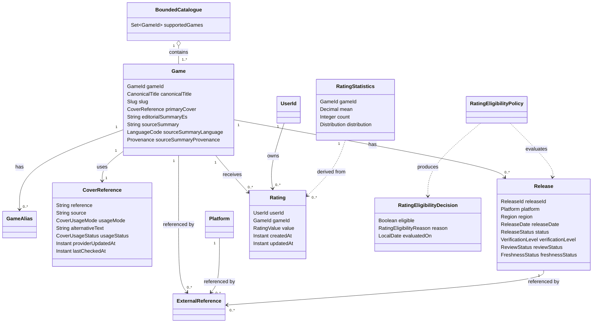

# Learning MVP Domain Model

- **Status:** Approved
- **Version:** 1.1
- **Owner:** Ruben Hernandez
- **Last updated:** 2026-07-30
- **Approval:** Owner-approved for the private, non-commercial learning MVP
- **Phase:** 1 — MVP solution definition
- **Scope:** Learning MVP
- **Product Brief:** [Product Brief v0.7](../../product/product-brief.md)
- **Story map:** [Learning MVP story map](../../product/mvp-story-map.md)
- **Provider spike:** [Game-data-provider spike](../../research/game-data-providers-spike.md)
- **Provider evidence:** [First authenticated IGDB PoC](../../research/igdb-poc-results.md)

> This document defines the minimum provider-independent domain model for the
> approved learning MVP. It is a conceptual contract, not a database schema, Java
> class model, API specification, or deployment design.

## 1. Purpose

This document translates the approved Product Brief and story map into shared domain
concepts, relationships, invariants, policies, and boundaries.

It supports one complete journey:

```text
release discovery
    -> game page
    -> personal rating
    -> Mis puntuaciones
```

The model guides the application use cases, API contract, persistence model,
provider normalization, authorization rules, and automated tests. It remains
independent from IGDB, HTTP, Spring, PostgreSQL, OIDC, and other implementation
technologies.

## 2. Scope

### 2.1 Included

- A deliberately bounded video-game catalogue.
- Canonical and alternative game titles.
- A displayable primary cover for every catalogue-visible game.
- Provider-hosted covers referenced from the IGDB CDN without copying provider
  image binaries.
- Recent and upcoming commercial releases.
- Platform and region release context.
- Imprecise, unknown, delayed, and cancelled release information.
- Data provenance, verification level, review status, and freshness.
- Internal identity independent from IGDB.
- One active integer rating from 1 to 10 per user and game.
- Rating eligibility after commercial release.
- Create, update, and delete rating behaviour.
- Aggregate arithmetic mean, count, and 1–10 distribution.
- Retrieval and maintenance of the signed-in user's ratings.

### 2.2 Deferred

- Written reviews, comments, and reactions.
- Personal library, play status, wishlists, and custom lists.
- Recommendations, rankings, and affinity profiles.
- Professional reviews and external scores.
- Platform-specific rating aggregates and verified-play claims.
- Prices, stores, and purchase comparison.
- Exhaustive editions, DLC, expansions, and remasters.
- Multiple simultaneous catalogue providers.
- Community, moderation, and social relationships.

No model element should be introduced solely in anticipation of these capabilities.

### 2.3 Related concept intentionally not implemented

`Availability` is defined only to protect the meaning of `Release`.

Access through Game Pass, PlayStation Plus, a promotion, or a rotating catalogue is
not a commercial release and must never overwrite a release date. Availability is
outside the MVP API, persistence model, and user journey.

## 3. Modelling principles

1. Product concepts define the internal model; external providers do not.
2. Every game has a provider-independent internal identity.
3. External IDs remain references rather than product identity.
4. A game and its platform or regional releases are different concepts.
5. Release date value and release date precision are separate.
6. Unknown information remains explicit; the product does not invent certainty.
7. Provenance, verification, review need, and freshness are separate parts of
   release information.
8. Spanish aliases, editorial content, and fallback visual assets are product-owned
   concerns.
9. Provider-hosted images are referenced, attributed, and delivered from an
   allowlisted provider CDN; provider image binaries are not copied by the product.
10. Every catalogue-visible game resolves to a displayable primary cover.
11. Personal and aggregate ratings are always separate concepts.
12. Aggregate information is derived from active personal ratings.
13. Time-dependent domain policies receive an explicit evaluation date; they never
    read an implicit system clock or default time zone.
14. Domain rules do not depend on delivery, persistence, or provider technology.
15. Section 9 is the canonical invariant register. Other sections explain or trace
    those invariants rather than define competing rules.
16. Complexity is added only when the approved journey requires it.

## 4. Ubiquitous language

| Term | Definition |
|---|---|
| `Game` | A video-game work with its own identity inside VideoGame Platform. |
| `GameId` | The provider-independent internal identifier of a game. |
| `ReleaseId` | The provider-independent internal identifier of a normalized release. |
| `CanonicalTitle` | The primary product title used to identify and display a game. |
| `GameAlias` | An alternative, historical, regional, or localized title that resolves to one game. |
| `CoverReference` | The approved external or product-owned visual reference used as a game's primary cover. |
| `CoverUsageMode` | `provider_cdn_reference` or `product_owned`; it defines how the image may be delivered in the current release mode. |
| `CoverUsageStatus` | `approved`, `pending_review`, or `unavailable`. |
| `Release` | A commercial release of one game for one platform and one region. |
| `Platform` | A normalized product concept representing a release platform. |
| `Region` | The geographic market to which a release applies, or explicit `unknown`. |
| `ReleaseDate` | A valid tagged temporal value: exact day, month, quarter, year, or unknown. |
| `DatePrecision` | The known precision: `day`, `month`, `quarter`, `year`, or `unknown`. |
| `ReleaseStatus` | `announced`, `scheduled`, `released`, `delayed`, `cancelled`, or `unknown`. |
| `Availability` | Access through a subscription, promotion, or rotating catalogue; not a release. |
| `ExternalReference` | A typed link between one internal concept and one external provider identity. |
| `Provenance` | Information identifying the origin of provider-backed data. |
| `Freshness` | Information describing when data was updated, synchronized, or verified. |
| `VerificationLevel` | Evidence level: `provider_only` or `verified`. |
| `ReviewStatus` | Whether the release is usable normally or requires manual review: `not_required` or `required`. |
| `FreshnessStatus` | Derived temporal state: `fresh` or `stale`. |
| `UserId` | The stable authenticated-user identifier supplied by the identity boundary. |
| `Rating` | The active personal score assigned by one user to one game. |
| `RatingValue` | An integer from 1 to 10 inclusive. |
| `RatingEligibilityDecision` | An eligibility result containing the boolean decision, a reason, and the date on which it was evaluated. |
| `RatingStatistics` | Mean, count, and distribution derived from active ratings for one game. |
| `BoundedCatalogue` | The explicitly limited set of curated, supported, and catalogue-visible games in the MVP. |

## 5. Domain boundaries

The MVP has two primary domain boundaries and one supporting external boundary.
These are conceptual modules, not independently deployable services.

```text
Catalogue and Releases
    BoundedCatalogue, Game, GameAlias, CoverReference, Release,
    ReleaseDate, Platform, Region, ExternalReference, Provenance,
    VerificationLevel, ReviewStatus, FreshnessStatus

Ratings
    Rating, RatingValue, RatingEligibilityPolicy,
    RatingEligibilityDecision, RatingStatistics

Identity boundary
    UserId
```

### 5.1 Catalogue and Releases

Owns bounded-catalogue membership, internal game identity, titles, primary-cover
references, normalized platforms and regions, commercial releases, typed dates,
status, external references, provenance, verification, review need, and freshness.

It does not own provider authentication, APICalypse queries, transport DTOs, or raw
IGDB taxonomy.

### 5.2 Ratings

Owns personal rating lifecycle, value validation, eligibility, ownership rules, and
aggregate calculation. It references `GameId` and `UserId` but does not own games or
user accounts.

### 5.3 Identity boundary

Identity is supplied by an established external approach. The domain needs only an
authenticated principal and a stable `UserId`. Credentials, sessions, tokens, and
identity-provider internals are outside this model.

## 6. Conceptual model



The diagram is conceptual. It does not prescribe classes, tables, ORM mappings,
aggregate-loading strategies, or API response shapes.

## 7. Core concepts and rules

### 7.1 BoundedCatalogue

`BoundedCatalogue` is the explicit set of games curated and supported by the MVP.
For this slice, every domain `Game` is a visible member of that catalogue.

Rules:

- Catalogue membership is explicit and product-owned.
- Provider search results and import candidates are not domain games.
- Provider data becomes a `Game` only after identity, required release information,
  and display requirements have passed curation.
- Import staging, rejected candidates, and raw provider records remain in the
  provider adapter or application workflow.
- Search and release discovery return only catalogue members.
- Removing a supported game is an explicit curation decision, never an automatic
  consequence of a provider miss or outage.

This deliberately avoids adding a publication lifecycle that the bounded MVP does
not need. If draft or hidden catalogue entries become a product capability later,
their lifecycle requires a separate decision.

### 7.2 Game

```text
Game
- gameId
- canonicalTitle
- slug
- primaryCover
- aliases[]
- editorialSummaryEs
- sourceSummary
- sourceSummaryLanguage
- sourceSummaryProvenance
- releases[]
- externalReferences[]
```

Rules:

- `gameId` is generated and owned by VideoGame Platform.
- `gameId` is never an IGDB or other provider ID.
- `canonicalTitle` is mandatory and non-blank.
- `slug` is a navigation value, not game identity.
- A title difference alone does not necessarily imply a different game.
- An alias resolves to exactly one game inside the bounded catalogue.
- Spanish aliases may be curated locally when provider coverage is incomplete.
- `editorialSummaryEs` is product-owned content.
- `sourceSummary` preserves source language and provenance.
- Automatic translation is not presented as official provider content.
- External scores and professional ratings are outside the MVP game model.
- Import candidates are not represented as partially valid domain games.
- Every domain game must resolve to an approved primary cover or the
  product-owned fallback cover.
- Provider image references retain provenance and usage approval status.
- A provider image with `pending_review` or `unavailable` status is never displayed.

`genres` and `companies` are deferred until the game-page or search contract proves
that the vertical slice needs them.

### 7.3 CoverReference

```text
CoverReference
- reference
- source
- usageMode
- alternativeText
- usageStatus
- providerUpdatedAt
- lastCheckedAt
```

`source` identifies either the external provider or VideoGame Platform for the
product-owned fallback. For `provider_cdn_reference`, `reference` is the opaque
provider `image_id` needed to construct a documented CDN URL. For `product_owned`,
it is a product-controlled asset reference.

Rules:

- `reference`, `source`, and `alternativeText` are mandatory and non-blank.
- `usageMode` is `provider_cdn_reference` or `product_owned`.
- `usageStatus` is `approved`, `pending_review`, or `unavailable`.
- Only an `approved` reference may be displayed as the real game cover.
- `approved` means approved for the declared usage mode and current release mode; it
  does not assert ownership of third-party artwork.
- Every catalogue-visible game resolves to either an approved real cover or the
  approved product-owned fallback.
- A provider cover is delivered directly from the documented HTTPS provider CDN.
- VideoGame Platform stores the provider image reference and normalized metadata,
  not the provider image binary.
- Provider binaries are not committed, persisted in product storage, proxied as
  product assets, redistributed, or exposed through the product API.
- A provider-hosted cover requires a matching game `ExternalReference` with a source
  page URL so the interface can provide visible attribution and a clear path to IGDB.
- Provider credentials, tokens, and authenticated API URLs never appear in image
  references or reach the browser.
- The delivery layer allowlists the documented IGDB image host and does not accept an
  arbitrary provider-supplied image host.
- The fallback remains visually consistent and does not pretend to be official game
  artwork.
- Provider provenance and update time are retained when supplied.
- `lastCheckedAt` records the last successful reference-resolution check; it is not
  the provider update timestamp.
- A broken, rejected, or legally uncertain provider reference falls back safely
  without making the game undiscoverable.
- Galleries, screenshots, videos, and multiple cover variants are outside the MVP.

### 7.4 GameAlias

```text
GameAlias
- value
- language
- region
- type
- provenance
```

Suggested types:

```text
localized | alternative | historical | abbreviation | product_curated
```

Rules:

- Alias value is mandatory and non-blank.
- Search normalization does not alter the displayed source value.
- Provider and product-curated aliases retain different provenance.
- Alias collisions across games are never resolved silently.
- Collision resolution may remain manual for the bounded MVP.

### 7.5 Release

```text
Release
- releaseId
- gameId
- platform
- region
- releaseDate
- status
- provenance
- providerUpdatedAt
- lastSyncedAt
- lastVerifiedAt
- verificationLevel
- reviewStatus
- freshnessStatus
- externalReferences[]
```

A release is interpreted as one coherent tuple:

```text
Game + Platform + Region + ReleaseDate + Status
```

Rules:

- A release belongs to exactly one game.
- It refers to one normalized platform and one region or explicit `unknown`.
- Date value and precision are valid by construction inside `ReleaseDate`.
- Fields from different provider release records are never merged silently.
- Subscription or catalogue availability never becomes a release.
- Unknown values remain representable.
- A cancelled release is not commercially released.
- A delayed release does not prove eligibility unless another valid release exists.
- Provider values retain provenance and synchronization information.
- Ambiguous or conflicting evidence sets `reviewStatus = required`.
- Freshness does not overwrite verification level or review status.
- The product never displays greater precision than the model contains.

### 7.6 Platform

`Platform` is a normalized product concept, not a provider enum.

Rules:

- It has stable internal identity.
- Provider IDs are external references.
- Normalization preserves commercially meaningful distinctions.
- Generic `PC` must not silently merge DOS and modern Windows when release meaning
  changes.
- Families and generations are added only when required by product behaviour.

### 7.7 Region

Rules:

- Region may be known, worldwide, or explicitly `unknown`.
- Missing provider data never defaults silently to worldwide.
- The MVP may filter by normalized region.
- Internal region identity is independent from provider numeric identifiers.

### 7.8 ReleaseDate and DatePrecision

`ReleaseDate` is a closed value type. Exactly one variant exists:

```text
ExactDate(LocalDate)
MonthPeriod(YearMonth)
QuarterPeriod(Year, Quarter)
YearPeriod(Year)
UnknownDate
```

`DatePrecision` is derived from the variant. API and persistence contracts may expose
the temporal value and precision as separate fields, but they must construct and
validate them atomically.

| Known information | Value | Precision | Valid display example |
|---|---|---|---|
| 26 June 2025 | `2025-06-26` | `day` | `26 de junio de 2025` |
| June 2027 | `2027-06` | `month` | `Junio de 2027` |
| Second quarter 2027 | `2027-Q2` | `quarter` | `Segundo trimestre de 2027` |
| 2028 | `2028` | `year` | `2028` |
| No reliable date | none | `unknown` | `Fecha por confirmar` |

Rules:

- Partial dates are not completed with invented days or months.
- Invalid value-and-precision combinations cannot be constructed.
- `UnknownDate` contains no synthetic temporal value.
- A one-day discrepancy remains visible to reconciliation logic.
- Provider timestamps are normalized using an explicit mapping zone; the JVM,
  database, or host default zone is never used.
- Presentation formatting must preserve the known precision.

### 7.9 ReleaseStatus

| Status | Meaning |
|---|---|
| `announced` | The release is known but no effective schedule is committed. |
| `scheduled` | A future release date or period is expected. |
| `released` | The commercial release has occurred. |
| `delayed` | A previous schedule is no longer effective. |
| `cancelled` | The represented commercial release will not occur. |
| `unknown` | Evidence cannot be mapped confidently to another state. |

The domain supports `unknown`; provider ambiguity must not be forced into a more
specific state.

### 7.10 ExternalReference

```text
ExternalReference
- provider
- entityType
- providerId
- providerUrl
```

Rules:

- `entityType` is `game`, `platform`, or `release` for the MVP.
- Provider ID is a reference, not product identity.
- `(provider, entityType, providerId)` identifies at most one internal concept.
- One external reference never points to more than one internal concept.
- Provider URL is optional and not required for product navigation.
- External-reference conflicts never silently create or merge games.

### 7.11 Provenance, verification, review, and freshness

```text
Provenance
- sourceKind
- sourceName
- sourceEntityType
- sourceEntityId

Freshness
- providerUpdatedAt
- lastSyncedAt
- lastVerifiedAt
```

`sourceKind` is `external_provider`, `product_curated`, or `official_source`.
`Provenance` contains normalized references only; raw provider response objects and
unbounded source records never enter the domain.

| Verification level | Meaning |
|---|---|
| `provider_only` | Normalized from the provider and not manually confirmed. |
| `verified` | Reconciled against an accepted official source. |

| Review status | Meaning |
|---|---|
| `not_required` | No unresolved ambiguity or conflict currently blocks normal use. |
| `required` | Evidence is ambiguous, conflicting, incomplete, or materially changed. |

| Freshness status | Meaning |
|---|---|
| `fresh` | The applicable freshness threshold has not been exceeded. |
| `stale` | The applicable freshness threshold has been exceeded. |

Rules:

- Provenance survives normalization.
- Synchronization time is not provider update time.
- Verification, review need, and freshness change independently.
- `freshnessStatus` is derived from freshness timestamps, the evaluation instant,
  and the operational threshold; it is not persisted as independent truth.
- Staleness alone does not erase a previous verification.
- A conflict sets `reviewStatus = required`; staleness may trigger review according
  to operational policy but remains observable separately.
- The last valid local copy remains usable during provider failure.
- Synchronization failure changes operational state but does not automatically
  invalidate the last known domain data.

The exact stale threshold and whether staleness automatically requests review are
operational policies and are not defined here.

### 7.12 Rating

```text
Rating
- userId
- gameId
- value
- createdAt
- updatedAt
```

Rules:

- It belongs to exactly one authenticated user and one internal game.
- Its domain identity is the pair `userId + gameId`.
- `value` is an integer from 1 to 10 inclusive.
- At most one active rating exists for each `userId + gameId`.
- The first valid operation creates the rating.
- A later valid selection updates the same active rating.
- Deletion removes the rating from active personal and aggregate contexts.
- Only the owner may update or delete it.
- A failed or invalid change preserves the previous valid rating.
- Provider and professional ratings are not personal ratings.

Physical deletion, logical deletion, and audit history are persistence decisions. The
domain result is simply that no active rating remains. A persistence surrogate ID
may exist later, but it is not part of the domain identity or public contract.

### 7.13 RatingStatistics

```text
RatingStatistics
- gameId
- mean
- count
- distribution[1..10]
```

Rules:

- Only active valid personal ratings participate.
- `count` equals the number of active ratings.
- Distribution bucket `n` counts active ratings with value `n`.
- The sum of all buckets equals `count`.
- `mean` is the unweighted arithmetic mean.
- If `count = 0`, no numeric mean exists.
- The exact arithmetic result is rounded to one decimal using `half up` when exposed
  by the product API.
- Spanish presentation uses a decimal comma and no `/10` denominator.
- Personal and aggregate values remain separately labelled.
- Platform-specific aggregates are outside the MVP.

`RatingStatistics` is derived information, not manually editable domain truth.

## 8. Domain policies

### 8.1 RatingEligibilityPolicy

The approved Product Brief allows ratings only after commercial release.

#### Accepted MVP rule

A game is eligible when at least one release independently proves that a commercial
release has occurred. The policy receives the game's releases and an explicit
`evaluationDate`; it never reads the system clock.

The application derives `evaluationDate` using the configured product zone,
`Europe/Madrid` for the Spanish-first MVP. Provider timestamp normalization uses its
own explicit provider-mapping zone and must not reuse the product zone implicitly.

A release proves eligibility only when all applicable conditions are true:

| Dimension | Accepted condition |
|---|---|
| Release status | `released` |
| Review status | `not_required` |
| Date | The threshold below has been reached, or an unknown date is manually verified |
| Verification level | `provider_only` or `verified` for a known date; `verified` for an unknown date |
| Freshness | Does not revoke a historical release fact by itself |

To avoid enabling ratings before an imprecise release has definitely occurred:

| Precision | Eligible from |
|---|---|
| `day` | On or after the represented day. |
| `month` | After the final day of the represented month. |
| `quarter` | After the final day of the represented quarter. |
| `year` | After the final day of the represented year. |
| `unknown` | Only when this release is `released`, `verified`, and does not require review. |

The policy returns:

```text
RatingEligibilityDecision
- eligible
- reason
- evaluatedOn
```

Reasons are stable domain values:

| Reason | Meaning |
|---|---|
| `ELIGIBLE_RELEASE_FOUND` | At least one release independently proves eligibility. |
| `NO_COMMERCIAL_RELEASE` | No commercial release is represented. |
| `RELEASE_NOT_OCCURRED` | All usable releases are future, announced, scheduled, or delayed. |
| `RELEASE_CANCELLED` | All represented commercial releases are cancelled. |
| `RELEASE_DATE_UNCERTAIN` | Date evidence cannot yet prove that release occurred. |
| `RELEASE_REVIEW_REQUIRED` | All otherwise relevant release evidence requires review. |

When no release is eligible, the policy selects one reason in this order:
`RELEASE_REVIEW_REQUIRED`, `RELEASE_NOT_OCCURRED`, `RELEASE_DATE_UNCERTAIN`,
`RELEASE_CANCELLED`, then `NO_COMMERCIAL_RELEASE`. This precedence makes mixed
release sets deterministic without hiding that individual releases retain their own
states.

The MVP uses **global game eligibility**: one qualifying commercial release
on any supported platform and region makes the game rateable. Platform- and
region-specific personal ratings are deferred.

For a known date, `provider_only` evidence is sufficient when the normalized release
is explicitly `released` and does not require review. Manual verification is not
required for every historical release. For an unknown date, explicit verification
is required.

Eligibility is checked for create and update. Delete is always allowed for the
owner. Freshness or review changes never silently delete or modify an existing
rating. If accepted catalogue curation reverses the underlying commercial-release
fact, the game and its ratings require explicit remediation; provider synchronization
must not perform that destructive change automatically.

This accepted direction is part of the MVP domain contract and must be reflected in
the rating API and automated tests.

### 8.2 RatingStatisticsPolicy

For active ratings `r1..rn`:

```text
count = n
mean = sum(rating values) / n
```

When `n = 0`:

```text
count = 0
mean = unavailable
all distribution buckets = 0
```

The domain retains the exact sum and count needed to reproduce the result. The
application or API consistently exposes one decimal using `half up`; Spanish
presentation changes the decimal separator but not the numeric value.

### 8.3 CatalogueSearchPolicy

Minimum search inputs:

- canonical title;
- alternative title;
- localized title;
- product-curated Spanish alias.

Rules:

- Search returns only internal games from the bounded catalogue.
- Raw provider entities are never exposed as product results.
- Provider misses are not silently mapped to another game.
- Zero results are a valid domain outcome.
- Catalogue-boundary state remains distinguishable from technical failure.
- Ambiguous aliases require review rather than arbitrary selection.

Ranking, tokenization, accents, stemming, and fuzzy matching belong to the search
contract or implementation design.

### 8.4 PersonalRatingsQuery

`Mis puntuaciones` is an authenticated application query, not a new domain entity or
personal-library aggregate.

Minimum contract:

- Scope by authenticated `UserId` before applying any search, sort, or pagination.
- Search only the current user's rated catalogue games by canonical title or alias.
- Default ordering is `updatedAt` descending.
- Supported sort keys are `updatedAt`, `canonicalTitle`, and `ratingValue`, in
  ascending or descending direction.
- Use `gameId` as the deterministic final tie-breaker.
- Pagination representation belongs to the API contract.
- Direct edit and delete address the rating by its domain identity
  `authenticated UserId + GameId`; a client-supplied user identity is never trusted.
- If no rating exists in that authenticated scope, the result is
  `RATING_NOT_FOUND`. The command does not inspect or reveal whether another user
  has rated the game, so a separate ownership-forbidden result is not part of this
  identity contract.

## 9. Invariants

This table is the canonical rule register. Explanatory sections and downstream
contracts must reference these IDs and must not redefine them inconsistently.

| ID | Rule |
|---|---|
| `CAT-001` | Every domain `Game` is a curated member of the bounded catalogue. |
| `CAT-002` | Provider results and import candidates do not become domain games before curation succeeds. |
| `CAT-003` | Provider failure or a provider miss never removes a supported game automatically. |
| `GAME-001` | Every game uses an internal provider-independent `GameId`. |
| `GAME-002` | Every game has a non-blank canonical title. |
| `GAME-003` | A slug is not game identity. |
| `GAME-004` | An alias resolves to one internal game and does not create another game by itself. |
| `GAME-005` | Spanish aliases and editorial content retain product ownership and provenance. |
| `GAME-006` | Every catalogue-visible game resolves to an approved primary cover. |
| `GAME-007` | A primary cover is either an approved provider reference or the approved product-owned fallback. |
| `GAME-008` | Provider cover references retain provenance and usage status. |
| `GAME-009` | A cover with `pending_review` or `unavailable` status is never displayed. |
| `GAME-010` | Provider covers use `provider_cdn_reference`; provider image binaries are not copied into product-controlled storage. |
| `GAME-011` | An approved provider cover is delivered only from the allowlisted documented provider image host. |
| `GAME-012` | A provider cover requires visible provider attribution and a clear path to its source game. |
| `GAME-013` | Provider image references never contain credentials, tokens, or authenticated API URLs. |
| `GAME-014` | Failure to resolve a provider cover selects the approved product-owned fallback without hiding the game. |
| `GAME-015` | Cover approval is scoped to a usage mode and release mode and does not assert artwork ownership. |
| `REL-001` | A release belongs to exactly one game. |
| `REL-002` | A release represents one platform and one region or explicit `unknown`. |
| `REL-003` | Release date value and precision form one valid `ReleaseDate` variant and cannot contradict each other. |
| `REL-004` | The product never presents more date precision than is known. |
| `REL-005` | Fields from separate provider release records are never merged silently. |
| `REL-006` | Availability is never represented as commercial release. |
| `REL-007` | A cancelled release never proves rating eligibility. |
| `REL-008` | Provider-backed releases retain provenance, freshness timestamps, verification level, and review status. |
| `REL-009` | Unknown release information remains explicit rather than guessed. |
| `REL-010` | Verification level, review status, and freshness status remain independently observable. |
| `REL-011` | Time-dependent release policies receive an explicit evaluation date or instant and never use a default time zone. |
| `EXT-001` | External provider ID is a reference, not internal identity. |
| `EXT-002` | Provider-specific taxonomy does not become the public product contract. |
| `EXT-003` | Provider failure does not discard the last valid local data. |
| `EXT-004` | An external reference is typed by provider and entity type and maps to at most one internal concept. |
| `RAT-001` | Rating value is an integer from 1 to 10 inclusive. |
| `RAT-002` | At most one active rating exists per user and game. |
| `RAT-010` | Rating domain identity is `UserId + GameId`; a persistence surrogate is not public identity. |
| `RAT-003` | Only an authenticated user may create a rating. |
| `RAT-004` | Only the owner may update or delete a rating. |
| `RAT-005` | Creating or updating a rating requires the game to satisfy `RatingEligibilityPolicy`; owner deletion remains allowed. |
| `RAT-006` | Updating preserves one active rating rather than creating another. |
| `RAT-007` | Deleting removes the rating from personal and aggregate contexts. |
| `RAT-008` | Invalid or failed operations preserve the previous valid state. |
| `RAT-009` | Personal and aggregate ratings are distinct concepts. |
| `AGG-001` | Statistics use only active valid personal ratings. |
| `AGG-002` | Aggregate count equals the sum of distribution buckets. |
| `AGG-003` | No numeric mean exists when count is zero. |
| `AGG-004` | The MVP aggregate is an unweighted arithmetic mean. |
| `AGG-005` | The exposed mean is rounded to one decimal using `half up`. |
| `USR-001` | `Mis puntuaciones` exposes only ratings owned by the authenticated user. |
| `USR-002` | Personal-rating search and sorting are applied only after authenticated-user scoping. |

## 10. State models

### 10.1 Personal rating

```text
Not rated
    | create valid eligible rating
    v
Rated
    | update valid rating -> Rated
    | delete
    v
Not rated
```

Invalid, unauthorized, or failed operations leave the previous valid state
unchanged.

### 10.2 Release data quality

```text
VerificationLevel

provider_only
    | official confirmation
    v
verified

ReviewStatus

not_required
    | conflicting or incomplete evidence
    v
required
    | accepted reconciliation
    v
not_required

FreshnessStatus

fresh
    | freshness threshold exceeded
    v
stale
    | successful refresh within threshold
    v
fresh
```

These axes change independently. Becoming stale never erases whether a release was
provider-only or verified, and resolving a conflict does not fabricate freshness.
Permissions and audit detail belong to later application and operational design.

### 10.3 Cover reference

```text
pending_review
    | approved source, usage mode, host, and attribution path
    v
approved

pending_review or approved
    | broken, replaced, rejected, or no longer allowed
    v
unavailable
```

An unavailable provider reference resolves to the approved product-owned fallback.
Restoring it requires a new successful review; provider synchronization never grants
`approved` status by itself.

## 11. External-provider boundary

```text
IGDB API
    -> IGDB transport mapping
    -> provider normalization
    -> provider-independent domain
    -> application use cases
    -> local persistence and product API
```

Boundary rules:

- Provider credentials never enter the domain or browser.
- Raw provider response types never enter domain use cases.
- Provider enums map defensively to internal concepts.
- Unknown provider values remain explicit and observable.
- Internal IDs are generated independently from provider IDs.
- Typed external references, normalized provenance, and timestamps survive
  normalization.
- Raw provider response objects and unbounded source records stop at the adapter.
- Provider timestamps are normalized with an explicit mapping zone and regression
  tests cover one-day boundaries.
- Spanish aliases may enrich data without mutating provider evidence.
- The browser reads local normalized metadata rather than calling the authenticated
  IGDB API.
- External scores are ignored for the MVP.
- Approved provider covers are resolved from stored `image_id` references and loaded
  directly from the allowlisted IGDB image CDN without provider credentials.
- The product never copies, proxies, commits, persists, or redistributes provider
  image binaries.
- Displays using IGDB covers provide visible attribution and a clear path to the
  corresponding IGDB game source.
- A product-owned fallback cover is used whenever no approved provider cover resolves.
- Fixture-based contract tests detect mapping regressions.

## 12. Worked examples

### 12.1 Released game eligible for rating

```yaml
game:
  gameId: game-01
  canonicalTitle: "Death Stranding 2: On the Beach"
  primaryCover:
    reference: "provider-image-id"
    source: igdb
    usageMode: provider_cdn_reference
    alternativeText: "Portada de Death Stranding 2: On the Beach"
    usageStatus: approved
    lastCheckedAt: 2026-07-29T10:00:00Z
release:
  platform: playstation-5
  region: europe
  releaseDate:
    exactDate: 2025-06-26
  status: released
  verificationLevel: verified
  reviewStatus: not_required
  freshnessStatus: fresh
ratingEligibility:
  eligible: true
  reason: ELIGIBLE_RELEASE_FOUND
  evaluatedOn: 2026-07-29
```

### 12.2 Upcoming release with quarter precision

```yaml
game:
  gameId: game-02
  canonicalTitle: "Example Future Game"
release:
  platform: xbox-series
  region: europe
  releaseDate:
    quarter: 2027-Q2
  status: scheduled
  verificationLevel: provider_only
  reviewStatus: not_required
  freshnessStatus: fresh
ratingEligibility:
  eligible: false
  reason: RELEASE_NOT_OCCURRED
  evaluatedOn: 2026-07-29
```

Valid display: `Segundo trimestre de 2027`.

Invalid display: `1 de abril de 2027`.

### 12.3 Availability is not release

```yaml
availability:
  service: xbox-game-pass
  availableFrom: 2026-08-01
commercialRelease:
  platform: xbox-series
  region: europe
  releaseDate:
    exactDate: 2024-11-15
  status: released
```

The Game Pass date must not overwrite the commercial release date.

### 12.4 Rating update and invalid change

Initial rating:

```yaml
userId: user-123
gameId: game-01
value: 8
```

A valid change to `9` produces one active rating with value `9`. A subsequent invalid
change to `11` is rejected and preserves value `9`.

### 12.5 No ratings

```yaml
ratingStatistics:
  gameId: game-03
  count: 0
  mean: unavailable
  distribution:
    1: 0
    2: 0
    3: 0
    4: 0
    5: 0
    6: 0
    7: 0
    8: 0
    9: 0
    10: 0
```

The product must not display an invented `0.0` mean.

## 13. Traceability to the MVP

| Capability | Concepts and rules |
|---|---|
| Explicit bounded catalogue | `BoundedCatalogue`, `CAT-001`–`CAT-003` |
| Recent and upcoming releases | `Game`, `Release`, `Platform`, `Region`, `ReleaseDate`, `ReleaseStatus` |
| Platform and region filters | normalized `Platform` and `Region` |
| Title and alias search | `CanonicalTitle`, `GameAlias`, `CatalogueSearchPolicy` |
| Correct game page | internal `GameId`, `CoverReference`, coherent release tuple, `ExternalReference` |
| Provider-hosted primary cover | `CoverUsageMode`, `GAME-006`–`GAME-015`, provider boundary |
| Provenance and data quality | `Provenance`, freshness timestamps, `VerificationLevel`, `ReviewStatus`, `FreshnessStatus` |
| Disable rating before release | `RatingEligibilityPolicy`, `RAT-005` |
| Create, update, and delete rating | `Rating`, `RatingValue`, `RAT-001`–`RAT-008`, `RAT-010` |
| Separate personal and aggregate values | `RAT-009`, `RatingStatistics` |
| Mean, count, distribution, and rounding | `AGG-001`–`AGG-005` |
| `Mis puntuaciones` | `UserId`, `PersonalRatingsQuery`, `USR-001`–`USR-002` |
| Provider independence | `GameId`, `ExternalReference`, provider boundary |
| Provider outage tolerance | local normalized data, `EXT-003` |

Authentication return-to-context, journey analytics, structured logs, synchronization
success metrics, and operational visibility are application or delivery concerns.
They remain required by the story map but do not introduce additional domain
entities.

## 14. Domain error vocabulary

HTTP statuses, payloads, and Spanish messages belong to the API contract.

| Code | Meaning |
|---|---|
| `GAME_NOT_FOUND` | No supported internal game exists for the supplied identity. |
| `GAME_OUTSIDE_CATALOGUE` | The requested title is outside the bounded catalogue. |
| `ALIAS_AMBIGUOUS` | An alias resolves to multiple possible games. |
| `RATING_NOT_ELIGIBLE` | Commercial release has not been established under the policy. |
| `RATING_VALUE_INVALID` | Value is not an integer from 1 to 10. |
| `RATING_NOT_FOUND` | No active rating exists for the user and game. |
| `RELEASE_DATA_REVIEW_REQUIRED` | Release data is ambiguous, conflicting, incomplete, or otherwise marked for review. |

Provider timeouts, persistence failures, and authentication-protocol errors are not
domain errors, though the application must translate them into useful behaviour.

## 15. Modelling decisions

| ID | Decision | Direction | Required before | Status |
|---|---|---|---|---|
| `MD-001` | Global or platform/region rating eligibility | Global after one qualifying commercial release | Rating API | Accepted |
| `MD-002` | Imprecise dates and eligibility | Eligible only after the complete represented period; exact dates are eligible on that date | Rating API and tests | Accepted |
| `MD-003` | Aggregate precision in API | Expose one decimal using `half up`; retain exact sum and count | OpenAPI | Accepted |
| `MD-004` | Rating deletion persistence strategy | No active rating after delete; physical deletion, logical deletion, and audit are decided later | Data model | Deferred |
| `MD-005` | Initial platform taxonomy | Support the platforms supplied and permitted by the selected provider for the bounded catalogue, normalized behind internal identities | Provider adapter | Accepted |
| `MD-006` | Release stale threshold | Decide later as an operational synchronization policy; it does not block the domain model | Sync design | Deferred — operational |
| `MD-007` | Alias collision resolution | Reject automatic ambiguity and curate manually | Search use case | Accepted |
| `MD-008` | Release data-quality representation | Model verification level, review need, and freshness as independent dimensions | Domain and provider contracts | Accepted |
| `MD-009` | Time-dependent policy input | Pass an explicit evaluation date using `Europe/Madrid` for product decisions; never use a default zone | Rating API and tests | Accepted |
| `MD-010` | Known-date evidence for rating | Accept `provider_only` when status is `released`, the threshold passed, and review is not required; require `verified` for unknown dates | Rating API and tests | Accepted |
| `MD-011` | Bounded-catalogue lifecycle | Domain games are already curated and visible; import candidates remain outside the domain | Provider adapter | Accepted |
| `MD-012` | External-reference identity | Type references by provider and entity type and map each to at most one internal concept | Provider adapter and data model | Accepted |
| `MD-013` | Provider-cover delivery | Store IGDB `image_id` references and load approved covers directly from the allowlisted provider CDN; do not copy or proxy provider binaries | Provider adapter and frontend | Accepted |
| `MD-014` | Provider-cover attribution | Require visible IGDB attribution and a clear path to the matching source game wherever a provider cover is displayed | Product API and frontend | Accepted |

Accepted directions are part of the MVP domain contract. Deferred decisions do not
block approval of this document, but they must be resolved before the indicated
downstream design. Silent assumptions are not accepted.

`MD-006` is not a business-domain choice. It answers how long synchronized provider
data remains operationally fresh, for example whether an upcoming release becomes
`stale` after 24 hours or several days without refresh. The correct threshold depends
on synchronization frequency, operating cost, and the volatility of each release
window, so it belongs in the synchronization design rather than this model.

## 16. Non-goals

This document does not define:

- REST endpoints, HTTP statuses, or JSON structures;
- database tables, columns, indexes, or migrations;
- Java packages, classes, records, or JPA mappings;
- Spring, React, or identity-provider configuration;
- IGDB queries, credentials, retries, or rate limiting;
- deployment topology, containers, or CI/CD;
- events, queues, caches, or microservices;
- detailed analytics events;
- user-interface components or visual design.

## 17. Acceptance checklist

- [x] The model covers the complete approved MVP journey and no unrelated capability.
- [x] Every domain game is a curated member of the bounded catalogue.
- [x] `Game`, `Release`, and `Availability` have distinct meanings.
- [x] Every catalogue-visible game resolves to an approved real cover or the
  product-owned fallback.
- [x] Cover provenance, alternative text, usage mode, usage status, and last check
  are explicit.
- [x] Provider cover binaries are not copied, proxied, committed, persisted, or
  redistributed.
- [x] Provider-hosted covers use the allowlisted CDN and expose visible attribution
  and a clear path to their source game.
- [x] Internal identity is independent from IGDB.
- [x] Date variants are valid by construction and use explicit evaluation zones.
- [x] Provenance, verification level, review need, and freshness remain independently
  explicit.
- [x] Spanish aliases and editorial content remain product-owned.
- [x] Rating value, ownership, uniqueness, eligibility, update, and delete are explicit.
- [x] Rating eligibility produces a deterministic reason and evaluation date.
- [x] Personal and aggregate ratings are separate concepts.
- [x] Aggregate calculation and no-rating state are explicit.
- [x] Accepted modelling decisions are reflected in downstream contracts.
- [x] Deferred persistence and synchronization decisions are tracked.
- [x] Deferred concepts have not leaked into the MVP model.
- [x] No framework, persistence, or deployment decision is introduced.
- [x] Links resolve from `docs/architecture/domain/mvp-domain-model.md`.
- [x] Repository documentation validation passes.

## 18. Sources

- [Product Brief v0.7](../../product/product-brief.md)
- [Learning MVP story map](../../product/mvp-story-map.md)
- [Game-data-provider spike](../../research/game-data-providers-spike.md)
- [First authenticated IGDB PoC](../../research/igdb-poc-results.md)
- [ADR-0001: Reference IGDB cover images without copying binaries](../../decisions/0001-reference-igdb-cover-images.md)
- [Original product vision](../../reference/video-game-platform-vision.pdf)

## 19. Change history

| Date | Version | Change | Owner |
|---|---|---|---|
| 2026-07-30 | 1.1 | Clarified authenticated rating addressing: commands scope by `UserId + GameId`, return `RATING_NOT_FOUND` when absent, and never reveal another user's rating state. | Ruben Hernandez |
| 2026-07-29 | 1.0 | Approved the minimum domain contract after final review; defined direct IGDB CDN cover references, attribution, allowlisted delivery, reference checks, and product-owned fallback without copying provider binaries. | Ruben Hernandez |
| 2026-07-29 | 0.3 | Made catalogue membership explicit; introduced valid release-date variants and explicit time-zone evaluation; separated verification, review, and freshness; typed external references; completed rating eligibility and personal-rating query rules; clarified aggregate rounding and domain identity; removed unsupported game fields and raw provenance records. Cover rules remain unchanged. | Ruben Hernandez |
| 2026-07-29 | 0.2 | Added mandatory visual coverage through approved primary covers or a product-owned fallback; accepted MD-001, MD-002, MD-003, MD-005, and MD-007; deferred MD-004 and operational MD-006. | Ruben Hernandez |
| 2026-07-29 | 0.1 | Initial model derived from the approved Product Brief, story map, provider spike, and IGDB PoC. | Ruben Hernandez |
