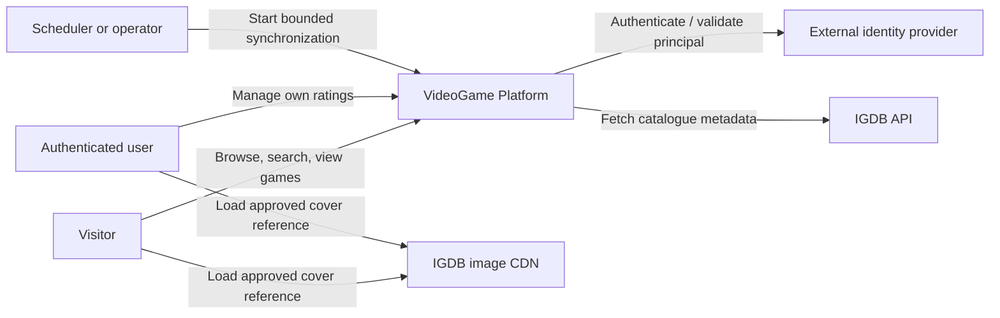
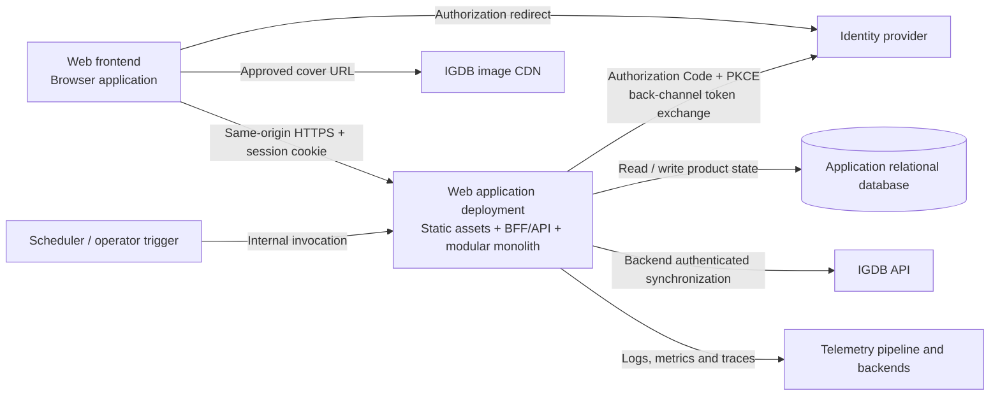
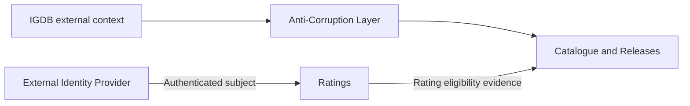
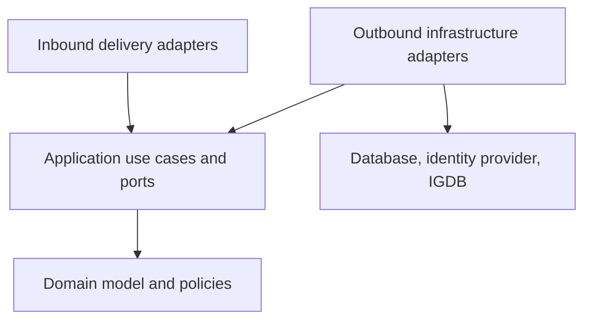
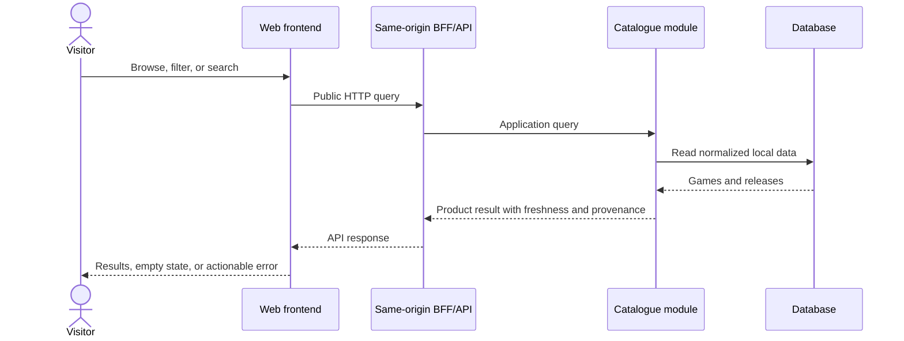
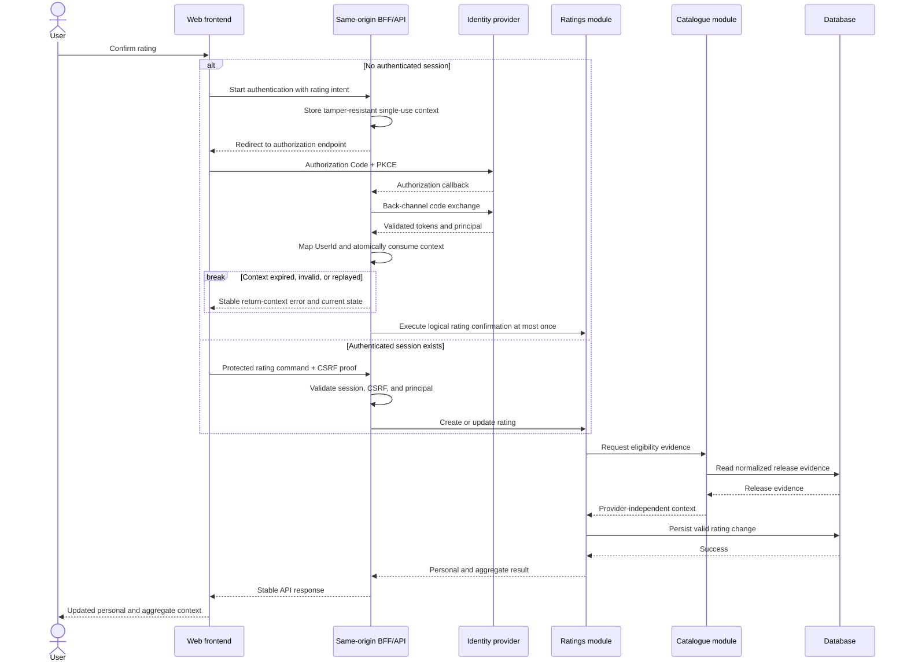
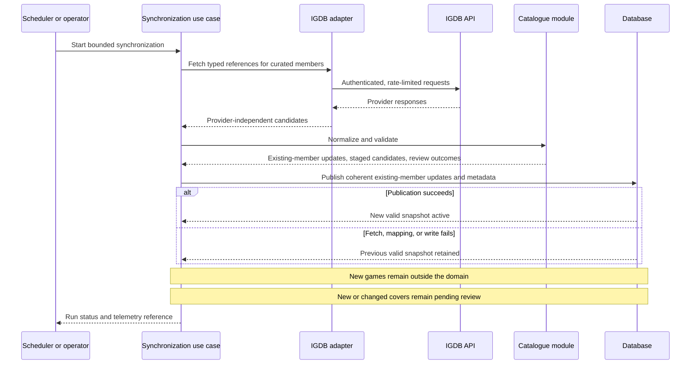

# Learning MVP Solution Architecture

- **Status:** Approved
- **Version:** 1.2
- **Owner:** Ruben Hernandez
- **Last updated:** 2026-08-04
- **Approval:** Owner-approved for the private, non-commercial learning MVP
- **Phase:** 1 — MVP solution definition (complete)
- **Initial release mode:** Private, non-commercial learning MVP
- **Product Brief:** [Product Brief](../product/product-brief.md)
- **Story map:** [Learning MVP story map](../product/mvp-story-map.md)
- **Domain model:** [Learning MVP domain model](domain/mvp-domain-model.md)
- **Use cases:** [Learning MVP use cases and relevant errors](application/mvp-use-cases.md)
- **Provider spike:** [Game-data-provider spike](../research/game-data-providers-spike.md)
- **Provider evidence:** [First authenticated IGDB PoC](../research/igdb-poc-results.md)
- **Cover decision:** [ADR-0001: Reference IGDB cover images without copying binaries](../decisions/0001-reference-igdb-cover-images.md)

> This document defines the initial solution architecture for the approved learning
> MVP and the principles that allow the product to evolve into a larger distributed
> platform. It deliberately distinguishes current architecture from possible target
> capabilities. Future technologies are introduced only when a product use case, an
> operational need, a measurable limitation, or an explicit bounded learning
> experiment justifies them.

## 1. Purpose

The initial architecture supports one complete vertical slice:

```text
release discovery
    -> game page
    -> personal rating
    -> Mis puntuaciones
```

It translates the product, domain, and application contracts into an executable
system that:

- serves public catalogue and release reads from product-controlled local data;
- delegates authentication to an external identity boundary;
- lets an authenticated user create, update, delete, and retrieve their own rating;
- keeps personal and aggregate rating information consistent;
- synchronizes a bounded catalogue from IGDB outside user request paths;
- remains usable when IGDB or its image CDN is temporarily unavailable;
- applies strategic Domain-Driven Design and hexagonal architecture from the first
  vertical slice;
- exposes a same-origin web, BFF, and OpenAPI-defined API boundary without requiring
  API Management in the first deployed slice;
- includes useful observability, security, automated testing, and delivery controls
  from the beginning;
- remains simple enough to be operated by one person;
- can evolve through measured architectural changes without pretending that the
  final distributed platform already exists.

This document is the architectural input to the
[approved API conventions](api/api-conventions.md) and the
[OpenAPI 3.1.2 contract](api/openapi.yaml).
It does not replace either of them.

## 2. Architectural position

### 2.1 Initial architecture

The MVP starts with one production-like application deployment:

```text
Browser
    |
Same-origin HTTPS
    |
Web application
    - static frontend assets
    - BFF / API adapter
    - modular-monolith application
    |
Relational application database

External dependencies:
- Identity Provider
- IGDB API
- IGDB image CDN
```

The backend is one deployable unit, but its business modules have explicit ownership,
contracts, and dependency rules.

### 2.2 Long-term direction

The project is expected to grow in functionality, traffic, operational maturity, and
technical breadth. Potential target capabilities include:

- advanced metrics, logs, traces, dashboards, alerts, SLOs, and capacity analysis;
- local, HTTP, and distributed caching;
- asynchronous processing and durable messaging;
- independently deployed services where justified;
- CQRS with separate read models where query needs diverge from writes;
- purpose-specific databases and search indexes;
- event-driven integrations and derived projections;
- automated horizontal scaling and cloud-native deployment;
- resilience testing, progressive delivery, and controlled fault injection;
- analytics, recommendation, moderation, and community capabilities.

These are **directional capabilities**, not mandatory MVP components. Their purpose
is to guide evolution, not to force technology into the first implementation.

### 2.3 Evolution rule

A technology may be introduced when at least one of these conditions exists:

1. a product use case cannot be implemented adequately with the current design;
2. measured load or reliability evidence shows a limitation;
3. independent deployment, ownership, scaling, or failure isolation is valuable;
4. an explicit learning experiment has a hypothesis, scope, success criteria, and
   removal plan;
5. the operational benefit exceeds the additional complexity.

The project must not invent requirements solely to justify a preferred technology.

## 3. Architectural drivers

### 3.1 Functional drivers

- Browse recent and upcoming releases.
- Filter releases by normalized platform and region.
- Search a bounded catalogue by canonical title or curated alias.
- Read a game page with release, provenance, freshness, verification, and rating
  context.
- Authenticate only at the rating or personal-data boundary.
- Resume the same game context after authentication.
- Maintain one active integer rating from 1 to 10 per user and game.
- Retrieve, search, sort, edit, and delete entries in `Mis puntuaciones`.
- Synchronize normalized catalogue data from IGDB without coupling the public API to
  provider availability or provider-specific concepts.

### 3.2 Learning drivers

- Apply DDD to discover and protect business boundaries.
- Apply hexagonal architecture as dependency discipline rather than folder ceremony.
- Practise API-first design and API lifecycle management.
- Include observability and operational concerns in each vertical slice.
- Learn performance and scaling through measurement and controlled load tests.
- Evolve from synchronous in-process collaboration to distributed communication only
  when an actual boundary requires it.
- Practise architectural decision records, fitness functions, migrations, and
  reversible changes.

### 3.3 Quality drivers

| Driver | Architectural consequence |
|---|---|
| Simplicity | Start with few deployables and one transactional data boundary. |
| Maintainability | Organize by business capability with explicit module contracts. |
| Domain integrity | Keep business rules independent from transport, frameworks, persistence, identity, and providers. |
| Consistency | Keep rating changes and their observable aggregate result consistent inside one application-owned boundary. |
| Provider resilience | Serve local normalized data; provider calls never occur in visitor or rating request paths. |
| Data quality | Preserve identity, provenance, date precision, verification, review need, freshness, and the previous valid snapshot. |
| Security and privacy | Delegate credentials, derive ownership from the authenticated principal, and keep secrets server-side. |
| API governance | Keep an OpenAPI-defined boundary and backend authorization; introduce API Management only when an explicit trigger justifies it. |
| Observability | Instrument requests, business operations, database access, and synchronization from the first slice. |
| Solo operability | Prefer reproducible automation, explicit failures, few components, and mature technology. |
| Evolvability | Preserve boundaries that can later be extracted without designing them as remote services now. |
| Performance | Establish baselines and use load tests before introducing optimization infrastructure. |

## 4. Scope

### 4.1 Included in the initial architecture

- A browser-based responsive web frontend.
- One same-origin web application entry point with a BFF/API adapter.
- One application backend exposed through an HTTP API inside the same deployable.
- A modular-monolith backend structure.
- Strategic DDD and selective tactical DDD.
- Hexagonal architecture within business modules.
- One application-owned relational data store.
- Public catalogue and game-detail reads.
- Authenticated rating and personal-rating operations.
- Delegated external authentication through a server-side BFF, secure session
  cookie, and stable `UserId` resolution.
- Bounded IGDB synchronization through a backend adapter.
- Direct browser delivery of approved IGDB covers under ADR-0001.
- Structured logs, request and application metrics, trace correlation, health, and
  synchronization telemetry.
- API contract validation, architecture tests, and repeatable delivery automation.
- Initial performance baselines and representative load tests.

### 4.2 Deferred until justified

- Independently deployed business microservices.
- A message broker or event-streaming platform.
- Distributed transactions.
- Physical CQRS with separate write and read stores.
- Event sourcing.
- A distributed cache.
- A dedicated full-text search engine.
- Multiple database technologies.
- A service mesh.
- Multi-region or active-active deployment.
- gRPC or another internal remote-call protocol.
- Multiple simultaneous catalogue providers.
- Public administration or curation interfaces.
- Broad unattended catalogue ingestion.
- Native mobile applications.
- Reviews, community, recommendations, lists, personal library, prices, stores, and
  external ratings.

### 4.3 Non-goals of this document

This document does not select:

- a frontend framework;
- a backend language or framework;
- a database product or persistence library;
- an identity-provider product;
- a concrete API Manager product;
- a cloud provider or hosting service;
- a container orchestrator;
- a CI/CD platform;
- a telemetry backend;
- a scheduler implementation;
- exact synchronization cadence, retry values, or stale thresholds;
- HTTP paths, methods, status codes, pagination shapes, or payload schemas.

Those decisions belong in API conventions, OpenAPI, deployment design,
implementation records, or dedicated ADRs when they become necessary.

## 5. Architecture decisions

The following decisions form the approved MVP architecture. They are accepted for
the current private learning release and must be revisited when a documented trigger
changes their context.

| ID | Decision | Rationale | Status |
|---|---|---|---|
| `SA-001` | Implement the initial backend as one deployable modular monolith. | The MVP has a small number of business boundaries, one owner, and no demonstrated need for independent scaling or deployment. | Accepted |
| `SA-002` | Expose a resource-oriented HTTP API using JSON and design it API-first. | The browser journey is request/response oriented and is well supported by OpenAPI tooling. | Accepted |
| `SA-003` | Serve the frontend and BFF/API from one same-origin application deployment initially. | Logical client/server separation does not require independent deployment; one origin avoids premature CORS and operational complexity. | Accepted |
| `SA-004` | Store catalogue and rating state in one application-owned relational database initially. | The model is structured, uniqueness matters, and one transactional boundary is simpler and safer. | Accepted |
| `SA-005` | Delegate authentication to an external standards-based identity provider through a server-side BFF using Authorization Code with PKCE. | Tokens remain server-side, the browser receives only an opaque secure session cookie, and the product does not implement credentials or recovery. | Accepted |
| `SA-006` | Resolve `UserId` exclusively from the validated issuer and subject in the authenticated principal. | The client must never choose or impersonate the rating owner, and mutable claims such as email are not identity. | Accepted |
| `SA-007` | Synchronize IGDB through a backend adapter and serve local normalized data to users. | This isolates provider failures and prevents provider concepts from becoming the product contract. | Accepted |
| `SA-008` | Execute synchronization through an internal scheduled or operator-triggered mechanism, not a public user endpoint. | Synchronization is an operational workflow rather than a visitor capability. | Accepted |
| `SA-009` | Load approved covers from the allowlisted IGDB CDN with a product-owned fallback. | This applies ADR-0001 without copying or proxying provider binaries. | Accepted by ADR-0001 |
| `SA-010` | Apply hexagonal architecture inside each business module. | Domain and application logic must remain independent from delivery and infrastructure technologies. | Accepted |
| `SA-011` | Apply strategic DDD and use tactical DDD patterns selectively. | The project needs explicit language, boundaries, ownership, and invariants without forcing every operation into a complex domain pattern. | Accepted |
| `SA-012` | Defer API Management; start with a simple same-origin HTTPS edge and introduce a gateway or manager only after an adoption trigger or bounded learning experiment. | The first slice has one client and one backend, so a mandatory manager adds a failure point and operational work without current product value. | Accepted |
| `SA-013` | Keep domain authorization and business validation in the backend when an API Manager is later introduced. | Edge policy must not become hidden or duplicated product logic. | Accepted |
| `SA-014` | Instrument the first slice for logs, metrics, trace correlation, health, and business-operation outcomes. | Observability is easier to evolve when instrumentation is present from the beginning. | Accepted |
| `SA-015` | Use logical commands, queries, and domain events without requiring distributed CQRS or messaging. | Clear intent and domain semantics are useful now; infrastructure separation is not. | Accepted |
| `SA-016` | Do not introduce microservices, brokers, distributed caches, search engines, or extra databases without an explicit trigger. | The long-term learning goal does not justify immediate operational complexity. | Accepted |
| `SA-017` | Do not select or introduce gRPC initially. Reconsider it only when a real process boundary and communication use case make it appropriate. | The current browser API and in-process module collaboration do not benefit from gRPC. | Accepted |
| `SA-018` | Treat the architecture as evolutionary and require evidence or a bounded learning experiment for significant complexity. | This enables broad technical learning without turning the platform into an unmeasured technology collection. | Accepted |

## 6. System context



### 6.1 Trust boundaries

- Browser input is untrusted, including identifiers, filters, sorting, return URLs,
  and rating values.
- The same-origin web and BFF/API adapter is an untrusted-input boundary, not a
  source of business truth.
- The identity provider is authoritative for authentication, but the backend still
  validates the authentication context required by its trust model.
- IGDB data is external candidate data. It must be validated and normalized before
  becoming product state.
- IGDB cover references are constrained by ADR-0001 host, path, size, extension,
  attribution, and fallback rules.
- The application-owned database is the source of truth for the current MVP product
  state served to users.

## 7. Runtime container view



### 7.1 Web frontend

Responsibilities:

- render the Spanish-first, mobile-first user experience;
- invoke public catalogue and authenticated rating API operations;
- navigate to the BFF authentication endpoint only when required by the approved
  journey;
- preserve and restore the intended game context after authentication;
- present loading, empty, stale, unavailable, and actionable error states;
- keep personal and aggregate ratings visually and semantically distinct;
- load only approved cover origins and display provider attribution and fallback;
- emit bounded journey analytics without making analytics an authorization input.

The frontend does not:

- call authenticated IGDB APIs;
- hold IGDB credentials;
- hold OAuth access or refresh tokens;
- decide rating ownership or eligibility;
- calculate authoritative rating aggregates;
- use provider IDs as product identity;
- access the database directly;
- call backend modules through internal protocols.

### 7.2 Web, BFF, and API adapter

The initial application exposes one same-origin HTTPS entry point. Static frontend
assets, BFF endpoints, and product API routes may be packaged in one deployable or
co-hosted behind one simple origin; independent frontend deployment is not required.

Initial responsibilities:

- serve or route static frontend assets;
- initiate Authorization Code with PKCE as a confidential server-side client;
- keep access and refresh tokens server-side;
- issue an opaque, `Secure`, `HttpOnly`, appropriately `SameSite` session cookie;
- validate CSRF protection on state-changing cookie-authenticated requests;
- validate and atomically consume the single-use post-authentication rating context;
- expose the OpenAPI-defined product API to the frontend;
- terminate or participate in TLS according to deployment design;
- apply basic request-size policies;
- create or propagate correlation and trace context;
- collect traffic metrics and safe access logs.

It must not:

- decide whether a game is eligible for rating;
- decide rating ownership;
- calculate aggregates;
- normalize provider data;
- access application tables;
- replace backend authorization.

The BFF is an inbound adapter inside the initial application deployment, not a new
business module or independently deployed service. Session persistence is an
implementation decision; the MVP does not require Redis or another distributed
session store.

API Management is deferred. It may be introduced when multiple external consumers,
API versions, independently routed services, centralized quotas or policies, a
developer portal, or a bounded learning experiment justify its cost. A future API
Manager remains a technical edge and never owns product authorization.

### 7.3 Application backend

Responsibilities:

- expose the product API through the same-origin BFF/API adapter;
- authenticate and authorize protected operations;
- coordinate application use cases and domain policies;
- own internal product identifiers and public contract mapping;
- read and write local product state;
- enforce rating uniqueness, eligibility, ownership, and consistency;
- synchronize and normalize bounded IGDB data;
- preserve the last valid catalogue snapshot on provider or mapping failure;
- emit safe errors, logs, metrics, traces, and synchronization telemetry.

The backend is one deployable unit for the MVP. Logical modules must not become
network services merely because they have separate responsibilities.

### 7.4 Application database

The MVP uses one relational database owned by the application. It supports:

- internal game and release identity;
- structured platform-region release tuples;
- uniqueness of one active rating per `UserId + GameId`;
- reliable update and delete semantics;
- deterministic filtering, sorting, and pagination;
- atomic publication or replacement of valid synchronized state;
- transactional consistency without distributed coordination.

PostgreSQL and versioned forward migrations are subsequently selected by
[ADR-0006](../decisions/0006-use-postgresql-and-versioned-forward-migrations.md).
The exact schemas, indexes, persistence framework, and migration tool remain
implementation decisions.

A shared physical database does not imply shared ownership. Each business module
owns its tables or schema and other modules must not query them directly.

### 7.5 External identity provider

Responsibilities outside VideoGame Platform:

- user registration and sign-in;
- credential storage and verification;
- password or account-recovery flows;
- issuing verifiable authentication context.

The backend maps the validated `issuer + subject` pair to a stable product `UserId`.
It does not use mutable claims such as email as identity. Rating APIs do not accept a
trusted owner identifier from the browser and return `RATING_NOT_FOUND` for absence
inside the authenticated `UserId + GameId` scope without revealing another user's
rating state.

The approved browser pattern is a server-side BFF using OAuth 2.0 Authorization Code
with PKCE and OpenID Connect where identity claims are required. The implicit grant
is not used. Tokens remain server-side; the browser receives an opaque session
cookie. Keycloak is subsequently selected as the initial identity-provider product by
[ADR-0007](../decisions/0007-use-keycloak-as-the-initial-identity-provider.md).

### 7.6 IGDB API and image CDN

The IGDB API is used only by the backend synchronization adapter. The public API
serves normalized local state and never exposes raw IGDB payloads, credentials, or
provider-specific taxonomy as its contract.

Approved cover metadata is stored as a constrained reference. The browser retrieves
the binary directly from the allowlisted IGDB image CDN, subject to ADR-0001.

### 7.7 Scheduler or operator trigger

`UC-009` is invoked through an internal operational mechanism. Initial options are:

- an application scheduler;
- a deployment-platform scheduled job;
- an authenticated operator command;
- a local command-line task for the first private learning slice.

The mechanism is deferred. Synchronization is not a public visitor endpoint and does
not run inside catalogue read requests.

## 8. Domain-Driven Design

### 8.1 Strategic DDD

Strategic DDD is applied from the beginning to establish language, ownership, and
boundaries.

Initial business contexts:

| Context | Responsibility | Initial deployment |
|---|---|---|
| `Catalogue and Releases` | Games, aliases, platforms, regions, releases, cover references, provenance, freshness, and catalogue synchronization. | Module inside the modular monolith |
| `Ratings` | Personal rating lifecycle, rating eligibility, aggregate-rating policy, and `Mis puntuaciones`. | Module inside the modular monolith |

Supporting or external boundaries:

| Boundary | Classification | Relationship |
|---|---|---|
| Identity Provider | External generic subdomain/service | Supplies authenticated identity; product maps it to `UserId`. |
| IGDB | External catalogue context | Protected by an Anti-Corruption Layer and provider-independent model. |
| API Management | Technical platform capability | Exposes and governs APIs; owns no product domain. |
| Observability | Technical platform capability | Measures the product and infrastructure; owns no business rules. |

A module, package, or deployable is not automatically a bounded context. Technical
concerns must not be promoted to domain contexts merely to make the diagram larger.

### 8.2 Context relationships



Rules:

- Catalogue does not expose provider DTOs or provider taxonomy as domain contracts.
- Ratings depends on a narrow Catalogue application contract, not on Catalogue
  persistence.
- Catalogue does not depend on Ratings.
- Identity-provider concepts are translated at the application boundary.
- Business terminology follows the approved domain model and glossary.

### 8.3 Tactical DDD

Tactical patterns are used when behaviour and invariants justify them:

- entities for concepts with identity and lifecycle;
- value objects for validated domain values;
- aggregates where consistency boundaries are meaningful;
- domain policies for rules that span concepts;
- repository ports for aggregate persistence;
- domain events for meaningful facts already produced by successful behaviour;
- domain services only when a rule belongs to no natural entity or value object.

Tactical DDD is not required for simple projections, filters, or read-only queries.
A query handler may return a purpose-built read model without rehydrating a rich
aggregate when no invariant is being changed.

## 9. Hexagonal architecture

Each business module follows a hexagonal dependency model:

```text
Inbound adapters
    - REST/API delivery
    - scheduler or operator trigger
            |
            v
Application ports and use cases
            |
            v
Domain model and policies
            ^
            |
Outbound ports
    - repositories
    - catalogue provider
    - identity context
    - clock
    - telemetry abstractions where needed
            ^
            |
Outbound adapters
    - relational persistence
    - IGDB client
    - identity integration
    - telemetry implementation
```

Example conceptual structure:

```text
backend
├── catalogue
│   ├── domain
│   ├── application
│   │   ├── inbound
│   │   └── outbound
│   └── adapters
│       ├── inbound
│       └── outbound
├── ratings
│   ├── domain
│   ├── application
│   │   ├── inbound
│   │   └── outbound
│   └── adapters
│       ├── inbound
│       └── outbound
├── identity
│   └── adapters
├── api
└── platform
    ├── configuration
    ├── observability
    └── scheduling
```

This is a conceptual structure, not a mandatory package tree. Hexagonal architecture
is enforced through dependency direction and replaceable boundaries, not by counting
folders named `ports` and `adapters`.

### 9.1 Dependency rules



Required rules:

1. Domain code depends on no delivery, framework, persistence, provider, identity,
   messaging, cache, or telemetry product.
2. Application use cases coordinate domain behaviour through explicit ports.
3. Inbound and outbound adapters depend inward on application contracts.
4. Provider DTOs are translated at the IGDB adapter boundary.
5. Persistence records do not become domain objects or public API payloads by
   default.
6. Cross-module access occurs through explicit application contracts, not direct
   repository or table access.
7. Shared code is limited to genuinely stable technical primitives; a generic
   `common` module must not become a dumping ground for business concepts.
8. Time-dependent product policies receive time from an application-owned `Clock`
   port configured for `Europe/Madrid`; clients never supply the authoritative
   evaluation date.
9. Dependency rules are enforced by automated architecture tests once implementation
   begins.

## 10. Module responsibilities

### 10.1 Catalogue and Releases

Owns:

- bounded-catalogue membership;
- games, aliases, approved cover references, releases, platforms, and regions;
- provider-independent identity and external references;
- provenance, date precision, verification, review, and freshness;
- catalogue search and release queries;
- normalized catalogue persistence;
- IGDB candidate mapping, staging outside the domain, and validated publication for
  already curated catalogue members;
- cover-reference review state; synchronization never grants cover approval.

It must not expose IGDB DTOs or provider IDs as application or public API identity.

### 10.2 Ratings

Owns:

- personal rating lifecycle;
- rating value validation;
- one-active-rating uniqueness;
- rating ownership and authorization decisions;
- rating eligibility policy;
- aggregate-rating policy;
- `Mis puntuaciones` queries.

It references `GameId` and `UserId` but does not own games or user accounts.
Rating commands address data only through authenticated `UserId + GameId`; scoped
absence becomes `RATING_NOT_FOUND` without inspecting another user's rating.

### 10.3 Catalogue-to-Ratings collaboration

Rating eligibility depends on commercial-release evidence owned by Catalogue. The
modules use one narrow provider-independent application contract, for example:

```text
RatingEligibilityContextQuery
    input: GameId, application-derived evaluation date
    output: release evidence required by RatingEligibilityPolicy
```

Initial collaboration is an in-process application call:

```text
Ratings application
    -> Catalogue application contract
        -> Catalogue domain and persistence
```

Rules:

- Ratings must not query Catalogue tables directly.
- Ratings must not depend on IGDB types or synchronization internals.
- Catalogue must not depend on Ratings.
- The contract returns only the product evidence needed for eligibility.
- The contract may later become remote only if an independently deployed boundary is
  justified.

## 11. Commands, queries, and domain events

The application may use logical CQRS from the first slice:

```text
Commands
- CreateRating
- UpdateRating
- DeleteRating
- SynchronizeBoundedCatalogue

Queries
- BrowseReleases
- SearchGames
- GetGameDetails
- GetMyRatings
```

This separates intent, validation, and models in code without requiring:

- separate services;
- separate databases;
- a message broker;
- eventual consistency;
- event sourcing.

Meaningful domain events may be represented in-process, for example:

```text
RatingCreated
RatingChanged
RatingDeleted
ReleaseChanged
```

An event must describe a successful business fact. It must not be created merely to
simulate an event-driven architecture.

If durable external publication is later needed, the project must evaluate an
outbox, event schemas, idempotent consumers, retry policy, dead-letter handling, and
observability together with the broker. Adding Kafka alone is not the architectural
change.

## 12. Data ownership and consistency

### 12.1 Logical ownership

One physical database is initially shared by deployment, not by ownership.

Possible logical separation:

```text
catalogue.*
ratings.*
platform.*
```

Exact schemas are an implementation decision. The architectural rules are:

- each business module owns its tables or schema;
- no module reads or writes another module's tables directly;
- cross-module information is obtained through an application contract;
- database constraints enforce invariants that must survive application defects or
  concurrent requests;
- persistence design must not leak into public API contracts.

### 12.2 Catalogue consistency

A synchronization run follows validate-before-publish:

1. fetch data for explicitly curated catalogue members;
2. normalize and validate it;
3. detect conflicts and review-required evidence;
4. stage new provider results outside the domain for explicit curation;
5. mark new or materially changed provider covers `pending_review` and use the
   product-owned fallback;
6. publish only coherent valid updates for existing curated members;
7. retain the previous valid state when publication fails.

A partial provider response must not silently delete supported games or overwrite a
valid release with invalid data. Synchronization never creates a domain `Game` or
grants provider-cover approval.

### 12.3 Rating consistency

Ratings owns personal ratings and the authoritative aggregate derived from active
ratings.

The observable consistency boundary of create, update, or delete includes:

- the personal rating;
- aggregate mean, count, and distribution;
- game-page rating context;
- `Mis puntuaciones` visibility.

The implementation may calculate aggregates on read or persist derived aggregate
state. That choice is deferred, but a successful command must not expose an
incompatible personal and aggregate result.

### 12.4 Transaction boundaries

| Operation | Initial transaction boundary |
|---|---|
| Create rating | Validate eligibility and uniqueness, persist the rating, and make the corresponding aggregate observable consistently. |
| Update rating | Preserve the previous value unless the complete valid change succeeds. |
| Delete rating | Remove the owned rating and make personal and aggregate views consistent. |
| Publish synchronization result | Publish coherent normalized updates for existing curated members and synchronization metadata, or preserve the previous valid snapshot; candidates remain staged and covers remain subject to review. |
| Catalogue queries | Read-only local operation; no provider calls or state changes. |

Distributed transactions are not required by the initial design.

## 13. Critical runtime flows

### 13.1 Public catalogue read



IGDB is intentionally absent from this flow.

### 13.2 Authenticate and create or update a rating



### 13.3 Bounded catalogue synchronization



### 13.4 Cover delivery

1. The Catalogue API returns an approved product cover representation, not an
   arbitrary remote URL or image binary.
2. The frontend constructs or receives only an allowlisted IGDB CDN reference and
   matching attribution/source information.
3. The browser requests the binary directly from the IGDB CDN.
4. Loading failure, rejected metadata, or unavailable usage status selects the
   product-owned fallback without hiding the game.
5. Provider credentials never participate in the browser image request.

## 14. API boundary and management

### 14.1 Public API style

The initial browser-facing API uses HTTP, JSON, and OpenAPI. This matches the current
request/response use cases and enables:

- standard browser integration;
- straightforward inspection and testing;
- API contract generation and validation;
- compatibility with future API Management when adoption triggers are met;
- conventional HTTP caching where appropriate;
- stable public documentation.

### 14.2 Contract implications

The [approved API conventions](api/api-conventions.md) and
[OpenAPI 3.1.2 contract](api/openapi.yaml)
must preserve these rules:

- public catalogue and game-detail queries are anonymous;
- rating commands and `Mis puntuaciones` require authentication;
- the owner comes from the validated principal, never a request `userId`;
- the stable product user maps from validated `issuer + subject`, never mutable
  claims such as email;
- public game identity uses internal `GameId` values;
- IGDB IDs, raw payloads, credentials, and normalization internals remain private;
- release date value and precision are represented separately;
- provenance, freshness, verification, and review-required states remain explicit;
- personal and aggregate ratings are different response concepts;
- the authoritative rating-evaluation date comes from the application clock using
  `Europe/Madrid`, never from a client request;
- zero results, no ratings, stale-but-usable data, unavailable aggregate statistics,
  and fallback covers are explicit states rather than generic server errors;
- no initial catalogue snapshot returns `CATALOGUE_NOT_READY` without calling IGDB
  from the request path;
- scoped rating absence returns `RATING_NOT_FOUND` without revealing another user's
  state;
- post-authentication rating confirmation is single-use and replay-safe;
- stable application error codes are distinct from localized messages and HTTP
  status codes;
- synchronization is not part of the public visitor API by default;
- payloads are independent from persistence and framework classes;
- backward-compatible evolution is preferred once the first contract is published.

The API-conventions document must still decide path naming, HTTP methods, status-code
mapping, pagination, filtering, sorting, error-envelope shape, security-scheme
representation, BFF session-cookie and CSRF behaviour, idempotency mechanisms, and
compatibility rules.

### 14.3 Protocol evolution and gRPC

No gRPC API or service is part of the initial architecture.

Current communication uses:

| Boundary | Initial mechanism |
|---|---|
| Browser to same-origin BFF/API | HTTPS/JSON plus opaque secure session cookie |
| BFF to identity provider | Authorization Code with PKCE and back-channel token exchange |
| Modules inside the backend | In-process application contracts |
| Backend to IGDB | Provider-supported HTTP API through an adapter |
| Backend to database | Selected persistence adapter |

A future process boundary must not automatically imply gRPC. Protocol selection must
consider:

- client type and ecosystem;
- synchronous versus asynchronous interaction;
- latency and throughput requirements;
- streaming needs;
- language interoperability;
- compatibility with the current or future public edge;
- debugging and operability;
- compatibility and schema evolution;
- team or learning value relative to complexity.

gRPC may be appropriate later for internal synchronous service-to-service calls,
streaming, or strongly typed polyglot clients. It remains one candidate alongside
HTTP/JSON, messaging, or other mechanisms. It will be selected only when a concrete
case supports it and recorded in an ADR.

## 15. Security and privacy

### 15.1 Authentication and authorization

- Catalogue reads remain public.
- Rating and personal-rating operations require a valid authenticated principal.
- The BFF is the confidential OAuth client, keeps tokens server-side, and establishes
  the application session; backend authorization remains authoritative.
- A user can read and mutate only their own personal ratings.
- Authentication success restores the original game context through a validated,
  bounded, short-lived, single-use return context.
- Replayed, expired, or invalid return context never repeats a rating command.
- Cookie-authenticated state changes require CSRF protection.
- Scoped rating absence returns `RATING_NOT_FOUND` without disclosing whether
  another user has rated the game.
- Domain and application code receive `UserId`, not tokens or identity-provider
  objects.

### 15.2 Provider security

- IGDB credentials exist only in backend secret management.
- The browser never calls authenticated IGDB endpoints.
- Provider responses are treated as untrusted external input.
- Rate limiting, bounded retries, timeouts, and defensive mapping apply at the
  adapter boundary.
- Logs and errors exclude credentials, tokens, raw provider payloads, stack traces,
  and unnecessary personal data.

### 15.3 Web, BFF, and API controls

Implementation must include appropriate controls for:

- TLS in non-local environments;
- restrictive cross-origin access;
- content security policy for approved image origins;
- validation of IDs, filters, sorting, pagination, rating values, and return URLs;
- secure session-cookie settings, CSRF protection, session rotation, logout, and
  expiry;
- safe error responses with correlation identifiers;
- dependency and secret scanning;
- application-edge request-size and coarse rate-limit policies;
- abuse protection if observed usage requires it.

## 16. Resilience and failure behaviour

| Failure | Required behaviour |
|---|---|
| Web application unavailable | The product is unavailable; health and alerting expose no false successful state. |
| No valid local catalogue snapshot | Return `CATALOGUE_NOT_READY`; never call IGDB from a user request as an emergency fallback. |
| IGDB unavailable | Continue serving the last valid local catalogue; record synchronization failure. |
| IGDB rate-limited | Apply bounded retry/backoff outside user paths; preserve the current snapshot. |
| Provider response invalid | Reject unsafe mapping; do not silently merge or overwrite valid product data. |
| Catalogue data stale | Serve it when still usable and expose freshness explicitly. |
| IGDB image unavailable | Show the product-owned fallback without hiding the game. |
| Identity provider unavailable | Public reads continue; existing sessions work only while locally valid, and new authentication or token refresh fails safely. |
| Authentication return context expired, invalid, or replayed | Do not execute the rating command; return a stable code and safe current state. |
| Rating command invalid | Preserve the previous valid personal and aggregate state. |
| Rating persistence failure | Expose no partial successful change; return a safe correlated error. |
| Aggregate statistics unavailable | Keep an otherwise coherent game page available with an explicit unavailable aggregate. |
| Synchronization write failure | Keep the previous valid snapshot active. |
| New provider game or cover discovered | Stage the game outside the domain; keep a new or changed cover pending review and use the fallback. |
| Telemetry unavailable | Do not block the product flow solely to publish optional telemetry. |

The MVP does not promise high availability. It does require predictable degradation
and prevention of corrupt or misleading state.

## 17. Observability strategy

### 17.1 Initial instrumentation

From the first vertical slice, record at minimum:

- correlation and trace identifiers across frontend request, BFF/API adapter, and
  application use case;
- operation or use-case name;
- HTTP outcome, stable application error code, and duration;
- authenticated versus anonymous context without logging identity tokens;
- database call duration and pool health;
- rating-command outcomes and rejection reasons without unnecessary personal data;
- authentication return-context outcomes without tokens, raw subject identifiers, or
  sensitive session values;
- synchronization run identity, duration, requests, retries, failures, mapped and
  rejected records, staged candidates, cover-review outcomes, publication outcome,
  and freshness;
- process liveness, readiness, database connectivity, and last synchronization state.

Telemetry uses open or replaceable instrumentation standards where practical so that
backends can evolve without rewriting business behaviour.

### 17.2 Advanced target capabilities

Later observability stages may introduce:

- centralized metrics, logs, and distributed traces;
- service-level indicators and objectives;
- alert rules tied to user impact;
- business and product dashboards;
- consumer lag and asynchronous-flow dashboards;
- cache hit ratios and stampede indicators;
- database saturation and query analysis;
- deployment, error-budget, and release-quality views;
- synthetic probes and controlled fault injection;
- capacity forecasting and cost monitoring.

Advanced tooling is adopted incrementally. Instrumentation precedes dashboards;
dashboards precede alerting; alerting must correspond to an actionable response.

## 18. Performance and scaling

### 18.1 Initial approach

- establish a representative dataset and traffic model;
- measure endpoint throughput, latency percentiles, error rate, and resource use;
- inspect SQL and indexes before adding caches;
- define baselines rather than pretending that MVP numbers are production SLAs;
- run repeatable load tests in CI or a dedicated performance workflow when stable;
- scale the stateless backend horizontally before extracting services, when
  appropriate.

### 18.2 Optimization order

A default investigation order is:

1. confirm the measurement and user impact;
2. profile application and database behaviour;
3. remove inefficient queries, payloads, or algorithms;
4. add appropriate database indexes or query models;
5. evaluate HTTP or local caching;
6. introduce distributed caching only when cross-instance sharing is valuable;
7. introduce a specialized read store or search engine when the query model warrants
   it;
8. extract and scale a service independently only when the boundary benefits.

The order is guidance, not an inflexible law. Evidence may justify a different step.

## 19. Evolution roadmap and triggers

This roadmap contains three decision horizons, not committed releases. Section 20
defines the evidence required for specific technologies.

### Stage 1 — Complete observable MVP

```text
Browser -> Same-origin BFF/API + modular monolith -> Relational database
                                              |
                                              -> IGDB
```

Capabilities:

- complete product journey;
- hexagonal modules and DDD boundaries;
- HTTP/JSON and OpenAPI;
- delegated identity through the server-side BFF;
- local catalogue synchronization;
- structured telemetry;
- CI/CD, migrations, architecture tests, and a lightweight performance baseline.

### Stage 2 — Performance and operability

After measuring the running slice:

- query and index optimization;
- HTTP or local caches;
- SLOs, dashboards, and alerting;
- fault and degradation testing;
- horizontal backend replication when session and state handling support it;
- API Management only when centralized edge capability or a bounded learning
  experiment has a measurable benefit.

### Stage 3 — Selective distribution

Messaging, independently deployed services, specialized stores, orchestration, and
advanced platform capabilities are considered individually through the adoption
triggers below. There is no predetermined sequence or target distributed topology.
Any extraction preserves ownership, contracts, consistency expectations, migration
and rollback paths, and observability.

## 20. Technology adoption triggers

| Capability | Introduce when | Do not introduce merely because |
|---|---|---|
| API Manager or Gateway | Multiple external consumers, versions, services, centralized quotas or policies, a developer portal, or a bounded learning experiment justify an independent edge. | Every backend must have a dedicated management product. |
| Distributed cache | Repeated reads fail a defined target after application and database optimization, and cache sharing across instances has value. | Large systems often use Redis. |
| Message broker | Processes need durable asynchronous communication, multiple consumers, replay, or independent failure handling. | Events exist in the domain model. |
| Microservice | Independent deployment, ownership, scaling, security, or failure isolation produces a measurable benefit. | A module has its own package. |
| Physical CQRS | Read and write models or scaling needs materially diverge and eventual consistency is acceptable. | Command and query classes exist. |
| Search engine | Search relevance, language analysis, or scale cannot be met acceptably by the current database. | The product has a search box. |
| Additional database | A bounded context has storage needs incompatible with the current database and owns the new data lifecycle. | Polyglot persistence looks advanced. |
| Kubernetes | Several independently operated components need scheduling, scaling, rollout, recovery, and resource governance. | The application can run in a container. |
| gRPC | A concrete internal process boundary benefits from strongly typed synchronous calls, streaming, performance, or polyglot clients. | The project includes microservices or the owner wants to practise it. |
| Service mesh | Service count and traffic policy justify shared transport security, observability, and routing controls. | Kubernetes is present. |

An explicit learning experiment may introduce a capability earlier, but it must
record:

- the learning question;
- the architectural hypothesis;
- the bounded scope;
- baseline and success metrics;
- operational costs and failure modes;
- whether the technology will be retained, changed, or removed.

## 21. Architectural fitness functions

Once implementation starts, automate checks where practical:

| Fitness function | Initial enforcement |
|---|---|
| Domain independence | Architecture tests prevent domain imports from frameworks and adapters. |
| Module ownership | No direct repository or table access across Catalogue and Ratings. |
| Provider isolation | No IGDB DTO or provider ID appears in domain or public API models. |
| API conformance | Implementation and generated clients validate against OpenAPI. |
| Error stability | Contract tests preserve stable application error codes. |
| Authentication ownership | Protected commands derive `UserId` from validated `issuer + subject`; no trusted client `userId` is accepted. |
| Authentication safety | Tests cover PKCE, secure session cookies, CSRF, expiry, logout, and single-use return context. |
| Catalogue resilience | Tests prove provider failure preserves the previous valid snapshot, candidates remain staged, and synchronization never approves covers. |
| Rating consistency | Concurrent and failure tests preserve uniqueness and aggregate correctness. |
| Public boundary | Browser traffic uses the same-origin BFF/API and implementation conforms to OpenAPI. |
| Observability | Critical use cases emit correlation, duration, outcome, and safe error telemetry. |
| Secret safety | Automated scans and tests prevent credentials or tokens in repository and logs. |
| Performance baseline | A lightweight repeatable workflow reports latency percentiles, throughput, and error rate once endpoints are stable. |
| Evolution safety | Significant new infrastructure has an ADR or experiment record with a trigger and success criteria. |

## 22. Testing strategy

The architecture requires:

- domain unit tests for eligibility, release precision, uniqueness, and aggregates;
- application tests for use-case flows, authorization, and failure guarantees;
- module-boundary and hexagonal dependency tests;
- persistence integration tests for uniqueness and transaction behaviour;
- IGDB adapter contract tests using fixtures and defensive mappings;
- API contract tests generated from or validated against OpenAPI;
- BFF integration tests for Authorization Code with PKCE, session-cookie security,
  CSRF, logout, expiry, and principal mapping;
- end-to-end tests for the primary journey and single-use authentication return
  context;
- synchronization tests proving preservation of the previous valid snapshot,
  candidate staging, and cover-review boundaries;
- cover tests for allowlisting, attribution, and fallback;
- observability tests for stable codes, correlation, and absence of secrets;
- performance baselines for critical read and rating flows.

The engineering gate is not only that the happy path works, but that the complete
vertical slice is automated, observable, documented, and operable by one person.

## 23. Deployment model

The minimum production-like topology contains:

```text
1 same-origin web application deployment
  - static frontend assets
  - BFF / API adapter
  - modular-monolith application
1 relational application database
1 external identity provider
IGDB API and IGDB image CDN as external dependencies
1 telemetry path with replaceable backends
```

A single-machine or simple platform deployment is sufficient for the private MVP.
The architecture does not initially require Kubernetes, service mesh, event
infrastructure, distributed cache, multiple databases, or independently scaled
business services.

Business modules inside the backend are deployed together. Scaling begins with
measurement and optimization. Replication requires an explicit session strategy but
does not by itself require Redis, a gateway, or service extraction.

## 24. Trade-offs and risks

| Decision | Benefit | Cost or risk | Mitigation |
|---|---|---|---|
| Modular monolith | Low operational cost, simple transactions, and visible domain collaboration | Boundaries can erode inside one codebase | Explicit contracts, ownership, and architecture tests |
| Hexagonal architecture | Domain independence and replaceable adapters | Additional interfaces and mapping can become ceremonial | Create ports only at meaningful boundaries |
| Strategic DDD | Clear language, ownership, and extraction readiness | Over-modelling or artificial bounded contexts | Use approved domain concepts and challenge every boundary |
| One relational database | Straightforward consistency, migration, and backup | Modules may couple through tables | Logical ownership and no cross-module persistence access |
| Same-origin BFF | Keeps OAuth tokens server-side and avoids premature CORS and extra deployment | Cookie sessions require CSRF, lifecycle, and server-side session controls | PKCE, secure cookie settings, CSRF protection, rotation, expiry, logout, and integration tests |
| API Management deferred | Avoids an unneeded deployable and failure point | API lifecycle learning and centralized policies arrive later | Keep OpenAPI and adoption triggers; use a bounded experiment when learning value is explicit |
| Local catalogue reads | Provider resilience and controlled public contract | Data may become stale | Explicit freshness, bounded synchronization, and last-valid snapshot |
| External identity | Avoids implementing credential security | Adds an external dependency | Public reads continue and identity is isolated through adapters |
| Early observability | Enables evidence-based evolution | Telemetry can become noisy or expensive | Define useful signals, retention, and cardinality controls |
| No broker initially | Simpler delivery and debugging | Durable asynchronous learning arrives later | Model meaningful facts and adopt broker with a real workflow |
| No distributed cache initially | Avoids invalidation and stale-data complexity | Some performance experiments are deferred | Establish load baselines and optimize first |
| No gRPC initially | Avoids an unjustified protocol and extra operational surface | gRPC learning is postponed | Revisit when a real process boundary makes protocol comparison valuable |
| Direct IGDB CDN covers | Visual catalogue without binary copying | Runtime CDN and provider-terms dependency | ADR-0001 allowlisting, attribution, checks, and fallback |

## 25. Approved decisions carried into OpenAPI

The first OpenAPI contract must implement these approved directions:

1. `SA-001`: initial modular monolith.
2. `SA-002`: browser-facing HTTP/JSON API-first boundary.
3. `SA-003`: one same-origin web application deployment initially.
4. `SA-005`: delegated authentication through a server-side BFF using Authorization
   Code with PKCE.
5. `SA-006`: stable product user identity from validated `issuer + subject`.
6. `SA-010`: hexagonal architecture inside business modules.
7. `SA-011`: strategic DDD and selective tactical DDD.
8. `SA-012`: API Management is deferred until an adoption trigger or bounded
   experiment.
9. Public catalogue reads and protected rating/personal-rating operations.
10. Internal-only synchronization and provider-independent public identity.
11. No gRPC in the initial contract or deployment.

The [approved API conventions](api/api-conventions.md) define:

- resource and path naming;
- methods and HTTP status codes;
- pagination, filtering, and sorting;
- error-envelope shape and code mapping;
- date and date-precision representation;
- same-origin BFF session and security representation;
- idempotency, replay, and concurrency behaviour;
- compatibility and versioning;
- future API Management compatibility without requiring publication through a
  manager.

PostgreSQL and the private OCI hosting boundary are selected by ADR-0005 and ADR-0006.
The approved technology baseline and ADR-0010 through ADR-0012 select the application
frameworks, migration and persistence libraries, and frontend tooling. Cache, broker,
orchestrator, and internal remote-call protocols remain deferred and do not change the
approved OpenAPI boundary.

## 26. Accepted supporting ADRs

The accepted solution and platform decisions recorded to date are:

```text
docs/decisions/
├── 0001-reference-igdb-cover-images.md
├── 0002-use-a-modular-monolith-and-relational-data-boundary.md
├── 0003-use-a-same-origin-bff-and-http-json-api.md
├── 0004-synchronize-and-serve-local-catalogue-data.md
├── 0005-host-private-dev-on-oci-always-free.md
├── 0006-use-postgresql-and-versioned-forward-migrations.md
├── 0007-use-keycloak-as-the-initial-identity-provider.md
├── 0008-use-github-actions-and-ghcr-for-initial-delivery.md
├── 0009-use-opentelemetry-compatible-instrumentation.md
├── 0010-use-java-25-spring-boot-4-and-spring-modulith.md
├── 0011-use-postgresql-and-flyway-for-application-persistence.md
└── 0012-use-react-typescript-and-vite-for-the-web-frontend.md
```

DDD and hexagonal dependency rules belong to ADR-0002 rather than a separate record.
Delegated identity, Authorization Code with PKCE, session security, and OpenAPI
belong to ADR-0003. A future API Manager receives its own ADR only when an adoption
trigger or bounded experiment makes the alternatives and operational consequences
material.

ADR-0005 through ADR-0009 select the minimum persistent platform choices only after
the logical architecture and OpenAPI boundary were approved. They do not introduce a
public production environment or distributed application architecture.

The technology baseline is approved and Phase 1 solution definition is complete.
ADR-0010 through ADR-0012 contain the only new durable baseline choices. Individual
quality and test libraries remain governed by the baseline rather than receiving one
decision record each. The walking skeleton is the next implementation gate.

No gRPC ADR is required while the decision is simply to defer protocol selection. A
future ADR should compare gRPC with the actual alternatives for a concrete boundary.

## 27. Acceptance checklist

- [x] The architecture supports the complete approved MVP journey.
- [x] Initial architecture and long-term target capabilities are clearly separated.
- [x] The backend starts as one deployable modular monolith.
- [x] Catalogue and Ratings are explicit DDD business boundaries.
- [x] Strategic DDD is applied without creating artificial contexts.
- [x] Tactical DDD is used only where behaviour and invariants justify it.
- [x] Each business module follows hexagonal dependency rules.
- [x] Module collaboration does not bypass application contracts.
- [x] The initial web, BFF, API, and backend share one origin and deployment boundary.
- [x] API Management remains deferred until a trigger or bounded experiment.
- [x] User request paths read local normalized catalogue data and never call IGDB.
- [x] Synchronization is a bounded internal workflow that cannot publish uncurated
      games or approve provider covers.
- [x] Provider failure preserves the previous valid catalogue snapshot.
- [x] Public identity is independent from IGDB.
- [x] Authentication uses a server-side BFF, PKCE, secure sessions, CSRF protection,
      and principal-derived ownership.
- [x] Authentication return context is single-use and replay-safe.
- [x] Authoritative evaluation time comes from the application clock.
- [x] One relational data boundary can enforce initial uniqueness and consistency.
- [x] Database ownership is logical even when the physical database is shared.
- [x] Personal and aggregate rating results remain consistent after commands.
- [x] Degraded catalogue and aggregate states follow the approved application
      contract.
- [x] Cover delivery follows ADR-0001 and always has a product-owned fallback.
- [x] Stable application errors remain separate from HTTP and localized copy.
- [x] Observability is instrumented from the first slice and advanced gradually.
- [x] Performance baselines precede caches, extra stores, or service extraction.
- [x] Commands, queries, and domain events do not imply distributed infrastructure.
- [x] No broker, distributed cache, search engine, extra database, or microservice is
      introduced without a trigger or bounded experiment.
- [x] gRPC remains deferred until a concrete use case and process boundary justify it.
- [x] Significant architectural evolution is measured and documented.
- [x] OpenAPI implications are explicit while transport details remain deferred.

## 28. Change history

| Date | Version | Change | Owner |
|---|---|---|---|
| 2026-08-04 | 1.2 | Linked the approved technology baseline and ADR-0010 through ADR-0012, closed Phase 1 solution definition, and identified the walking skeleton as the next gate. | Ruben Hernandez |
| 2026-08-03 | 1.1 | Linked the approved platform decisions for OCI Always Free hosting, PostgreSQL migrations, Keycloak, GitHub Actions/GHCR, and OpenTelemetry without changing the logical solution boundary. | Ruben Hernandez |
| 2026-07-30 | 1.0 | Approved the minimum solution architecture after review; selected a same-origin server-side BFF with Authorization Code and PKCE, deferred API Management to explicit triggers, aligned synchronization and degraded states with the application contract, and reduced speculative roadmap and ADR scope. | Ruben Hernandez |
| 2026-07-30 | 0.2 | Added evolutionary architecture, target capabilities, DDD, hexagonal architecture, API Manager from the first slice, adoption triggers, fitness functions, and explicit deferral of gRPC until justified by a real use case. | Ruben Hernandez |
| 2026-07-30 | 0.1 | Initial proposed solution architecture derived from the approved Product Brief, story map, domain model, application use cases, provider evidence, and cover ADR. | Ruben Hernandez |
