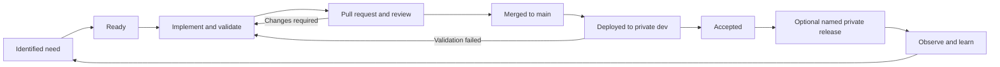

# Learning MVP delivery lifecycle

- **Status:** Approved
- **Version:** 1.5
- **Owner:** Ruben Hernandez
- **Last updated:** 2026-08-13
- **Approval:** Owner-approved for the private, non-commercial learning MVP
- **Phase:** MVP implementation after completed Phase 1 solution definition
- **Scope:** Private, non-commercial learning MVP operated by one person
- **Product boundary:** [Learning MVP story map](../product/mvp-story-map.md)
- **Use cases:** [Learning MVP use cases and relevant errors](../architecture/application/mvp-use-cases.md)
- **Solution architecture:** [Learning MVP solution architecture](../architecture/mvp-solution-architecture.md)
- **OpenAPI:** [Browser-facing API contract](../architecture/api/openapi.yaml)
- **Platform:** [Learning MVP platform and delivery design](../architecture/deployment/mvp-platform-and-delivery.md)
- **Work management:** [GitHub Issues and Projects baseline](work-management.md)

> This document defines the human workflow and evidence required to move a small
> change from intent to an accepted private release. The platform document owns the
> technical deployment mechanics. A future operations runbook will own executable
> commands after the implementation and remote environment exist.

## 1. Purpose and authority

The lifecycle protects product scope, correctness, security, data integrity, and
operability without simulating a large organization. Ruben is the only product owner,
human approver, and risk owner. Codex may assist with analysis and a fresh second-pass
review, but it is not an independent human approval.

This document is authoritative for:

- work readiness and risk classification;
- branch, commit, pull-request, review, and merge rules;
- quality gates and acceptance evidence;
- release decisions and the Definition of Done.

The [platform design](../architecture/deployment/mvp-platform-and-delivery.md) is
authoritative for environments, artefacts, deployment, migrations, secrets, health,
observability, backup, and recovery. When the documents conflict, stop and resolve the
conflict rather than selecting silently.

`MUST` is mandatory, `SHOULD` is the expected default with a documented reason for
deviation, and `MAY` is optional. Controls apply proportionally: a documentation fix
does not need the evidence of a destructive data migration.

## 2. Principles

1. Product or learning value leads implementation.
2. Deliver the smallest coherent vertical slice or explicit enabler.
3. Keep `main` releasable and build immutable artefacts from reviewed source.
4. Validate contracts, security, data, accessibility, and operations as part of the
   change, not after it.
5. Preserve valid state on failures and prove recovery where data is at risk.
6. Keep decisions, code, migrations, infrastructure, and evidence in or linked from
   the repository.
7. Introduce process and technology only when current risk or a bounded learning goal
   justifies them.

## 3. Change flow



| State | Required exit evidence |
|---|---|
| Identified need | Problem, outcome, owner, and relevant product or technical source |
| Ready | Testable acceptance criteria, scope, dependencies, risk, and no unresolved blocking decision |
| Implement and validate | Focused change, tests, documentation, and applicable local checks |
| Pull request and review | Complete diff, passing required gates, findings resolved or explicitly accepted |
| Merged to `main` | Traceable commit and trusted CI result |
| Deployed to private `dev` | Known image digest, migration result, readiness, and smoke-test evidence |
| Accepted | Product and technical acceptance criteria pass; residual risk is recorded |
| Named private release | Explicit version/tag and release record; a `dev` deployment alone is not a release |

## 4. Readiness and risk

A change is ready when all applicable conditions are true:

- [ ] It maps to an approved journey/use case, defect, operational need, architectural
      decision, or bounded learning experiment.
- [ ] In-scope and out-of-scope behaviour and acceptance criteria are explicit.
- [ ] Domain, API, schema, identity, provider, security, privacy, accessibility, and
      operational impacts have been considered.
- [ ] Dependencies and sequencing are understood.
- [ ] Significant or durable choices have an ADR or an explicitly assigned decision.
- [ ] The work is small enough for one focused review.

Classify changes by their highest applicable risk:

| Risk | Examples | Additional evidence |
|---|---|---|
| Low | Documentation correction, internal refactor with unchanged behaviour | Normal review and applicable checks |
| Medium | Endpoint, dependency, non-destructive schema, authentication flow | Explicit test and recovery approach |
| High | Destructive migration, authorization boundary, secret exposure, topology change | ADR or reviewed design, recovery rehearsal, and explicit owner go/no-go |
| Emergency | Active credential leak, data corruption, severe unavailable journey | Containment first, minimum safe validation, traceable deployment, and follow-up review |

An experiment MUST define its hypothesis, bounded scope, success/failure criteria,
evidence, owner, and adopt/change/reject decision before its result is used.

## 5. Git and pull requests

Use short-lived branches from the current `main`; do not use long-lived environment or
release branches. Recommended names are `feature/<short-name>`, `fix/<short-name>`,
`docs/<short-name>`, and `experiment/<short-name>`.

Commits SHOULD be small, buildable, and written in English with an intent-focused
imperative subject. Do not mix unrelated refactoring with a product change. Squash
merge is the default; preserve multiple commits only when their sequence is useful
review or migration evidence.

Every material change uses a pull request. Its description covers, proportionally:

- context, scope, and solution;
- Semantic Versioning impact for each affected releasable artefact;
- API, data, configuration, provider, and compatibility impact;
- security, privacy, accessibility, and operational impact;
- validation evidence;
- residual risks and rollback or forward-fix approach;
- related use case, ADR, contract, or work item when one exists.

Before merge:

1. all required automated gates pass;
2. Ruben performs a fresh review of the rendered diff;
3. a second pass, optionally Codex-assisted, checks correctness, security, data,
   compatibility, maintainability, and operational risk;
4. findings are resolved or residual risk is explicitly accepted.

A separate GitHub issue is optional for small changes when the pull request and linked
source provide sufficient traceability.

When an issue exists, use `Related to #<issue-number>` while deployment, smoke tests,
or acceptance remain after merge. Use `Closes #<issue-number>` only when merging the
pull request satisfies every applicable acceptance step. Material work remains open
after merge, moves to `In validation`, and is closed only after acceptance; the
[work-management baseline](work-management.md) owns the corresponding Project states
and automations.

### 5.1 Semantic Versioning

Every implementation change MUST assess whether it changes a releasable artefact and
update that artefact using Semantic Versioning (`MAJOR.MINOR.PATCH`) in the same
change. Versions are independent: the backend Maven reactor, frontend npm package,
and isolated IGDB PoC change only when their own delivered behaviour changes.

The current pre-`1.0.0` policy is:

| Change | Version increment |
|---|---|
| Compatible defect fix, security fix, or internal correction | `PATCH` |
| New compatible capability or material enabler | `MINOR` |
| Intentional incompatible pre-1.0 contract change | `MINOR`, with an explicit compatibility decision and migration notes |

After `1.0.0`, incompatible public API or supported operational-contract changes use
`MAJOR`, compatible capabilities use `MINOR`, and compatible fixes use `PATCH`.
Documentation-only changes do not bump an executable artefact unless they correct or
complete release content for that artefact.

Development versions use the `-SNAPSHOT` suffix. A named release removes the suffix,
uses the exact same version in the built artefact, and creates the matching `vX.Y.Z`
Git tag. The root Maven project version is the backend artefact version; backend
modules inherit it and their parent reference must be updated atomically. Never leave
the parent and reactor versions inconsistent.

## 6. Validation and quality gates

The repository MUST expose stable validation commands as implementation appears. The
current commands are:

```bash
bash scripts/validate-actions.sh
git diff --check
bash scripts/validate-docs.sh
npm ci
bash scripts/validate-openapi.sh
npm run frontend:verify
bash scripts/validate-browser.sh
bash scripts/validate-migrations.sh
./mvnw clean verify
./mvnw -f tools/igdb-poc/pom.xml clean verify
```

The current walking skeleton adds compilation, Spotless formatting, JaCoCo XML/HTML,
plan-aware SonarQube Cloud analysis, domain and application tests, architecture
tests, persistence/migration integration tests, API conformance, provider-fixture
tests, secret scanning, dependency checks/submission, CodeQL, and a no-mock browser
accessibility smoke against the combined JAR and PostgreSQL. Session/CSRF tests and image build/scan are added when their
corresponding code exists.

Accessibility is an MVP gate, not a public-production-only activity. Frontend changes
MUST cover applicable semantic structure, accessible names, keyboard and focus
behaviour, contrast, validation/error announcements, responsive use, and an automated
accessibility check when the chosen frontend tooling supports it.

| Gate | Pull request | `main` | Deploy to `dev` |
|---|---:|---:|---:|
| Documentation and OpenAPI | Required when affected | Required | Required |
| Build, static analysis, unit and architecture tests | Required when code exists | Required | Required |
| Integration, migration, contract, and security tests | Required when relevant | Required | Required |
| Secret/dependency/image checks | Required when relevant | Required | Required |
| Accessibility evidence | Required for affected UI | Required | Required for the journey |
| Readiness and smoke tests | No | No | Required |
| Recovery evidence | Medium/high-risk changes | Medium/high-risk changes | Required when state is at risk |

Retries may collect diagnostics but MUST NOT turn an unreliable test into a pass. A
temporary waiver requires the failed control, reason, risk, compensating control,
owner, expiry/removal condition, and follow-up. Repeated waivers require fixing the
process or architecture.

## 7. Contract, data, security, and dependency changes

- OpenAPI changes precede or accompany implementation and generated documentation.
- Breaking API changes require an explicit compatibility decision; the private MVP
  does not silently break its reviewed contract.
- Schema changes use immutable versioned migrations and preserve compatibility with
  the deployment/rollback plan defined by the platform.
- Destructive data changes require a verified backup and recovery plan.
- Configuration additions document name, purpose, safe default, validation, secret
  classification, and restart behaviour.
- Secrets never enter Git, images, frontend code, URLs, screenshots, or logs; a
  suspected leak is rotated or revoked before repository cleanup is considered done.
- Dependency changes record purpose, compatibility, licence, security exposure, and
  rollback. Automated update pull requests are reviewed, not blindly merged.

## 8. Deployment, acceptance, and release

The platform document defines the technical deployment sequence. This lifecycle adds
the approval boundary:

- a merge may publish an immutable image automatically;
- the first `dev` deployments require manual owner approval until migrations,
  readiness, smoke tests, and recovery are proven;
- deployment success is not product acceptance;
- a named private release is optional and requires an explicit version/tag, accepted
  journey evidence, known limitations, and the deployed image digest;
- public production remains prohibited until the provider release-mode gate, privacy,
  security, support, and cost decisions are reopened and approved.

The owner postpones a release when evidence is incomplete and delay is safer than the
known consequence. Rollback is not automatic when a forward fix or data recovery is
safer; the chosen action must protect valid state and schema compatibility.

## 9. Operational evidence and incidents

Retain only evidence needed to answer what changed, why, which source and image were
deployed, which checks and migrations ran, what was observed, and how recovery works.
Do not retain credentials, tokens, unnecessary personal data, or unapproved provider
payloads.

For the private MVP, incidents use one lightweight flow:

```text
detect -> contain -> restore valid state -> verify -> record cause and follow-up
```

Credential exposure, cross-user authorization, data loss/corruption, and loss of the
last valid catalogue snapshot are material incidents. Emergency work may shorten the
normal sequence but cannot remove source control, minimum validation, deployment
traceability, security/data consideration, or recovery planning.

Measure only signals that support decisions. Initially retain deployment outcome,
lead time when useful, failed-deployment/rollback count, flaky checks, vulnerability
age, catalogue freshness/synchronization outcome, and rating-command failures. Formal
DORA targets, SLOs, on-call metrics, and team-flow metrics are deferred until traffic
or coordination makes them meaningful.

## 10. Definition of Done

A work item is done when all applicable conditions are true:

- [ ] Acceptance criteria and approved product scope are satisfied.
- [ ] The implementation is understandable and preserves domain/module boundaries.
- [ ] Tests cover success, rejection, and relevant failure guarantees.
- [ ] OpenAPI, migrations, configuration, infrastructure, and documentation are
      updated together.
- [ ] Semantic Versioning impact was assessed and every affected artefact version is
      consistent across build files, generated names, documentation, and release data.
- [ ] Security, privacy, accessibility, provider, and secret impacts are addressed.
- [ ] Relevant logs, metrics, traces, health, and business-operation signals exist.
- [ ] Required gates pass and the complete diff has received a fresh second pass.
- [ ] The immutable artefact is traceable to source.
- [ ] Required `dev` deployment, readiness, smoke, and acceptance checks pass.
- [ ] Recovery is credible for the change risk.
- [ ] Known limitations and follow-up work are recorded.

## 11. Current adoption state

| Capability | State | Next action |
|---|---|---|
| Product, domain, use cases, solution architecture | Completed | Preserve approved boundaries |
| OpenAPI and documentation validation | Completed | Keep generated reference synchronized |
| Platform and persistent decisions | Completed by this design and ADR-0005 through ADR-0009 | Implement incrementally |
| Technology baseline | Completed by baseline v1.0 and ADR-0010 through ADR-0012 | Preserve selected lines and upgrade policy |
| Application skeleton and implementation tests | Implemented locally and in CI | Preserve the aggregate quality/security gates while adding public API and BFF compatibility evidence |
| Immutable multi-architecture image | After local skeleton | Build and publish from `main` |
| Private OCI `dev` environment | After local skeleton | Provision only Always Free resources from reviewed IaC |
| Operations runbook | After commands exist | Record exact start, deploy, backup, restore, and recovery procedures |
| Public production | Deferred | Reopen legal, provider, privacy, security, support, and cost gates |

## 12. Change history

| Version | Date | Change | Owner |
|---|---|---|---|
| 1.5 | 2026-08-22 | Recorded the stable combined-package command and no-mock packaged browser/API/PostgreSQL smoke as walking-skeleton gates. | Ruben Hernandez |
| 1.4 | 2026-08-13 | Recorded the executable PR/`main` quality, coverage, SonarQube Cloud, dependency-submission, and security gates, real no-retry browser smoke, and local command parity. | Ruben Hernandez |
| 1.3 | 2026-08-09 | Added mandatory per-artefact Semantic Versioning assessment, pre-1.0 increment rules, Maven inheritance consistency, and release suffix/tag conventions. | Ruben Hernandez |
| 1.2 | 2026-08-06 | Linked the approved work-management baseline and clarified acceptance-aware issue closure after merge. | Ruben Hernandez |
| 1.1 | 2026-08-04 | Recorded the approved technology baseline, closed Phase 1 solution definition, and made the executable walking skeleton the next gate. | Ruben Hernandez |
| 1.0 | 2026-08-03 | Approved a concise solo-project lifecycle, separated platform mechanics, made accessibility an MVP gate, and clarified `dev` deployment versus private release. | Ruben Hernandez |
