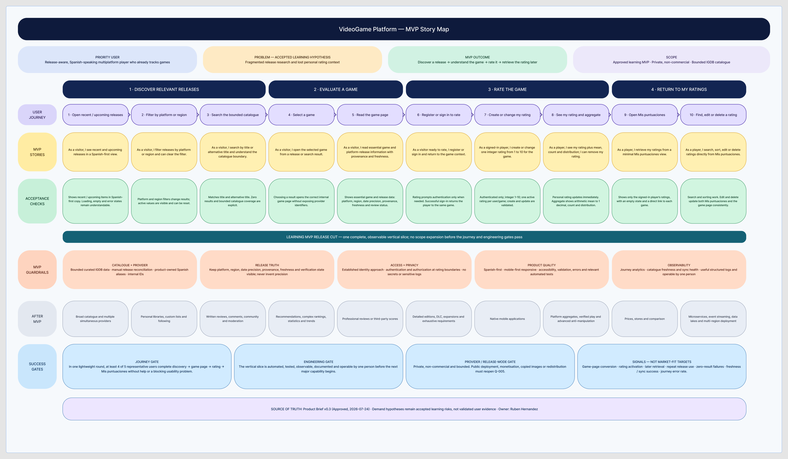

# Learning MVP story map

- **Status:** Journey gate `PASS`
- **Product Brief:** [Approved Product Brief](product-brief.md)
- **Last updated:** 2026-08-03
- **Owner:** Ruben Hernandez
- **Editable board:** [Open the FigJam story map](https://www.figma.com/board/4OfeyWSF3rvEhDE5HGKUK8)
- **PNG export:** [Download the repository export](assets/mvp-story-map.png)
- **Clickable prototype:** [Open the prototype record](clickable-prototype.md)
- **Usability script:** [Run the moderated test](../research/prototype-usability-test-guide.md)
- **Accepted round:** [Review the simulated synthesis](../research/simulated-round-synthesis.md)
- **Domain model:** [Approved learning MVP domain model](../architecture/domain/mvp-domain-model.md)

This story map turns the approved primary journey into the smallest coherent
learning MVP. It is an alignment aid, not a detailed implementation backlog or an
architecture decision.

The FigJam board and PNG preserve the initial release-cut snapshot. This Markdown
document and the linked clickable prototype contain the later owner-approved rating
interaction details. The current prototype exposes all eight curated game pages;
*Death Stranding 2: On the Beach* remains the single fully wired rating journey. The
accepted simulated round reached 4/5 unaided and initially required iteration for
blocking finding F-01. The focused simulated regression resolved F-01 through F-08,
so minimum contracts can now begin.

## Outcome and audience

The priority user is a release-aware, Spanish-speaking multiplatform player who
researches several games per month and already keeps a wishlist, backlog, rating
history, or similar personal record.

The MVP should let that player:

> Discover a relevant release, understand the game and its release context, record
> a rating, and retrieve or maintain that rating later.

The underlying demand problem remains an accepted learning hypothesis. Synthetic
research informs the map but is not treated as real-user evidence.

## Story map

| Activity | User steps | MVP stories |
|---|---|---|
| Discover relevant releases | Open recent or upcoming releases; filter by platform or region; search the bounded catalogue | See Spanish-first release information; narrow results; search by title or alternative title; understand zero results and catalogue coverage |
| Evaluate a game | Select a game; read its game page | Open the correct internal game; understand essential catalogue and platform-release information, provenance, freshness, date precision, and verification state |
| Rate the game | If released, open the inline 1–10 selector; register or sign in only when confirming; see personal and aggregate context | Resume the same game after authentication; keep one integer rating from 1 to 10 per user and game; create, update, or delete it; keep aggregate and personal ratings visible and distinct; disable rating before release |
| Return to personal ratings | Open `Mis puntuaciones`; find and manage a rating | Retrieve only the signed-in player's ratings; search and sort them; open the related game; edit or delete a rating directly |

## MVP release cut

The first release is one complete, observable vertical slice across all four
activities. It includes:

- a Spanish-first, mobile-first responsive experience;
- a deliberately bounded catalogue sourced from IGDB under the approved private,
  non-commercial learning mode;
- recent and upcoming releases with platform and region filters;
- title and alternative-title search;
- a game page with explicit release provenance, freshness, precision, and review
  state;
- an approved primary cover loaded from a provider CDN reference, with visible
  attribution and a product-owned fallback;
- an established registration and sign-in approach;
- one active integer rating from 1 to 10 per user and game;
- an inline number selector instead of a separate rating page;
- rating eligibility only after release;
- create, update, and delete behaviour;
- arithmetic mean to one decimal, rating count, and distribution, with a Spanish
  decimal comma and no `/10` denominator;
- separately labelled aggregate and personal ratings wherever rating context appears;
- a minimal `Mis puntuaciones` view with search, sorting, direct edit, and delete;
- basic journey analytics and operational visibility.

## Acceptance criteria

### Release discovery

- Recent and upcoming releases use Spanish-first product copy.
- Platform and region filters update the result set, show their active values, and
  can be cleared.
- Search matches a title or alternative title within the bounded catalogue.
- Loading, empty, error, zero-result, and catalogue-boundary states are explicit
  enough for the user to understand what happened.

### Game page

- Selecting a release or search result opens the correct internal game.
- The page shows the essential game and platform-release information needed by the
  journey.
- Platform, region, date precision, provenance, freshness, and verification state
  remain explicit; the product never invents a more precise release date.
- Aggregate and personal-rating states are visible and labelled separately.
- An unreleased game shows `No disponible` for the aggregate and a disabled personal
  selector rather than a fabricated score.
- Provider identifiers and provider-specific concepts do not become the public
  product contract.
- An approved provider cover is loaded directly from the allowlisted provider CDN,
  includes visible attribution and a clear source path, and falls back without
  hiding the game.

### Authentication and rating

- Authentication is required at the rating boundary, not for release discovery or
  reading the game page.
- Successful registration or sign-in returns the player to the same game context.
- Only an authenticated user can create, change, or remove a rating.
- A rating is an integer from 1 to 10, and only one active rating exists per user and
  game.
- Tapping the personal-rating control opens a compact 1–10 selector in context; it
  does not navigate to a separate rating page.
- A game cannot be rated before its commercial release.
- Invalid or failed operations preserve the existing rating and return an actionable
  error.

### Personal and aggregate context

- A successful change is reflected in the player's rating without ambiguity.
- The aggregate and personal rating are always labelled and displayed separately.
- The aggregate shows the arithmetic mean to one decimal, rating count, and
  distribution. Spanish copy uses a decimal comma, and no score includes a
  denominator such as `/10`.
- When no eligible aggregate exists, the state is explicit rather than represented
  by an invented numeric mean.
- Editing or deleting a rating keeps the game page and `Mis puntuaciones`
  consistent.

### `Mis puntuaciones`

- The view contains only the signed-in player's ratings.
- It provides an understandable empty state, search, sorting, and a direct link to
  each game.
- A player can edit or delete a rating directly from the view.

## Cross-cutting guardrails

- Keep IGDB data bounded and curated, reconcile ambiguous displayed release dates
  manually, and maintain product-owned Spanish aliases.
- Use local normalized metadata and direct provider-CDN cover references without
  copied, proxied, persisted, committed, or redistributed provider image binaries.
- Require visible provider attribution, an allowlisted image host, and a
  product-owned fallback wherever provider covers appear.
- Enforce authentication, authorization, validation, privacy, and safe logging at
  the relevant boundaries.
- Treat accessibility, useful errors, relevant automated tests, catalogue freshness,
  journey analytics, and operability by one person as part of the slice.
- Do not introduce a production architecture, framework, database, queue, cache, or
  deployment model through this product map.

## Success gates

- **Journey gate:** at least four of five representative users complete release
  discovery → game page → rating → `Mis puntuaciones` without assistance or a
  blocking usability problem, using the
  [prototype usability test guide](../research/prototype-usability-test-guide.md).
  **Current result: `PASS`.** The owner accepts the
  [simulated round](../research/simulated-round-synthesis.md) for this learning
  decision: 4/5 completed unaided, and the focused simulated regression resolved
  F-01 with no blocking issue remaining.
- **Engineering gate:** the slice is automated, tested, observable, documented, and
  operable by one person before another major capability starts.
- **Provider release-mode gate:** public deployment, monetization, copied or
  application-stored images, redistribution, or broad unattended synchronization reopens
  [Q-005](open-questions.md) before deployment.

Signals such as game-page conversion, rating activation, later rating retrieval,
repeat release use, zero-result failures, catalogue freshness, synchronization
success, and journey error rate guide learning. They are not product-market-fit
targets.

## Explicitly after the MVP

- broad catalogue coverage or multiple simultaneous providers;
- personal libraries, custom lists, and following;
- written reviews, comments, community features, and advanced moderation;
- recommendations, complex rankings, statistics, and trend analysis;
- professional reviews or third-party scores;
- detailed editions, DLC, expansions, and exhaustive technical requirements;
- native mobile applications;
- platform-specific aggregates, verified-play claims, and advanced
  anti-manipulation;
- prices, stores, and comparison;
- microservices, event streaming, data lakes, and multi-region deployment.

## Sources

- [Approved Product Brief](product-brief.md)
- [Mobile-first clickable prototype](clickable-prototype.md)
- [Prototype usability test guide](../research/prototype-usability-test-guide.md)
- [Accepted simulated usability synthesis](../research/simulated-round-synthesis.md)
- [Product assumptions](assumptions.md)
- [Open questions and decisions](open-questions.md)
- [Product glossary](glossary.md)
- [Approved learning MVP domain model](../architecture/domain/mvp-domain-model.md)
- [ADR-0001: Reference IGDB cover images without copying binaries](../decisions/0001-reference-igdb-cover-images.md)
