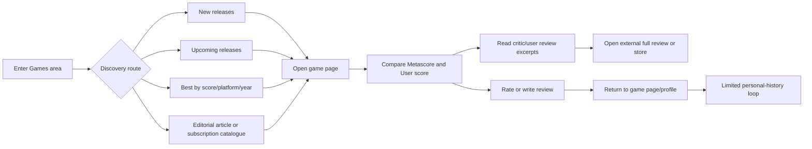
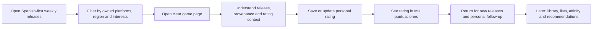

# Competitor Journey Comparison — Metacritic vs. VideoGame Platform

- **Status:** Research draft
- **Version:** 0.1
- **Date:** 2026-07-23
- **Competitor:** Metacritic
- **Product:** VideoGame Platform
- **Phase:** 0 — Product alignment / competitor research
- **Recommended repository path:** `docs/research/competitor-journey-comparison-metacritic.md`

> This document compares the public Metacritic journey with the candidate journey
> defined for VideoGame Platform. It distinguishes observed behaviour from inference
> and opportunity hypotheses. It is not evidence of user demand: the proposed
> differentiators must still be validated with real users.

## 1. Executive summary

Metacritic is strongest as a **reference for critical consensus**. Its brand, large
catalogue, critic network, recognisable Metascore, platform-specific scores and
release coverage let a user answer a narrow question quickly: _“How was this game
received by critics and users?”_

Its weaker area is the **continuous personal journey**. Public pages support browsing,
reading scores and submitting ratings or reviews, but the experience is not designed
primarily around remembering what the user has played, maintaining a personal game
history, following games, or returning to a personalised release view. Metacritic's
own help centre stated in November 2025 that profiles show written reviews but not
bare ratings, and that review editing still requires copying the existing review into
the submission box.

The opportunity for VideoGame Platform is therefore **not merely “Metacritic translated
into Spanish”**. A stronger position is:

> **A Spanish-first product that helps players discover relevant releases, understand
> them through trusted local and global signals, and maintain an organised history of
> their own relationship with games.**

Spanish is a meaningful advantage, but it should be expressed throughout the product:
regional release dates, Spanish-language sources, review-language filters, culturally
relevant editorial context, local platform availability and prices, moderation in
Spanish, and community relationships based on shared taste. Metacritic already includes
several Spanish and Latin American publications in its critic panel, so the defensible
advantage is not simply the presence of Spanish reviews; it is making the **entire
experience Spanish-first and community-first**.

### Main recommendation

The candidate MVP should retain its narrow release → game page → rating journey, but it
should add a minimal **`Mis puntuaciones`** view. Without a central place to retrieve
past ratings, the product records an action but does not yet fulfil the promise of
keeping the user's opinion organised. A full library can remain deferred.

## 2. Scope and method

### Product basis

The current [Product Brief](../product/product-brief.md) proposes one candidate journey:

1. Discover recent or upcoming releases.
2. Open a game page.
3. Register or sign in when deciding to rate.
4. Create or update a rating.
5. See the personal rating and aggregate result.

The long-term product direction also includes personal libraries, lists, reviews,
recommendations, professional scores, trends and community capabilities. Those are
not all MVP commitments.

### Competitor evidence reviewed

The comparison uses public Metacritic pages and support documentation accessed on
2026-07-23, including:

- Games landing page.
- New and upcoming release calendar.
- Browse and ranking pages.
- A representative game detail page.
- Metascore methodology and critic-source documentation.
- Ratings, review timing and profile-management help articles.
- A small sample of external research and community feedback as secondary evidence.

### Evidence labels

- **Observed:** visible in a reviewed public page or explicitly stated by Metacritic.
- **Inference:** interpretation based on the sampled journey; requires usability tests.
- **Opportunity hypothesis:** proposed product direction; requires user validation.
- **Not verified:** could not be confirmed without a logged-in, longitudinal or
  region-specific test.

## 3. Metacritic's apparent product job

Metacritic positions the Metascore as a single representation of critical consensus
across games, movies, television and music. It also invites users to add ratings and
reviews and provides links for where to watch or play.

For games, the core product jobs appear to be:

1. Check critic consensus quickly.
2. Compare critic and user reception.
3. Browse highly rated, recent or upcoming games.
4. Read excerpts and follow links to professional reviews.
5. Add a personal score or written review.
6. Find a purchase option.

The product is primarily **score-centric and title-centric**, rather than
**player-history-centric**.

## 4. Journey overview

### 4.1 Metacritic public journey

### 4.2 Target VideoGame Platform journey

The target journey closes a loop that Metacritic only partially supports:
**discover → evaluate → record → retrieve → return**.

## 5. Stage-by-stage competitor journey comparison

| Journey stage | User goal | Metacritic — observed solution | Strengths | Friction / gap | VideoGame Platform opportunity | Priority |
|---|---|---|---|---|---|---|
| 1. Entry | Reach relevant game content | A broad entertainment site with Games, Movies, TV, Music and News; the Games landing page contains new releases, upcoming games, rankings, subscription catalogues, videos and news | High content breadth; many entry paths; strong brand recognition | Games compete with other entertainment domains and editorial modules; the experience can feel content-heavy rather than task-focused | A game-only, task-oriented home with a dominant “this week” journey | **P0** |
| 2. Discover releases | Know what is new or coming soon | Games page modules plus a release article updated several times per week and grouped by week/date/platform | Strong freshness; useful platform coverage; notable-release curation | Release content is presented in English and follows an English/US editorial frame; relevance to the user's platforms, region and tastes is limited | Spanish-first weekly releases, regional dates, local time zone, platform filters, “relevant to you” ordering | **P0** |
| 3. Browse/filter | Reduce a large catalogue | Browse pages expose release year, platform, release type and genre; sorting includes Metascore, User Score and Newest | Familiar filters; large catalogue; strong ranking utility | Ranking by score can hide uncertainty when count/recency is not prominent; no sampled filter for review language, ownership, play status or player fit | Show vote count/confidence, region and language; later add player-fit and personal-state filters | P0/P1 |
| 4. Open game page | Understand one game quickly | Platform-specific page with release date, Metascore, user score, counts, purchase options, critic/user review distributions, details and related games | Dense evaluation information; critic and user scores are clearly separated; platform differences are visible | The most prominent information is “how it scored,” not “is it for me?”; multi-platform/version modelling can be cognitively heavy | Lead with concise game identity, availability and “why it may fit you,” while preserving source and platform context | **P0** |
| 5. Compare critics and users | Detect consensus or disagreement | Separate Metascore and User score with positive/mixed/negative distributions and review excerpts | Fast comparison; large critic panel; links to original reviews | Exact critic weights are not public; full reviews may be unavailable or paywalled; language and geographic context are not foregrounded | Transparent provenance, source language/country filters, accessible summaries and explicit confidence/coverage | P1 |
| 6. Read community opinions | Understand real player experience | User reviews, scores, dates, platform and sentiment filters; sampled pages contain reviews in several languages | Large participation; useful qualitative detail; spoiler/report actions are present | Languages are mixed in one stream; no language filter was observed; review credibility lacks visible playtime/completion context | Default to Spanish, filter/translate other languages, attach platform/status/hours voluntarily, reviewer reputation and helpfulness | P1 |
| 7. Rate | Record personal opinion | Score slider on game page; sign-in required; game ratings open 36 hours after release; Early Access games cannot be rated until full release | Low conceptual complexity; delay is a basic defence against launch manipulation | A raw number provides little context; no ownership/playtime verification was observed; the user must later remember where ratings were made | One fast rating plus optional context: platform, played/completed status, hours and “recommended?” | **P0** for score; P1 for context |
| 8. Edit/retrieve rating | Maintain a trustworthy personal history | Help documentation says users navigate back to the product page; profiles show written reviews but not bare ratings; review editing involves copying and resubmitting text | Existing ratings can be changed | Weak retrieval and management journey; the action is not converted into a useful personal collection | A first-class `Mis puntuaciones` view with sorting, search and direct edit/delete | **P0** |
| 9. Track lifecycle | Remember pending, playing, completed or abandoned games | No equivalent was verified in the sampled public journey | — | No clear game-lifecycle model or backlog loop was found | Personal library states, platform, dates, hours and private notes | P1 |
| 10. Return | Have a reason to come back | New release/editorial content and score changes create repeat utility | Strong content cadence | Personal return triggers are weak: no verified rating history dashboard, progress reminders or personalised weekly view | Weekly personalised release digest, followed games, library prompts and rating reminders | P1 |
| 11. Community | Find people with useful taste | Public reviews provide usernames and opinions | Large pool of voices | Community relationships, taste affinity and Spanish-language subcommunities are not central in the sampled journey | “Users with taste similar to yours,” Spanish-speaking circles, curated lists and respectful discussion | P2 |
| 12. Recommendation | Find the next game likely to fit | Rankings, related games and editorial lists | Simple and understandable discovery mechanisms | Sampled related-games output is not explained and may skew toward globally high-scoring titles rather than personal relevance | Explainable recommendations: “because you rated…”, platform/length/language constraints and affinity | P2 |

## 6. What Metacritic does well and should be learned from

### 6.1 A clear, memorable primary signal

The Metascore is understandable at a glance. The separation between critic consensus
and user opinion is also valuable. VideoGame Platform should not imitate the brand or
formula, but it should learn the product lesson: **one page needs a small number of
immediately legible signals**.

### 6.2 Strong score provenance at review level

Metacritic shows publication, score, date, platform, excerpt and—where available—a
link to the original review. This makes the aggregate inspectable even though its
weighting is not fully transparent.

### 6.3 Platform-aware evaluation

A game can have different critic coverage and scores by platform. Treating a game and
its releases as distinct concepts is important for VideoGame Platform's domain model.

### 6.4 Fresh release coverage

The major-release calendar is updated several times per week and separates this week's
releases, recent releases and upcoming weeks. This is a strong reference for the
candidate MVP release journey.

### 6.5 Editorial curation in addition to database browsing

Metacritic does not rely only on a catalogue. It creates updated articles, rankings,
subscription-service selections and release summaries. Pure database completeness is
not enough; curation reduces decision effort.

### 6.6 A deliberately selected critic panel

The critic source list is broad and international, and includes multiple publications
from Spain and Latin America. The lesson is to define source eligibility and data
provenance rather than indiscriminately aggregate everything available.

## 7. Main gaps and product opportunities

### 7.1 Spanish-first, not merely translated

#### Observation

The sampled Metacritic interface, help centre, navigation and editorial framing are in
English. Its critic panel nevertheless includes Spanish-language sources such as
3DJuegos, Areajugones, Cultura Geek, ElDesmarque, Generación Xbox, HardZone, Hobby
Consolas, IGN Spain, LaPS4, LevelUp, Malditos Nerds, Meristation, Nintenderos and
others. User reviews may also be written in Spanish, but they coexist with other
languages in the same stream.

#### Opportunity hypothesis

VideoGame Platform can make Spanish the organising principle of the experience:

- Spanish interface and product copy from day one.
- Regional release dates for Spain and Latin American markets.
- Prices and store availability in the user's market.
- Filters for Spanish-language professional and user reviews.
- Visible source country and language.
- Optional translation of reviews, always preserving the original.
- Spanish-speaking moderation and community guidelines.
- Local editorial context: availability, censorship, dubbing/subtitle quality,
  regional editions and subscription catalogues.
- Support for terminology variants without fragmenting the community.

#### Strategic nuance

“Spanish” alone is easy to copy. The stronger moat is **Spanish-language participation,
local data quality, trusted moderation and accumulated taste relationships**.

### 7.2 Complete the personal-value loop

#### Observation

Metacritic can capture a rating, but its help centre states that the profile does not
currently list ratings without written reviews. This creates a gap between expressing
an opinion and using that opinion later.

#### Opportunity hypothesis

Make every rating immediately useful:

- `Mis puntuaciones` page.
- Search and sort by date, score, title and platform.
- Direct edit/delete.
- Optional note and played platform.
- Clear distinction between personal score and community aggregate.
- Export or account portability later.

#### Product Brief implication

This should be considered part of the thin rating capability, not a full personal
library. Otherwise the current value proposition—keeping a personal rating organised
in one place—is only partially delivered.

### 7.3 Move from “is it good?” to “is it for me?”

#### Observation

Metacritic is optimised for consensus. A score is efficient, but it compresses
important differences in preferences, genre expectations, technical state and player
context.

#### Opportunity hypothesis

Over time, complement the aggregate with:

- “Players similar to you rated it…”
- Recommendation reasons.
- Common strengths and weaknesses extracted from structured tags or moderated review
  summaries.
- Filters for campaign length, difficulty, multiplayer mode, accessibility, language,
  platform performance and monetisation.
- Separate “quality” from “fit.”

Do not add all of this to the MVP. The MVP should reserve space in the information
architecture and data model without pretending the data already exists.

### 7.4 Contextualise user ratings and improve trust

#### Observation

Metacritic delays game ratings until 36 hours after release and blocks ratings during
Early Access. These are sensible basic controls. However, no proof of ownership,
playtime or completion was visible in the sampled journey, and user-score systems are
exposed to brigading and review bombing.

#### Opportunity hypothesis

- Allow a score with optional context: played, completed, abandoned, hours and
  platform.
- Distinguish “verified through integration” from “self-declared”; never imply
  verification without evidence.
- Show score count and confidence alongside averages.
- Use rate limits, anomaly detection and moderation queues.
- Preserve rating history internally for auditability.
- Avoid ranking low-volume titles solely by raw average; use minimum counts or a
  confidence-adjusted ranking.
- Clearly explain changes caused by moderation or recalculation.

### 7.5 Make professional criticism accessible to Spanish speakers

#### Observation

Metacritic links to original professional reviews. Some links may be unavailable or
behind publisher registration/subscription. Review excerpts and source language vary.

#### Opportunity hypothesis

Subject to licensing and copyright constraints:

- Aggregate only authorised metadata and excerpts.
- Prioritise Spanish-language publications for Spanish users.
- Offer structured critic summaries written by the platform rather than copying full
  reviews.
- Show consensus themes with links and attribution.
- Indicate inaccessible/paywalled sources before navigation when known.
- Never scrape or republish protected content without permission.

### 7.6 Cleaner information architecture

#### Observation

Metacritic's Games area includes many useful modules, but the global product also
contains Movies, TV, Music, News, purchase links and advertising. Secondary community
feedback about the 2023 redesign reported oversized content, confusing navigation,
ad intrusion and sorting problems. This feedback is anecdotal and may not represent
the current experience, but it identifies usability risks worth testing.

#### Opportunity hypothesis

- One product domain: games.
- One dominant action per screen.
- Fewer competing modules above the fold.
- Stable filters with shareable URLs.
- Explicit sorting semantics.
- Accessible score colours that do not rely on colour alone.
- Performance budgets and restrained advertising if monetisation is introduced.

### 7.7 Explain related games and recommendations

#### Observation

The sampled game page displayed “Related Games” without an explanation of the
relationship. The list was dominated by highly rated landmark titles, which may be
useful but does not communicate whether similarity is based on genre, mechanics,
studio, franchise or audience.

#### Opportunity hypothesis

Every recommendation should answer “why?”:

- Similar genre and mechanics.
- Same franchise or studio.
- Similar players liked both.
- Fits the user's platform and preferred session length.
- Newly released alternative.

Explainability is more trustworthy and easier to debug than an unexplained ranked
list.

### 7.8 Local release truth and version clarity

#### Observation

Metacritic distinguishes platforms and release dates, but a modern game's identity can
include Early Access, regional launches, ports, remasters, editions, DLC and major
updates. Scores can differ by platform and arrive over time.

#### Opportunity hypothesis

Model explicitly:

- Game/work.
- Platform release.
- Region-specific availability.
- Edition.
- DLC/expansion.
- Early Access versus full release.
- Review coverage and score freshness per release.

The UI should default to one understandable game page and reveal release complexity
progressively.

## 8. Proposed positioning

### Weak positioning

> “Metacritic in Spanish.”

Problems:

- Easy for a larger competitor to imitate.
- Understates personal tracking and community value.
- Creates an expectation of recreating a legally and operationally expensive critic
  aggregation network.
- Competes directly with Metacritic's strongest asset: its score brand.

### Stronger positioning

> **Discover what is worth playing now, understand why it may fit you and keep your
> gaming history organised—with Spanish-speaking players and sources at the centre.**

### Positioning pillars

1. **Relevance:** releases and recommendations adapted to the user's platforms,
   market and taste.
2. **Memory:** personal ratings and game history are first-class product objects.
3. **Context:** scores include provenance, volume and optional play context.
4. **Language and culture:** Spanish-first discovery, criticism and community.
5. **Clarity:** a focused, game-only experience with explicit data freshness.

## 9. Capability prioritisation

### P0 — Candidate MVP

These capabilities directly support the current candidate journey and the identified
competitor gap:

- Spanish-first interface.
- Recent/weekly release view.
- Platform and region-aware filtering.
- Search by title and alternative title.
- Clear game page with essential information and data provenance.
- Registration/sign-in using an established identity solution.
- Create, change and remove one personal rating per user and game.
- Aggregate rating and rating count.
- Minimal `Mis puntuaciones` page.
- Basic catalogue freshness and journey analytics.

### P1 — First retention and trust expansion

- Library states: pending, playing, completed, abandoned and favourite.
- Played platform, dates, hours and private note.
- Written reviews and spoiler controls.
- Language filters and optional translation.
- Helpful/report mechanisms and moderation workflow.
- Spanish/Latin American critic-source layer through authorised access.
- Follow games and receive release/date-change notifications.
- Confidence-adjusted rankings and anomaly detection.

### P2 — Differentiated community and discovery

- Taste affinity between users.
- Explainable personalised recommendations.
- Public and private lists.
- Following users, studios, franchises and genres.
- Structured strengths/weaknesses and multidimensional ratings.
- Community groups or regional spaces.
- Trend and cohort analytics.

## 10. What should not be copied into the MVP

- A proprietary critic-weighting system intended to compete with the Metascore.
- Aggregation of professional reviews without explicit legal access.
- Movies, television or music.
- Purchase comparison across many stores.
- Editorial news production at scale.
- Separate complex pages for every platform before the domain model is understood.
- Full written reviews and community interaction before moderation is viable.
- Algorithmic recommendations before enough behavioural data exists.
- Microservices or event streaming solely to imitate a large-platform architecture.

The product should copy **lessons**, not surface area.

## 11. Risks and counterarguments

| Proposed advantage | Counterargument | Response / validation needed |
|---|---|---|
| Spanish-first experience | Spanish-speaking players already use English products and local media | Test whether language changes task success, trust and return behaviour rather than assuming preference |
| Personal ratings history | Backlog products already solve tracking better | Compare against Backloggd, GG, Infinite Backlog and similar products in a separate competitor analysis |
| Local critic aggregation | Licensing and source maintenance may be expensive | Keep external professional scores out of the MVP until authorised access is confirmed |
| Community | Network effects strongly favour existing platforms | Start with individual utility; community should enhance a useful solo product |
| Better user-score trust | Verification integrations add complexity and may exclude users | Begin with transparent self-declared context and operational controls; integrate only when valuable |
| Weekly releases | Release calendars are widely available | Differentiate through platform/region relevance and connection to personal ratings/history |
| Cleaner UX | A small product is naturally cleaner only because it has fewer capabilities | Protect simplicity with explicit information architecture and performance budgets as scope grows |

## 12. Hypotheses to add to the research register

| ID | Hypothesis | Risk | Suggested evidence |
|---|---|---:|---|
| COMP-H01 | Spanish-speaking regular players find a Spanish-first release and rating journey easier or more trustworthy than Metacritic | High | Comparative usability test with real recent-release tasks |
| COMP-H02 | A central history of personal ratings creates more repeat value than rating only on each game page | High | Prototype test plus repeated-use diary study |
| COMP-H03 | Regional/platform-personalised weekly releases are more valuable than a generic global calendar | High | Concierge weekly digest and click-through/return measurement |
| COMP-H04 | Users value Spanish-language professional and community opinions enough to prefer the product | Medium | Interview recent behaviour; language-filter fake door |
| COMP-H05 | Rating context such as platform and completion status improves trust without creating excessive friction | Medium | A/B prototype: numeric score alone vs. optional context |
| COMP-H06 | Users understand and value confidence/volume indicators next to aggregates | Medium | Comprehension test and ranking-choice exercise |
| COMP-H07 | Explainable related games outperform unexplained similarity lists | Low/Medium | Preference test using real game-page prototypes |

## 13. Recommended validation activities

### 13.1 Comparative task-based usability test

Ask 5–8 Spanish-speaking regular players to complete the same tasks in Metacritic and
a low-fidelity VideoGame Platform prototype:

1. Find the most relevant releases for this week on their platform.
2. Decide whether one game is likely to fit them.
3. Compare professional and user reception.
4. Record a personal rating.
5. Find and edit that rating later.

Measure completion, time, errors, confidence, comprehension and spontaneous comments.
Do not ask only which design they prefer.

### 13.2 Concierge release digest

Send a manually curated Spanish weekly release digest filtered by participant platform.
Measure opens, game-detail clicks, saved/rated games and repeated use over 3–4 weeks.
This validates the release job before building synchronisation pipelines.

### 13.3 `Mis puntuaciones` prototype

Test whether users can answer:

- What did I rate recently?
- Which games did I score highest?
- What score did I give a specific game?
- Can I change or delete it?

This tests the main proposed gap with very low implementation cost.

### 13.4 Language and regional relevance test

Show the same game page in two variants:

- Global/English-first sources.
- Spanish-first presentation with region and source-language context.

Measure comprehension, trust, perceived relevance and which sources participants open.

## 14. Success signals for the differentiated journey

Candidate signals, not approved targets:

- Release-view → game-page conversion segmented by platform and region.
- Percentage of registered users who rate at least one game.
- Percentage of raters who open `Mis puntuaciones` within 30 days.
- Repeat weekly release-view usage.
- Rating edit/delete task success.
- Percentage of users applying Spanish-language or regional filters.
- Game-page comprehension and confidence in usability sessions.
- Catalogue freshness by region/platform.
- Report rate, moderation time and suspicious-rating rate once community features exist.

Visits and registrations alone do not demonstrate that the competitor gap has been
solved.

## 15. Product decisions suggested by this comparison

1. **Keep the MVP focused on releases, game page and rating.**
2. **Add `Mis puntuaciones` to close the personal loop.**
3. **Treat Spanish-first localisation as product behaviour, not translation.**
4. **Do not depend on Metacritic data or recreate Metascore in the MVP.**
5. **Model game and platform release separately, but hide unnecessary complexity in
   the first UI.**
6. **Expose aggregate count and provenance from the beginning.**
7. **Reserve reviews, community and recommendations for evidence-driven later phases.**
8. **Run direct comparative usability tests before claiming a UX advantage.**
9. **Add other direct tracking competitors to the next analysis; Metacritic is only a
   partial competitor for the personal-library proposition.**

## 16. Confidence and limitations

### Confidence

- **High:** Metacritic's public information architecture, score model, release pages,
  game-page content, review timing rules and documented profile/editing limitations.
- **Medium:** UX and retention implications inferred from the public journey.
- **Low until validated:** willingness of Spanish-speaking users to switch, value of
  local-language reviews, desired rating context and strength of community demand.

### Limitations

- No logged-in end-to-end account test was performed.
- No mobile-versus-desktop comparison was performed.
- Purchase options and availability may vary by geography.
- One game page was used as the primary detail-page sample.
- Community complaints are anecdotal secondary evidence and should not be treated as
  representative usability research.
- Metacritic may change functionality after the research date.

## 17. Sources

### Primary — Metacritic

1. [Games landing page](https://www.metacritic.com/game/), accessed 2026-07-23.
2. [Notable Video Game Releases: New and Upcoming](https://www.metacritic.com/news/major-new-and-upcoming-video-games-ps5-xbox-switch-pc/), updated 2026-07-20, accessed 2026-07-23.
3. [Best Games by User Score](https://www.metacritic.com/browse/game/all/all/all-time/userscore/), accessed 2026-07-23.
4. [All Upcoming Game Releases](https://www.metacritic.com/browse/game/?releaseType=coming-soon), accessed 2026-07-23.
5. [Crimson Desert game page](https://www.metacritic.com/game/crimson-desert/), accessed 2026-07-23.
6. [About Us](https://www.metacritic.com/about-us/), accessed 2026-07-23.
7. [How do you compute METASCORES?](https://metacritichelp.zendesk.com/hc/en-us/articles/14478499933079-How-do-you-compute-METASCORES), updated 2023-10-19, accessed 2026-07-23.
8. [Which game critics and publications are included?](https://metacritichelp.zendesk.com/hc/en-us/articles/14483198627607-Which-game-critics-and-publications-are-included-in-your-calculations), updated 2026-06-26, accessed 2026-07-23.
9. [When can a user submit a rating or review?](https://metacritichelp.zendesk.com/hc/en-us/articles/16147081687959-As-a-Metacritic-User-when-can-I-submit-a-rating-or-review-for-games-movies-tv-shows-or-albums), updated 2023-07-19, accessed 2026-07-23.
10. [Why are Early Access reviews not scored?](https://metacritichelp.zendesk.com/hc/en-us/articles/22278444453527-Why-are-Early-Access-reviews-not-scored-Why-can-t-I-submit-a-user-review-for-a-game-in-Early-Access), published 2024-03-22, accessed 2026-07-23.
11. [How can I edit my user review?](https://metacritichelp.zendesk.com/hc/en-us/articles/10605524174359-How-can-I-edit-my-user-review), updated 2025-11-18, accessed 2026-07-23.
12. [Why can some full reviews not be opened?](https://metacritichelp.zendesk.com/hc/en-us/articles/14482904111127-Why-can-I-click-on-some-reviews-to-read-the-full-review-and-I-can-t-on-others-), updated 2023-05-10, accessed 2026-07-23.
13. [Why can an external full review require login or subscription?](https://metacritichelp.zendesk.com/hc/en-us/articles/10605510994711-Why-when-I-click-on-a-review-it-says-I-have-to-login-or-subscribe-to-read-the-review), updated 2023-05-10, accessed 2026-07-23.

### Secondary — risk and anecdotal UX signals

14. Javier Coronado-Blázquez, [A NLP Approach to “Review Bombing” in Metacritic PC Videogames User Ratings](https://arxiv.org/abs/2405.06306), 2024.
15. [Metacritic community discussion about the 2023 UI redesign](https://www.reddit.com/r/metacritic/comments/16gws37/new_ui/), anecdotal evidence, accessed 2026-07-23.

## 18. Follow-up research

A complete competitor landscape should next compare VideoGame Platform with products
whose primary job is personal tracking and social discovery, not critic aggregation.
Suggested categories:

- Backlog and game-history platforms.
- Social rating/list platforms.
- Game databases and release calendars.
- Professional-review aggregators.
- Storefront wishlists and subscription catalogues.

Metacritic is an important competitor for the **evaluation** stage, but only a partial
competitor for the intended end-to-end product.
