# 🚀 CI/CD Quick Guide – Build & Push + Argo CD (GitOps)

> **Platform**: GitHub Actions + Argo CD  
**Date**: July 2025  
**Repository**: *videogame‑platform* (Java 21 + Spring Boot 3 micro‑services)

---

## 1 · GitOps in a Nutshell 🤖

* **Single source of truth** – desired state (Kubernetes YAML/Helm/Kustomize) lives in *git*.<br>
* **Pull‑based delivery** – the cluster (via the Argo CD controller) **pulls & reconciles** changes – no CI job ever `kubectl apply`s.<br>
* **Immutable artefacts** – CI publishes an **image digest** (content addressable) to a registry; manifests reference the digest, never `latest`.<br>
* **Separation of duties**

| Concern | Owner | Tool | What happens |
|---------|-------|------|--------------|
| **Build & test** | CI runners | GitHub Actions | Compiles, tests, signs & scans containers |
| **Release** | Image registry | GHCR + Sigstore | Stores signed SBOMed images |
| **Deploy** | Argo CD | `Application` CRD | Continuously reconciles k8s objects |
| **Update** | Argo CD Image Updater | Annotation‑driven | Writes back the *new digest* to git |

This split lets you **rollback with `git revert`** and delivers an audit trail of *who* changed *what* infra.

---

## 2 · Continuous Integration – `build-and-push.yml` 🔨

| Stage | Key action | Notes |
|-------|------------|-------|
| **Triggers** | on `push`, `pull_request`, nightly cron 10:02 UTC, manual | Service‑scoped paths (`services/**`) |
| **Matrix** | `service: game-service` (extend as repo grows) | Parallel build lanes |
| **Build & unit tests** | `mvn verify` with Temurin 21 | Fails fast on JUnit errors |
| **Mutation tests** | PIT 1.19.5; threshold ≥ 80 % | Skipped on nightly schedule |
| **Static analysis** | SonarQube scan + Quality Gate | Blocks pipeline on new defects |
| **Container build** | Docker Buildx, *linux/amd64* | Push to `ghcr.io/<org>/<repo>/<service>:<sha>` |
| **Signing** | Sigstore **Cosign keyless** | Provably attests provenance |
| **Security scan** | Trivy (CRITICAL/HIGH) | Fails build on vulnerabilities |
| **Artefact export** | `IMAGE_REF` with digest sha256 | Consumed by Argo CD Image Updater |

```yaml
# excerpt – stages trimmed for brevity
- name: 📦 Build & push image
  uses: docker/build-push-action@v6
  with:
    context: services/${ '{' } matrix.service }
    push: true
    tags: |
      ghcr.io/${ '{' } github.repository }/${ '{' } matrix.service }:${ '{' } github.sha }
      ghcr.io/${ '{' } github.repository }/${ '{' } matrix.service }:latest
- name: 🔒 Cosign sign (keyless)
  run: cosign sign --yes ${ '{' } env.IMAGE_REF }
- name: 🛡️ Trivy image scan
  uses: aquasecurity/trivy-action@0.31.0
```

> **Secrets/variables required**

| Name | Why |
|------|-----|
| `GITHUB_TOKEN` | Push to GHCR & write provenance |
| `SONAR_TOKEN` / `SONAR_HOST_URL` | Quality gate |
| (optional) OIDC trust to GHCR | For keyless Cosign verify |

---

## 3 · Continuous Deployment – `argocd-app.yaml` 🚢

The Argo CD **Application** declares **where** to pull manifests and **how** to sync them:

```yaml
apiVersion: argoproj.io/v1alpha1
kind: Application
metadata:
  name: videogame-platform-dev
  annotations:
    argocd-image-updater.argoproj.io/image-list: game-service=ghcr.io/.../game-service
    argocd-image-updater.argoproj.io/update-strategy.game-service: digest
spec:
  source:
    repoURL: https://github.com/rubhern/videogame-platform.git
    path: infra/dev/videogame-platform
    targetRevision: main
  destination:
    server: https://kubernetes.default.svc
    namespace: dev
  syncPolicy:
    automated:
      prune: true
      selfHeal: true
    syncOptions:
      - CreateNamespace=true
```

* **Image Updater** polls the registry, detects the **new digest** pushed by CI and commits the change back to `main`.  
* Argo CD picks up the commit → **Sync** → rolling restart (Kubernetes Deployment with zero‑downtime).  
* `prune: true` removes obsolete resources; `selfHeal` forces spec‑drift back to git.

---

## 4 · End‑to‑End Flow 🛠️➡️🖥️

```mermaid
sequenceDiagram
  participant Dev
  participant GitHub
  participant CI as GitHub Actions
  participant GHCR as ghcr.io
  participant Updater as Argo CD Image Updater
  participant ArgoCD as Argo CD
  participant K8s as k3s Cluster

  Dev->>GitHub: git push (code)
  GitHub->>CI: dispatch workflow
  CI->>GHCR: build & push image@sha256
  CI->>GitHub: status ✓
  Updater-->>GHCR: watch tag
  Updater->>GitHub: commit new digest to manifests
  GitHub->>ArgoCD: webhook
  ArgoCD->>K8s: apply manifests
  K8s-->>ArgoCD: health OK
```



---

## 5 · Next Steps & Hardening 🔒

1. **Add SBOM generation** (`docker buildx bake --sbom`) and upload it to GHCR.  
2. **Enable Progressive Delivery** – use Argo Rollouts for canary analysis before full rollout.  
3. **Bootstrap Argo CD via Terraform** for repeatable cluster bring‑up.  
4. **Policy as Code** – integrate `Kyverno` or `Kubewarden` to forbid image tags without digests.

---
